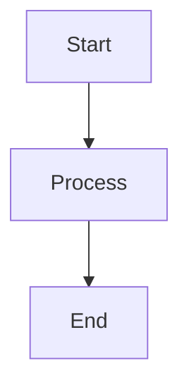

# TruLoad Documentation

Comprehensive documentation for the TruLoad Intelligent Weighing and Enforcement Solution.

## 📚 Documentation Sections

- **[Getting Started](docs/getting-started/index.md)** - Installation and setup
- **[User Manual](docs/user-manual/index.md)** - End-user guides for all modules
- **[Technical Documentation](docs/technical/index.md)** - Architecture, API, deployment
- **[Testing](docs/testing/index.md)** - Test strategies, reports, and guides
- **[Legal & Compliance](docs/legal/index.md)** - EAC Act, Traffic Act, regulations
- **[Support](docs/support/index.md)** - FAQ, troubleshooting, contact

## 🚀 Quick Start

### View Documentation Locally

```bash
# Create virtual environment
python -m venv venv

# Activate virtual environment
# Windows
venv\Scripts\activate
# Linux/macOS
source venv/bin/activate

# Install dependencies
pip install -r requirements.txt

# Serve documentation locally
mkdocs serve

# Open in browser
# Windows
start http://localhost:8000
# Linux/macOS
open http://localhost:8000
```

### Build Static Site

```bash
# Ensure virtual environment is activated
# Windows: venv\Scripts\activate
# Linux/macOS: source venv/bin/activate

# Build documentation
mkdocs build

# Output will be in site/ directory
ls site/
```

### Deploy to GitHub Pages

```bash
# Ensure virtual environment is activated
# Windows: venv\Scripts\activate
# Linux/macOS: source venv/bin/activate

# Deploy to GitHub Pages
mkdocs gh-deploy

# Or use mike for versioning
mike deploy --push --update-aliases 1.0 latest
mike set-default --push latest
```

## 🏗️ Structure

```
truload-docs/
├── mkdocs.yml                    # MkDocs configuration
├── requirements.txt              # Python dependencies
├── docs/                         # Documentation source
│   ├── index.md                  # Home page
│   ├── getting-started/          # Getting started guides
│   ├── user-manual/              # User documentation
│   │   ├── weighing/             # Weighing module docs
│   │   ├── prosecution/          # Prosecution module docs
│   │   ├── yard/                 # Yard management docs
│   │   └── ...
│   ├── technical/                # Technical documentation
│   │   ├── api/                  # API reference
│   │   │   ├── swagger.md        # Swagger UI guide
│   │   │   └── openapi.md        # OpenAPI spec download
│   │   ├── architecture/         # System architecture
│   │   ├── development/          # Development guides
│   │   ├── deployment/           # Deployment guides
│   │   └── integration/          # Integration guides
│   ├── testing/                  # Testing documentation
│   │   ├── index.md              # Testing overview
│   │   ├── reports.md            # Test reports
│   │   ├── unit/                 # Unit testing
│   │   ├── integration/          # Integration testing
│   │   ├── e2e/                  # E2E testing
│   │   └── performance/          # Performance testing
│   ├── legal/                    # Legal & compliance
│   ├── support/                  # Support resources
│   └── release-notes/            # Release notes
├── docs/assets/                  # Images, logos, files
│   ├── logo.png
│   ├── favicon.ico
│   └── screenshots/
├── docs/stylesheets/             # Custom CSS
│   ├── extra.css
│   └── api.css
├── docs/javascripts/             # Custom JavaScript
│   └── extra.js
└── site/                         # Generated static site (not in git)
```

## 📝 Writing Documentation

### Markdown Format

All documentation is written in Markdown with Material for MkDocs extensions:

```markdown
# Page Title

## Section

Regular paragraph with **bold** and *italic* text.

### Code Blocks

```python
def hello_world():
    print("Hello, TruLoad!")
```

### Admonitions

!!! note "Important Note"
    This is an important note.

!!! warning "Warning"
    This is a warning.

!!! tip "Pro Tip"
    This is a helpful tip.

### Tables

| Column 1 | Column 2 |
|----------|----------|
| Value 1  | Value 2  |

### Mermaid Diagrams


```

### Material Extensions

```markdown
<!-- Buttons -->
[Download :material-download:](path/to/file){ .md-button }

<!-- Cards Grid -->
<div class="grid cards" markdown>
-   :material-icon: __Title__
    ---
    Description
    [:octicons-arrow-right-24: Link](url)
</div>

<!-- Tabs -->
=== "Tab 1"
    Content for tab 1

=== "Tab 2"
    Content for tab 2

<!-- Annotations -->
Some text with annotation (1)
{ .annotate }

1.  :material-information: Annotation content
```

## 🔧 Configuration

### mkdocs.yml

Main configuration file for the documentation site:

```yaml
site_name: TruLoad Documentation
theme:
  name: material
  palette:
    - scheme: default
      primary: indigo
      accent: indigo
  features:
    - navigation.tabs
    - navigation.sections
    - search.suggest
    - content.code.copy
```

### Plugins

- **search** - Full-text search
- **git-revision-date-localized** - Last updated dates
- **minify** - Minify HTML
- **awesome-pages** - Custom navigation
- **macros** - Template variables

## 🎨 Styling

### Custom CSS

Add custom styles in `docs/stylesheets/extra.css`:

```css
.custom-class {
    color: #3f51b5;
}
```

### Custom JavaScript

Add custom scripts in `docs/javascripts/extra.js`:

```javascript
console.log('TruLoad Docs Loaded');
```

## 📦 Dependencies

```
mkdocs>=1.5.3
mkdocs-material>=9.5.3
mkdocs-git-revision-date-localized-plugin>=1.2.2
mkdocs-minify-plugin>=0.8.0
mkdocs-awesome-pages-plugin>=2.9.2
mkdocs-macros-plugin>=1.0.5
pymdown-extensions>=10.7
```

## 🚀 Deployment

### GitHub Pages

Automatic deployment via GitHub Actions:

```yaml
name: Deploy Docs

on:
  push:
    branches: [main]

jobs:
  deploy:
    runs-on: ubuntu-latest
    steps:
      - uses: actions/checkout@v4
      - uses: actions/setup-python@v4
        with:
          python-version: 3.x
      - run: pip install -r requirements.txt
      - run: mkdocs gh-deploy --force
```

### Versioning with Mike

```bash
# Deploy version 1.0
mike deploy --push --update-aliases 1.0 latest

# List versions
mike list

# Set default version
mike set-default --push latest

# Delete version
mike delete --push 0.9
```

## 📖 API Documentation

### Swagger UI Integration

The documentation includes links to the live Swagger UI:

- Development: `https://localhost:7001/swagger`
- Production: `https://kuraweighapitest.masterspace.co.ke/swagger`

### OpenAPI Specification

Download OpenAPI spec for Postman/Insomnia:

```bash
curl -o openapi.json https://kuraweighapitest.masterspace.co.ke/swagger/v1/swagger.json
```

See [OpenAPI Documentation](docs/technical/api/openapi.md) for detailed instructions.

## 🧪 Test Reports

Test reports are automatically generated and published:

- **Backend Tests**: Generated by xUnit, published to test server
- **Frontend Tests**: Generated by Jest, coverage by Istanbul
- **E2E Tests**: Generated by Playwright, includes screenshots/videos
- **Performance Tests**: Generated by K6, includes charts and metrics

View live reports at: [Test Reports](docs/testing/reports.md)

## 🤝 Contributing

### Adding New Documentation

1. Set up your environment:
   ```bash
   python -m venv venv
   # Windows
   venv\Scripts\activate
   # Linux/macOS
   source venv/bin/activate
   pip install -r requirements.txt
   ```

2. Create a new Markdown file in the appropriate directory
3. Add entry to `mkdocs.yml` navigation
4. Follow the style guide
5. Test locally with `mkdocs serve`
6. Submit pull request

### Documentation Style Guide

- Use clear, concise language
- Include code examples
- Add screenshots where helpful
- Use proper heading hierarchy (H1 → H2 → H3)
- Include links to related pages
- Add diagrams for complex concepts

## 🔍 Search

Full-text search is available on all documentation pages. Press `/` to focus the search bar.

## 📧 Support

For documentation issues or suggestions:

- :material-github: [GitHub Issues](https://github.com/Bengo-Hub/truload-docs/issues)
- :material-email: [docs@truload.example.com](mailto:docs@truload.example.com)
- :material-slack: #truload-docs

## 📄 License

Documentation is licensed under [CC BY-SA 4.0](https://creativecommons.org/licenses/by-sa/4.0/).

Code examples in the documentation are licensed under [MIT License](LICENSE).

---

**Built with** [MkDocs](https://www.mkdocs.org/) and [Material for MkDocs](https://squidfunk.github.io/mkdocs-material/)

