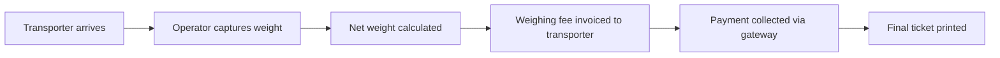
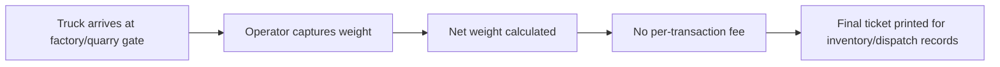

# Commercial Weighing Business Models

TruLoad supports two distinct commercial weighing business models. Understanding which model applies to your organisation determines how billing, fees, and transaction workflows are configured.

---

## Model 1 — Third-Party Weighbridge (Fee-per-Transaction)

In this model, the weighbridge operator **provides weighing services to external transporters and charges a fee for each transaction**.

### How it works

### Characteristics

| Attribute | Value |
|-----------|-------|
| **Weighing fee** | Charged per completed transaction |
| **Invoice** | Generated automatically on second-weight capture |
| **Payment gateway** | Treasury or direct payment at weighbridge |
| **Transporter portal** | Fully applicable — transporters access their own records |
| **Platform subscription** | Charged to the weighbridge operator |

### Configuration

1. Navigate to **Setup > Settings > Commercial**.
2. Set **Weighing Business Model** to `Third-Party Weighbridge`.
3. Enter the **Weighing Fee (KES)** — this is charged to the transporter per completed weighing.
4. The **Payment Gateway** is configured by the platform administrator.

### Who uses this model

- Commercial public weighbridges
- Port authority weighbridges
- Highway weighbridges operated by private concessionaires
- Third-party logistics hubs

---

## Model 2 — Facility-Owned Scale (In-House Weighing)

In this model, the organisation **owns or operates the weighbridge exclusively for its own fleet** — no external transporters pay a per-transaction fee.

### How it works

### Characteristics

| Attribute | Value |
|-----------|-------|
| **Weighing fee** | **None** — no per-transaction charge |
| **Invoice** | Not generated for weighing transactions |
| **Payment gateway** | Not applicable |
| **Transporter portal** | Optional — only needed if external haulers deliver to the site |
| **Platform subscription** | Charged to the facility owner (same as Model 1) |

### Configuration

1. Navigate to **Setup > Settings > Commercial**.
2. Set **Weighing Business Model** to `Facility-Owned Scale`.
3. Leave the **Weighing Fee** at zero or unset — the system will skip invoice generation.

### Who uses this model

- Factories weighing inbound raw materials and outbound finished goods
- Quarry and mining operations tracking truck payload per shift
- Grain depots receiving and dispatching bulk commodities
- Waste management facilities calculating tipping fees internally

---

## Choosing the Right Model

| Question | Model 1 | Model 2 |
|----------|---------|---------|
| Do you charge external transporters per weighing? | Yes | No |
| Do trucks belong to your own fleet? | Sometimes | Usually |
| Do you need payment collection at the weighbridge? | Yes | No |
| Do you issue payment invoices to transporters? | Yes | No |
| Is your weighbridge your core business? | Yes | No (it supports your core business) |

---

## Platform Subscription (Both Models)

Regardless of business model, TruLoad charges the **organisation** a platform subscription fee. This covers:

- Access to the weighing module
- Reporting and analytics
- Transporter portal (if enabled)
- API access (if enabled)

See the [Billing & Plans](../billing/index.md) section for available plans and feature entitlements.

---

!!! note "Switching models"
    Changing the business model setting only affects **new** transactions. Previously invoiced weighings are not retroactively changed.
