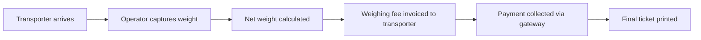
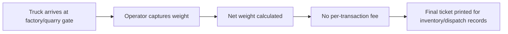

# Commercial Weighing Business Models

TruLoad supports two distinct commercial weighing business models. Understanding which model applies to your organisation determines how billing, fees, and transaction workflows are configured.

!!! note "Business model vs. industry vertical"
    The business model (Model 1 or Model 2, below) is a separate setting from your organisation's
    industry vertical (quarry, waste management, factory, logistics, etc., set under Setup >
    Settings). The vertical only affects cosmetic labelling and report scoping — it is the
    **Weighing Business Model** setting alone that actually turns invoicing on or off. A quarry,
    for example, is Model 1 the moment it bills anyone (a client, a hauler) for weighing services,
    and Model 2 only if every weighing is purely internal tracking with nothing invoiced. See
    "Choosing the Right Model" below rather than assuming a model from the vertical alone.

---

## Model 1 — Third-Party Weighbridge (Fee-per-Transaction)

In this model, the weighbridge operator **provides weighing services to external transporters and charges a fee for each transaction**.

### How it works

### Characteristics

| Attribute | Value |
|-----------|-------|
| **Weighing fee** | Charged per completed transaction, using the tariff rule system described below |
| **Invoice** | Generated automatically once a rule's billing period elapses (immediately, or rolled up daily/weekly/monthly) |
| **Payment gateway** | Treasury or direct payment at weighbridge |
| **Transporter portal** | Fully applicable — transporters access their own records |
| **Platform subscription** | Charged to the weighbridge operator |

### How the weighing fee is actually determined: tariff rules

The flat **Weighing Fee (KES)** under Setup > Settings > Commercial is a zero-config fallback, not
the primary mechanism. Most Model 1 operators instead define one or more **tariff rules** on
**Setup > Tariffs**, each specifying:

- **Scope** — either a specific transporter's contract rate, or a bracket matched by vehicle type,
  axle count range, and/or gross weight range. A transporter contract rule always wins over any
  bracket rule; among bracket rules, the most specific match wins.
- **Rate basis** — how the fee amount is applied: `PerTonne` (fee × net weight in tonnes — the
  default for new rules, since most commercial tenants bill by tonnage), `PerKg` (fee × net weight
  in kg), or `Flat` (a fixed amount per matching weighing, regardless of tonnage).
- **Billing period** — when the fee is actually invoiced: `Immediate` (one invoice per weighing,
  right when it completes — the original behaviour) or `Daily`/`Weekly`/`Bi-weekly`/`Monthly`/
  `Quarterly`/`Yearly` (the fee accrues instead, and every accrual for the same organisation,
  billed party, and period is rolled into ONE invoice once that period elapses — e.g. a client who
  settles with a transporter monthly on aggregated tonnage).
- **Bill To (if different)** — optional. Bills a distinct commissioning client instead of the
  vehicle's own transporter — see "Billing on behalf of a client" in the
  [Setup guide](setup.md#billing-on-behalf-of-a-client). This is how a quarry or mining operation
  that extracts/hauls **for a client** (rather than for its own account) bills that client on
  aggregated tonnage, regardless of which hauling company's trucks were actually weighed.

When a weighing matches no tariff rule, the organisation's flat `CommercialWeighingFeeKes` value
applies instead, exactly as before — this keeps existing, unclassified organisations behaving
identically to prior versions of TruLoad.

### Configuration

1. Navigate to **Setup > Tariffs** to define one or more tariff rules (label, scope, fee, rate
   basis, and billing period) — see above.
2. Navigate to **Setup > Settings > Commercial** and set **Weighing Business Model** to
   `Third-Party Weighbridge`.
3. Enter the **Weighing Fee (KES)** — the fallback amount charged when no tariff rule matches a
   weighing. Set this even if you configure tariff rules, so unmatched weighings are never billed
   at zero unintentionally.
4. The **Payment Gateway** is configured by the platform administrator.

### Who uses this model

- Commercial public weighbridges
- Port authority weighbridges
- Highway weighbridges operated by private concessionaires
- Third-party logistics hubs
- Quarry, mining, or waste-management operations that bill someone for the weighing — a hauler
  paying per load, or a client the operation extracts/hauls/disposes on behalf of (see "Billing on
  behalf of a client" above). The quarry/mining/waste *label* doesn't determine the model; billing
  anyone for weighing does.

---

## Model 2 — Facility-Owned Scale (In-House Weighing)

In this model, the organisation **owns or operates the weighbridge exclusively for its own fleet** — no external transporters pay a per-transaction fee.

### How it works

### Characteristics

| Attribute | Value |
|-----------|-------|
| **Weighing fee** | **None** — no per-transaction charge |
| **Invoice** | Not generated for weighing transactions |
| **Payment gateway** | Not applicable |
| **Transporter portal** | Optional — only needed if external haulers deliver to the site |
| **Platform subscription** | Charged to the facility owner (same as Model 1) |

### Configuration

1. Navigate to **Setup > Settings > Commercial**.
2. Set **Weighing Business Model** to `Facility-Owned Scale`.
3. Leave the **Weighing Fee** at zero or unset — the system will skip invoice generation.

### Who uses this model

- Factories weighing inbound raw materials and outbound finished goods for their own account
- Quarry and mining operations tracking their own fleet's payload per shift, with nothing invoiced
  to an external hauler or client
- Grain depots receiving and dispatching bulk commodities for their own account
- Waste management facilities tracking internal tipping volumes with no billed party

If any of the above starts billing a hauler or client for the weighing, switch to Model 1 — the
vertical doesn't change, only the business model setting does.

---

## Choosing the Right Model

| Question | Model 1 | Model 2 |
|----------|---------|---------|
| Do you charge external transporters per weighing? | Yes | No |
| Do trucks belong to your own fleet? | Sometimes | Usually |
| Do you need payment collection at the weighbridge? | Yes | No |
| Do you issue payment invoices to transporters? | Yes | No |
| Is your weighbridge your core business? | Yes | No (it supports your core business) |

---

## Treasury / GL Linkage

When **Payment gateway** is set to Treasury, Model 1 weighing-fee invoices post as real treasury
`Invoice`s (`invoice_type="commercial_weighing_fee"`) in **your own organisation's book** — not the
platform's. Settlement account resolution (`BankAccount.DefaultInvoiceTypes`) and GL account
mapping (`GLAccountMapping`) are both scoped strictly to your tenant, so your weighing-fee revenue
can never be routed into another tenant's account or the platform's own subscription book, and vice
versa. Configure your settlement bank account for `commercial_weighing_fee` under **Setup >
Payments** (or Banking > Accounts) — this is self-service; no platform operator action is required.
Model 2 organisations generate no weighing invoices, so nothing posts to GL for weighing
transactions regardless of Treasury access.

The platform subscription fee (below) is entirely separate: it always posts to the **platform's
own book** (`invoice_type="subscription"`), regardless of your business model or vertical.

## Platform Subscription (Both Models)

Regardless of business model, TruLoad charges the **organisation** a platform subscription fee. This covers:

- Access to the weighing module
- Reporting and analytics
- Transporter portal (if enabled)
- API access (if enabled)

See the [Billing & Plans](../billing/index.md) section for available plans and feature entitlements.

---

!!! note "Switching models"
    Changing the business model setting only affects **new** transactions. Previously invoiced weighings are not retroactively changed.
