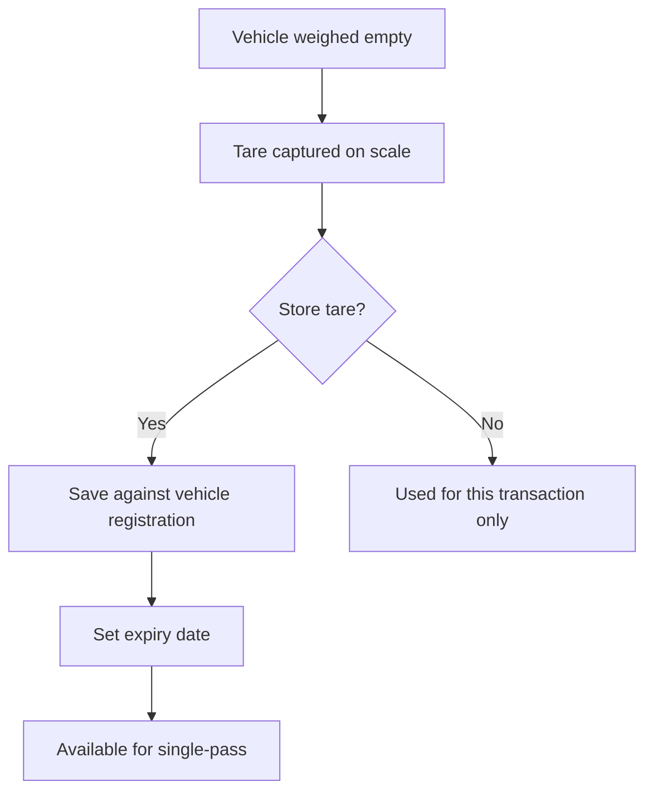

# Tare Management

Tare weight is the weight of the empty vehicle. Accurate tare management is critical for commercial weighing because every kilogram of error in the tare directly affects the billed net weight.

## Tare Types

TruLoad supports three approaches to tare weight:

| Type | Description | When to use |
|------|-------------|-------------|
| **Measured tare** | Captured on the scale during a two-pass transaction | Default for all transactions; most accurate |
| **Stored tare** | Previously measured tare saved against the vehicle registration | Enables single-pass weighing for returning vehicles |
| **Preset tare** | Manufacturer-specified or fleet-standard tare entered manually | Used when scale access is limited or for fleet standardization |

## Stored Tare Workflow

### Storing a tare weight

1. After capturing a tare weight during a normal two-pass transaction, the system prompts: **Save as stored tare?**
2. Confirm to save the tare against the vehicle's registration number.
3. The system sets the expiry date based on the configured tare validity period (default: 90 days).
4. On subsequent visits, the stored tare is auto-applied when the vehicle registration is entered.

### Tare expiry and re-verification

!!! warning "Expired tare"
    When a stored tare has expired, the system **blocks single-pass mode** for that vehicle and requires a fresh tare capture.

- **Expiry period**: Configured in **Setup > System Config > Tare Validity (days)**
- **Grace period**: Optionally allow a configurable number of days past expiry before hard-blocking
- **Re-verification**: Any new tare capture automatically extends the expiry date

### Viewing tare history

Navigate to **Weighing > Tare Register** to view:

- All stored tare weights across the fleet
- Expiry status (valid, expiring soon, expired)
- History of tare changes per vehicle
- Last verification date and operator

## Preset Tare

Preset tare weights are entered manually by a supervisor and are typically sourced from:

- Vehicle manufacturer specifications
- Fleet management records
- Regulatory documentation

!!! note "Accuracy considerations"
    Preset tare is less accurate than measured tare because it does not account for vehicle modifications, fuel level, or accessory weight. Use measured tare whenever possible.

To set a preset tare:

1. Navigate to **Weighing > Tare Register**.
2. Search for the vehicle by registration number (or add a new vehicle entry).
3. Click **Set Preset Tare** and enter the weight.
4. Provide a justification (required for audit purposes).
5. The preset tare is available immediately for single-pass transactions.

## Anomaly Detection

TruLoad monitors tare weights for anomalies that may indicate data quality issues:

| Anomaly | Detection Rule | Action |
|---------|---------------|--------|
| **Tare drift** | New measured tare differs from stored tare by more than the configured threshold | System flags the transaction for supervisor review |
| **Unusually high tare** | Tare exceeds the typical range for the vehicle class | Warning displayed to operator; supervisor approval required to proceed |
| **Unusually low tare** | Tare falls below the minimum expected for the vehicle class | Same as above |
| **Rapid tare changes** | Multiple tare updates for the same vehicle within a short period | Audit alert generated |

## Tare Approval Workflow

When anomaly detection flags a tare value:

1. The transaction is placed in `Pending Review` state.
2. A notification is sent to the supervisor.
3. The supervisor reviews the flagged value, compares with history, and either:
    - **Approves** -- the new tare is accepted and stored
    - **Rejects** -- the operator must re-capture or use the previous stored value
    - **Overrides** -- the supervisor enters a corrected value with justification
4. All decisions are recorded in the audit log.
