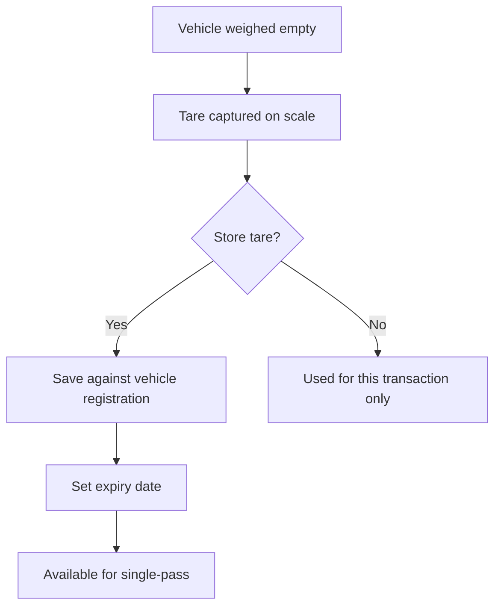

# Tare Management

Tare weight is the weight of the empty vehicle. Accurate tare management is critical for commercial weighing because every kilogram of error in the tare directly affects the billed net weight.

## Tare Types

TruLoad supports three approaches to tare weight:

| Type | Description | When to use |
|------|-------------|-------------|
| **Measured tare** | Captured on the scale during a two-pass transaction | Default for all transactions; most accurate |
| **Stored tare** | Previously measured tare saved against the vehicle registration | Enables single-pass weighing for returning vehicles |
| **Preset tare** | Manufacturer-specified or fleet-standard tare entered manually | Used when scale access is limited or for fleet standardization |

## Stored Tare Workflow

```mermaid
flowchart TD
    A[Vehicle weighed empty] --> B[Tare captured on scale]
    B --> C{Store tare?}
    C -->|Yes| D[Save against vehicle registration]
    D --> E[Set expiry date]
    E --> F[Available for single-pass]
    C -->|No| G[Used for this transaction only]
```

### Storing a tare weight

1. Every tare weight captured during a normal two-pass transaction is automatically saved against the vehicle's registration number. There is no separate confirmation step.
2. The system sets the expiry date based on the configured tare validity period (default: 90 days).
3. On subsequent visits, the stored tare is auto-applied when the vehicle registration is entered.

### Tare expiry and re-verification

!!! warning "Expired tare"
    When a stored tare has expired, the system **blocks single-pass mode** for that vehicle and requires a fresh tare capture.

- **Expiry period**: Configured per organisation in **Setup > Settings > Commercial > Default Tare Expiry (days)**
- **Stale transaction threshold**: Separate from tare expiry. If first-weight-only transactions remain open past the configured hours (default 8 h), station managers receive an email alert. Configure in **Setup > Settings > Weighing > Commercial Pending Weighing Threshold (hours)**.
- **Grace period**: Optionally allow a configurable number of days past expiry before hard-blocking
- **Re-verification**: Any new tare capture automatically extends the expiry date

### Viewing tare history

Navigate to **Weighing > Tare Register** to view:

- All stored tare weights across the fleet
- Expiry status (valid, expiring soon, expired)
- History of tare changes per vehicle
- Last verification date and operator

## Preset Tare

Preset tare weights are entered manually by a supervisor and are typically sourced from:

- Vehicle manufacturer specifications
- Fleet management records
- Regulatory documentation

!!! note "Accuracy considerations"
    Preset tare is less accurate than measured tare because it does not account for vehicle modifications, fuel level, or accessory weight. Use measured tare whenever possible.

To set a preset tare:

1. Navigate to **Weighing > Tare Register**.
2. Search for the vehicle by registration number (or add a new vehicle entry).
3. Click **Set Preset Tare** and enter the weight.
4. Provide a justification (required for audit purposes).
5. The preset tare is available immediately for single-pass transactions.

## Anomaly Detection

TruLoad monitors tare weights for drift that may indicate a data quality issue:

| Anomaly | Detection Rule | Action |
|---------|---------------|--------|
| **Tare drift** | New measured tare differs from the vehicle's prior stored tare by more than the configured threshold (**Setup > Settings > Weighing > Tare Drift Anomaly Threshold %**, default 5%) | The transaction (or standalone tare-register entry) is flagged for supervisor review. The capture itself is **not blocked**; flagging is informational and runs alongside the normal workflow |
| **Vehicle-class range** | New tare falls outside the mean ± 2 standard deviations of the last recorded tares for vehicles sharing this vehicle's axle configuration. Requires at least 10 historical readings for that configuration — with fewer, the sample is too thin to be statistically meaningful and the check is skipped rather than risk false positives | Same as tare drift: flagged for supervisor review, capture is not blocked |
| **Rapid tare change** | The vehicle has accumulated 3 or more tare re-measurements within a trailing 24-hour window (both configurable — **Setup > Settings > Weighing**) | Same as above — flagged for review, not blocked |

All three rules run independently and can all fire on the same reading; the Pending Review reason
field lists every rule that triggered.

!!! note "Scope"
    All three checks share the single **Pending Review** queue and reason field described below —
    there's no separate view per anomaly type.

## Tare Approval Workflow

When drift detection flags a tare value:

1. The flagged entry appears in **Weighing > Tare Register > Pending Review**, showing the vehicle, the drift reason, and when it was flagged. The underlying transaction/tare entry is unaffected and continues normally.
2. A supervisor with `weighing.override` reviews the flagged value and either:
    - **Approves**: clears the flag, and the recorded tare stands as is
    - **Rejects**: clears the flag with a reason. The recorded tare is not retroactively changed, so re-verify the vehicle on its next visit.
    - **Overrides**: enters a corrected tare weight with a required justification. This updates the vehicle's stored tare going forward but does not rewrite an already-completed transaction's weights or fees.
3. All decisions are recorded (`TareAnomalyResolution`, resolver, and timestamp).
