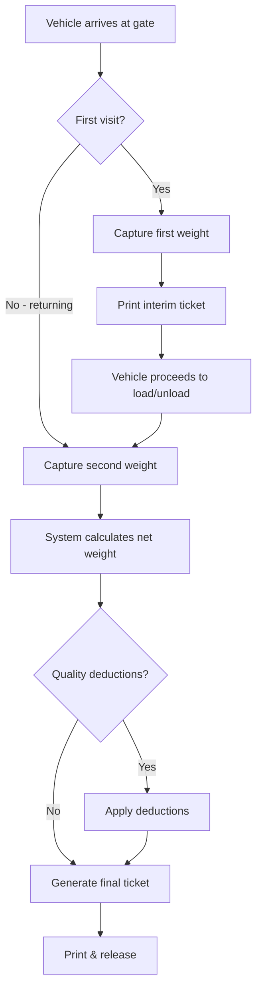
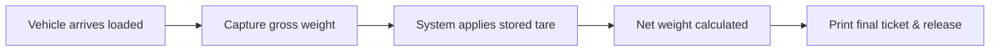

# Two-Pass Weighing

Two-pass weighing is the standard commercial workflow where a vehicle is weighed twice -- once loaded and once empty -- to determine the **net weight** of the cargo.

$$
\text{Net Weight} = \text{Gross Weight} - \text{Tare Weight}
$$

## Workflow Overview

## Inbound Weighing (Gross First)

This is the most common pattern for **receiving** goods. The loaded vehicle arrives, is weighed (gross), unloads, then returns to the scale for the tare weight.

### Step-by-step

1. **Open the Weighing module** and confirm the station and shift are active.
2. **Start a new transaction** and select the weighing direction as `Inbound`.
3. **Enter vehicle details**:
    - Registration number (plate)
    - Transporter name (auto-populated if the vehicle is registered)
    - Driver name and ID
    - Cargo type (selects the applicable tolerance and deduction rules)
4. **Capture the gross weight**:
    - Direct the vehicle onto the scale
    - Wait for the TruConnect stable indicator
    - Click **Capture Weight** or let auto-weight trigger
    - Confirm the captured value
5. **Print the interim ticket** showing the gross weight and transaction reference.
6. **Release the vehicle** to the loading/unloading bay.
7. When the vehicle returns empty:
    - Open the pending transaction by scanning the ticket barcode or searching by plate
    - **Capture the tare weight**
    - System calculates net weight automatically
8. **Apply quality deductions** if applicable (moisture, foreign matter, grade).
9. **Review and confirm** the final ticket.
10. **Print the final weight ticket** and release the vehicle.

!!! tip "Stored tare shortcut"
    If the vehicle has a valid stored tare weight, you can skip the second pass entirely. See [Tare Management](tare-management.md) for details.

## Outbound Weighing (Tare First)

Used when **dispatching** goods. The empty vehicle arrives first (tare), loads up, then returns for the gross weight.

### Step-by-step

1. **Start a new transaction** and select the weighing direction as `Outbound`.
2. **Enter vehicle details** (same fields as inbound).
3. **Capture the tare weight** (vehicle is empty).
4. **Print the interim ticket** and release the vehicle to the loading bay.
5. When the vehicle returns loaded:
    - Open the pending transaction
    - **Capture the gross weight**
    - Net weight is calculated automatically
6. **Apply any quality deductions** and **confirm the final ticket**.
7. **Print and release**.

## Single-Pass with Stored Tare

When a vehicle's tare weight is stored and still valid (not expired), operators can complete the transaction in a single visit:

1. Start a new transaction.
2. Enter the vehicle registration -- the system auto-fills the stored tare.
3. Capture the gross (or tare, for outbound) weight.
4. The system immediately calculates the net weight.
5. Review, confirm, print, and release.

!!! warning "Tare expiry"
    If the stored tare has expired, the system will prompt for a fresh tare capture. The expiry period is configured in **Setup > System Config**.

## Transaction States

| State | Meaning |
|-------|---------|
| `Pending` | First pass captured, awaiting second pass |
| `Complete` | Both passes captured, net weight calculated |
| `Voided` | Transaction cancelled before completion |
| `Adjusted` | Supervisor applied a manual correction |

## Handling Exceptions

### Vehicle leaves without second pass

Pending transactions remain open. A supervisor can:

- Void the transaction with a documented reason
- Extend the pending period if the vehicle is expected to return

### Weight discrepancy

If the net weight falls outside the tolerance for the selected cargo type:

1. The system flags the transaction with a warning.
2. The supervisor reviews and can approve, reject, or request a reweigh.
3. All overrides are recorded in the audit log.

### Scale fault during capture

If TruConnect loses the scale connection mid-capture:

1. The system preserves any already-captured values.
2. Reconnect the scale and retry the capture.
3. If the scale cannot be recovered, the supervisor can enter a manual weight with justification (requires the `manual_weight_override` permission).
