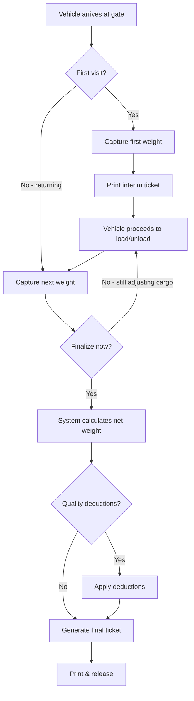
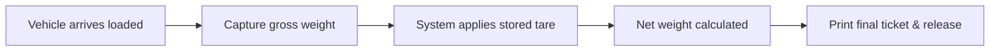

# Two-Pass Weighing

Two-pass weighing is the standard commercial workflow where a vehicle is weighed twice, once loaded and once empty, to determine the **net weight** of the cargo. A transaction is not limited to exactly two captures: if the vehicle needs to leave the scale to adjust cargo and come back, TruLoad supports any number of reweighs under the same transaction before it is finalized and billed. That mechanism is covered in full in [Reweighs and Multiple Capture Passes](#reweighs-and-multiple-capture-passes) below; the rest of this page describes the core two-pass flow.

$$
\text{Net Weight} = \text{Gross Weight} - \text{Tare Weight}
$$

## Workflow Overview

```mermaid
flowchart TD
    A[Vehicle arrives at gate] --> B{First visit?}
    B -->|Yes| C[Capture first weight]
    B -->|No - returning| D[Capture next weight]
    C --> E[Print interim ticket]
    E --> F[Vehicle proceeds to load/unload]
    F --> D
    D --> Z{Finalize now?}
    Z -->|No - still adjusting cargo| F
    Z -->|Yes| G[System calculates net weight]
    G --> H{Quality deductions?}
    H -->|Yes| I[Apply deductions]
    H -->|No| J[Generate final ticket]
    I --> J
    J --> K[Print & release]
```

Every capture after the first is a **finalize or reweigh** decision: the operator either closes out the transaction (finalize) or saves the reading and sends the vehicle back for another pass (reweigh), and the loop can repeat as many times as the cargo adjustment needs.

## Inbound Weighing (Gross First)

This is the most common pattern for **receiving** goods. The loaded vehicle arrives, is weighed (gross), unloads, then returns to the scale for the tare weight.

### Step-by-step

1. **Open the Weighing module** and confirm the station and shift are active.
2. **Start a new transaction** and choose **Gross** as the first weight type. There is no separate "Inbound/Outbound" toggle; the direction is expressed entirely by which weight you capture first.
3. **Enter vehicle details**:
    - Registration number (plate)
    - Transporter name (auto-populated if the vehicle is registered)
    - Driver name and ID
    - Cargo type (selects the applicable tolerance and deduction rules)
4. **Capture the gross weight**:
    - Direct the vehicle onto the scale
    - Wait for the TruConnect stable indicator
    - Click **Capture Weight** or let auto-weight trigger
    - Confirm the captured value
5. **Print the interim ticket** showing the gross weight and transaction reference.
6. **Release the vehicle** to the loading/unloading bay.
7. When the vehicle returns empty:
    - Open the pending transaction by scanning the ticket barcode or searching by plate
    - **Capture the tare weight**
    - System calculates net weight automatically
    - Choose to **finalize** (the normal case: proceed to step 8) or, if the load still needs adjusting, save the reading as a reweigh and send the vehicle back out. See [Reweighs and Multiple Capture Passes](#reweighs-and-multiple-capture-passes) for that path.
8. **Apply quality deductions** if applicable (moisture, foreign matter, grade).
9. **Review and confirm** the final ticket.
10. **Print the final weight ticket** and release the vehicle.

!!! tip "Stored tare shortcut"
    If the vehicle has a valid stored tare weight, you can skip the second pass entirely. See [Tare Management](tare-management.md) for details.

## Outbound Weighing (Tare First)

Used when **dispatching** goods. The empty vehicle arrives first (tare), loads up, then returns for the gross weight.

### Step-by-step

1. **Start a new transaction** and choose **Tare** as the first weight type.
2. **Enter vehicle details** (same fields as inbound).
3. **Capture the tare weight** (vehicle is empty).
4. **Print the interim ticket** and release the vehicle to the loading bay.
5. When the vehicle returns loaded:
    - Open the pending transaction
    - **Capture the gross weight**
    - Net weight is calculated automatically
    - Choose to **finalize** or save the reading as a reweigh if more cargo needs to be loaded or offloaded. See [Reweighs and Multiple Capture Passes](#reweighs-and-multiple-capture-passes).
6. **Apply any quality deductions** and **confirm the final ticket**.
7. **Print and release**.

## Single-Pass with Stored Tare

When a vehicle's tare weight is stored and still valid (not expired), operators can complete the transaction in a single visit:

```mermaid
flowchart LR
    A[Vehicle arrives loaded] --> B[Capture gross weight]
    B --> C[System applies stored tare]
    C --> D[Net weight calculated]
    D --> E[Print final ticket & release]
```

1. Start a new transaction.
2. Enter the vehicle registration. The system auto-fills the stored tare.
3. Capture the gross (or tare, for outbound) weight.
4. The system immediately calculates the net weight.
5. Review, confirm, print, and release.

!!! warning "Tare expiry"
    If the stored tare has expired, the system will prompt for a fresh tare capture. The expiry period is configured in **Setup > System Config**.

Single-pass weighing is unaffected by the reweigh capability described next. A vehicle with a
valid stored tare that doesn't need a second physical pass still completes in one visit exactly as
above.

## Reweighs and Multiple Capture Passes

A real weighbridge rarely sees a clean "weigh once, weigh again, done" flow. A truck often needs to
leave the scale after its second weight to top up or shed cargo, then come back for another
reading, sometimes more than once, before the load is right. TruLoad's commercial weighing supports
this directly: a transaction can accumulate any number of weight captures, and every one of them is
recorded, not just the first and last.

### How captures are numbered

Every weight capture on a transaction (beyond the very first) is a **finalize-or-reweigh** decision:

- **Finalize** (the default) closes the transaction and bills it, exactly like the original
  second-weight behaviour.
- **Save as a reweigh** keeps the transaction open under the same ticket number for another visit.
  No invoice is created yet.

Captures are counted in the order they happen:

| Capture | Meaning | Display label |
|---------|---------|----------------|
| 1st | First weight | "First Weight" |
| 2nd | Second weight (may or may not finalize) | "Second Weight" |
| 3rd | 1st reweigh | "Reweigh #1" |
| 4th | 2nd reweigh | "Reweigh #2" |
| ... | ... | "Reweigh #N" |

Reweighs have their own count, separate from the capture number. A third capture is never called a
"3rd weight" on screen or on the ticket. It's the **1st reweigh**. This keeps the language matching
what actually happened at the scale: two weighings to establish gross and tare, then however many
adjustment passes it took to get the load right.

A reason is required whenever a capture doesn't finalize the transaction, so there's always a record
of why the vehicle went back out (for example "over_limit_adjust_cargo" or
"confirm_weight_recheck"). The same reason field is required when staff manually attach a capture to
a transaction outside the normal matching window (see [Resume Flow](#resume-flow-returning-vehicle)
below).

### What stays on the transaction record

- **First weight** always reflects the very first capture. It never changes, regardless of how many
  reweighs follow.
- **Second weight** now means whichever capture actually finalized the transaction. If the vehicle
  was reweighed twice before the operator finalized, the "second weight" fields on the ticket hold
  the third reading, not literally the second one taken.
- The full capture history is available on the transaction and shown on the weight ticket: every
  pass with its weight, type, timestamp, and label ("First Weight" / "Second Weight" / "Reweigh
  #N"), plus the reason recorded for any pass that didn't finalize.

### Worked example

Truck **KAA 123X** arrives loaded with maize:

1. **First weight**: gross, 32,400 kg. Interim ticket printed, truck released to unload.
2. While it's away unloading, two unrelated trucks are weighed on the same scale. The bridge is
   never blocked waiting for one vehicle to come back.
3. Truck returns 20 minutes later. The operator types the plate on the Capture screen; because 20
   minutes is inside the configured auto-match window, TruLoad prompts to resume the open
   transaction automatically.
4. **Second weight**: tare, 24,800 kg. Net comes to 7,600 kg, but the order called for around
   9,000 kg, so the load is short. The operator saves this reading without finalizing
   (reason: "under_limit_add_cargo"). The transaction stays open; no ticket or invoice yet.
5. Truck goes back to top up the load, returns again. The operator resumes the same transaction and
   captures 26,100 kg. Net is now 8,700 kg, closer but still a little short. Saved again without
   finalizing. This is the **1st reweigh**.
6. Truck returns once more with 27,300 kg. Net is 9,100 kg, within tolerance. The operator
   finalizes this time. This is the **2nd reweigh**, and it's the capture that closes the
   transaction and creates the invoice (for a Third-Party Weighbridge organisation).
7. On the final ticket: **First Weight** still shows the original 32,400 kg gross from step 1.
   **Second Weight** now shows 27,300 kg tare, the capture from step 6 that actually finalized the
   transaction. The full pass history underneath lists all four captures in order, each labelled
   and timestamped, with the reweigh reasons attached to the two that didn't finalize.

### Active Weighings board

The station's **Active Weighings** board lists every open transaction for that station, including
ones sitting in an awaiting-reweigh state, not just transactions still waiting on their first
second-weight capture. A supervisor scanning the board can see at a glance which vehicles are
mid-adjustment and pick any of them up directly, without needing the plate re-entered at the Capture
screen.

## Transaction States

| State | Meaning |
|-------|---------|
| `Pending` | Transaction created, no weight captured yet |
| `FirstWeightCaptured` | First pass captured, awaiting second pass |
| `AwaitingReweigh` | A second weight or reweigh was captured without finalizing. Net weight is calculated and visible for reference, but the transaction stays open for another capture and no invoice exists yet |
| `Complete` | The transaction has been finalized, net weight calculated |
| `ToleranceExceeded` | Net discrepancy beyond the configured tolerance, needs supervisor approval before the ticket can be finalised |
| `Voided` | Transaction cancelled before completion |

These match the ticket status badge described in [Weight Tickets](weight-tickets.md#ticket-status)
exactly. There is a single set of transaction states used throughout the commercial module.

## Resume Flow (Returning Vehicle)

When an operator enters a vehicle registration number on the **Capture** screen, TruLoad looks up
**every** open transaction for that plate, not just the single most recent one. A vehicle can
plausibly have more than one open transaction (for example, it was mid-reweigh on one load when it
was sent back for another), so the operator gets the full list rather than a guess.

Each candidate transaction is flagged `isWithinAutoWindow`:

- **Within the window**: safe to auto-resume. TruLoad shows a **Resume Weighing** dialog with the
  ticket number, last captured weight, and elapsed time. The operator picks **Resume** to jump
  straight to the next capture step with that transaction pre-loaded, or **Start New** to leave it
  open and create a fresh transaction instead.
- **Outside the window**: still shown (on the Active Weighings board or the resume picker), but
  attaching a new capture to it requires the `manual_weight_override` permission and a reason
  (`isOverrideAttach` + `reweighReason`). This covers a vehicle that took much longer than usual to
  come back, without silently blocking staff from continuing that transaction.

The window itself is a dedicated setting, separate from the stale-transaction alert threshold
described next:

| Setting | Purpose | Default |
|---------|---------|---------|
| **Reweigh Auto-Match Window (minutes)** (`commercial.reweigh_match_window_minutes`) | How long after a vehicle's last capture it can be auto-resumed without an override | 30 minutes |
| **Commercial Pending Weighing Threshold (hours)** (`commercial.pending_weighing_threshold_hours`) | How long a transaction can sit open before triggering the stale-transaction manager alert | 8 hours |

These serve different purposes on purpose: the match window is short because it's about whether a
returning vehicle can be resumed without extra sign-off, while the stale threshold is long because
it's a "someone forgot about this transaction entirely" alert. Both are configured under
**Setup > Settings > Weighing**.

### Stale Transaction Notifications

If a first-weight-only transaction remains open past the pending-weighing threshold (default 8
hours) without a second weight being captured, TruLoad automatically emails the **Commercial
Weighing Manager** and **Station Manager** assigned to that organisation. Notifications are sent
once per transaction (tracked by the `StaleAlertSentAt` field). The threshold can be configured in
**Setup > Settings > Weighing > Commercial Pending Weighing Threshold (hours)**.

## Handling Exceptions

### Vehicle leaves without returning

A vehicle sent back for a routine reweigh (`AwaitingReweigh`) is expected to come back. That's the
normal flow, not an exception. This section covers a vehicle that leaves and never returns at all,
first-weight-only or otherwise. Pending transactions remain open. A supervisor can:

- Void the transaction with a documented reason. Voiding is immediate and server-side, so it does not
  leave a dangling open record behind for that plate.
- Allow the vehicle to return within the configured window/threshold. The Resume dialog will appear automatically when the plate is re-entered

### Weight discrepancy

If the net weight falls outside the tolerance for the selected cargo type:

1. The system flags the transaction `ToleranceExceeded` with a warning; the transaction still completes normally otherwise.
2. A supervisor with `weighing.override` can **Approve** the exception (unblocks final ticket generation) or **Reject** it (voids the transaction, requiring a fresh weighing).
3. The final ticket PDF cannot be generated while a `ToleranceExceeded` transaction is unapproved.
4. All decisions are recorded in the audit log.

### Scale fault during capture

If TruConnect loses the scale connection mid-capture:

1. The system preserves any already-captured values.
2. Reconnect the scale and retry the capture.
3. If the scale cannot be recovered, the supervisor can enter a manual weight with justification (requires the `manual_weight_override` permission).
