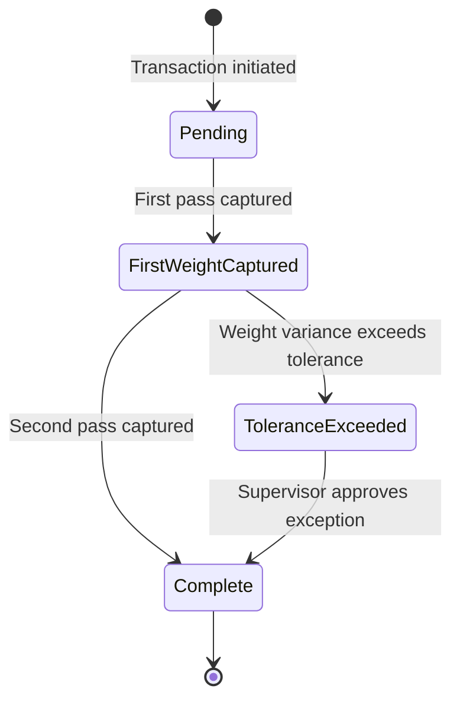

# Weight Tickets

Weight tickets are the official record of each weighing transaction. In commercial operations, they serve as the basis for billing, inventory reconciliation, and dispute resolution.

## Ticket Types

| Type | When Generated | Contains |
|------|---------------|----------|
| **Interim ticket** | After the first pass of a two-pass transaction | Gross or tare weight only; marked as "INTERIM" |
| **Final ticket** | After both passes are complete (or single-pass with stored tare) | Gross, tare, net weight, deductions, and final billable weight |

## Ticket Sections

### Weight Summary

The weight summary is the primary block on every commercial ticket:

| Field | Description |
|-------|-------------|
| **Tare weight** | Weight of the empty vehicle (kg) |
| **Tare source** | `Measured`, `Stored`, or `Preset` |
| **Gross weight** | Weight of vehicle + cargo (kg) |
| **Net weight** | Gross minus tare (kg) |
| **Quality deduction** | Weight deducted for moisture, foreign matter, or grade (kg) — if applicable |
| **Adjusted net weight** | Net weight minus quality deduction — the billable weight (kg) |

### Ticket Status

Shows the transaction status badge:

| Status | Meaning |
|--------|---------|
| **Pending** | First pass captured; awaiting second pass |
| **FirstWeightCaptured** | Synonym for Pending in the API |
| **Complete** | Both passes done; final ticket available |
| **ToleranceExceeded** | Weight variance beyond configured tolerance — supervisor approval required |

A tolerance-exceeded transaction displays a warning until a supervisor approves the exception.

### Vehicle Details

| Field | Description |
|-------|-------------|
| Vehicle registration | Plate number |
| Vehicle make | Manufacturer / model |
| Trailer registration | Trailer plate (if applicable) |
| Weighing type | `Multideck` or `Mobile` |

### Consignment & Cargo

| Field | Description |
|-------|-------------|
| Consignment number | Reference number for the load |
| Order reference | Customer purchase order or delivery order number |
| Cargo type | Commodity description (e.g., Maize, Cement) |
| Seal numbers | Container or trailer seal numbers |
| Expected net weight | Declared load weight (kg) — used to compute discrepancy |
| Weight discrepancy | Difference between expected and actual net weight (kg) |
| Tolerance | Configured tolerance applied to this transaction |

### Parties & Route

| Field | Description |
|-------|-------------|
| Transporter | Registered hauling company |
| Driver | Driver name |
| Origin | Cargo source location |
| Destination | Delivery destination |
| Remarks | Free-text notes added by the operator |

### Weighing Passes

| Field | Description |
|-------|-------------|
| 1st pass weight | Weight captured on the first pass (kg), with timestamp |
| 1st pass type | `Gross` or `Tare` — identifies what was weighed first |
| 2nd pass weight | Weight captured on the second pass (kg), with timestamp |
| 2nd pass type | The complementary weight type |

### Billing

Shown when a weighing fee is configured for the organisation:

| Field | Description |
|-------|-------------|
| Weighing fee | Per-transaction charge in the configured currency (KES or USD) |

### Station & Officer

| Field | Description |
|-------|-------------|
| Station | Weighbridge station name and code |
| Weighed by | Name of the operator who captured the transaction |
| Weighed at | Timestamp of the final weight capture |
| Capture source | `TruConnect` (live scale) or `Manual` |

## Enforcement vs. Commercial Ticket Comparison

| Aspect | Enforcement Ticket | Commercial Ticket |
|--------|-------------------|-------------------|
| **Purpose** | Regulatory compliance evidence | Billing and inventory record |
| **Violation fields** | Yes (act, section, excess weight) | No |
| **Case reference** | Yes (linked to case register) | No |
| **Tare source** | Always measured on-site | Measured, stored, or preset |
| **Quality deductions** | Not applicable | Optional per cargo type |
| **Billable weight** | Not applicable | Yes (adjusted net) |
| **Legal watermark** | Government agency seal | Company branding |

## Printing

### PDF (A4)

Click **Print Ticket** in the ticket detail drawer to generate a full-page PDF with:

- Company logo and branding
- Weight summary hero (tare / gross / net)
- All consignment and cargo details
- Operator and driver signature lines

An interim PDF is available after the first pass for use as a delivery receipt. The final PDF is generated after the second pass.

### Thermal printer

TruLoad generates tickets formatted for standard 80mm thermal receipt printers. The ticket is auto-sent to the configured printer when the operator clicks **Print Ticket** on the weighing screen.

## Searching and Filtering Tickets

The ticket list supports filtering by:

| Filter | Options |
|--------|---------|
| Date range | From / to date |
| Time range | From / to time (within the date range) |
| Status | All / Pending / First Weight Done / Complete / Tolerance Exceeded |
| Station | All stations or a specific station |
| Vehicle registration | Partial match |
| Ticket number | Exact or partial match |

Use the **Export** button to download filtered results as CSV for reconciliation or reporting.

## Ticket Lifecycle

