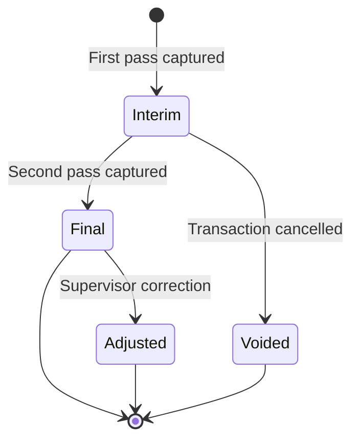

# Weight Tickets

Weight tickets are the official record of each weighing transaction. In commercial operations, they serve as the basis for billing, inventory reconciliation, and dispute resolution.

## Ticket Types

| Type | When Generated | Contains |
|------|---------------|----------|
| **Interim ticket** | After the first pass of a two-pass transaction | Gross or tare weight only; marked as "INTERIM" |
| **Final ticket** | After both passes are complete (or single-pass with stored tare) | Gross, tare, net weight, deductions, and final billable weight |
| **Void ticket** | When a transaction is cancelled | Original values with "VOID" watermark and void reason |

## Ticket Fields

### Header

| Field | Description |
|-------|-------------|
| Ticket number | Unique sequential reference (format: `WTK-YYYYMMDD-NNNNN`) |
| Station | Weighbridge station name and code |
| Date/time | Timestamp of ticket generation |
| Operator | Name of the operator who completed the transaction |

### Vehicle & Cargo

| Field | Description |
|-------|-------------|
| Registration | Vehicle plate number |
| Transporter | Registered transporter/company name |
| Driver | Driver name and ID number |
| Cargo type | Commodity being weighed |
| Origin | Where the cargo is coming from |
| Destination | Where the cargo is going |

### Weights

| Field | Description |
|-------|-------------|
| Gross weight | Weight of vehicle + cargo (kg) |
| Tare weight | Weight of empty vehicle (kg) |
| Net weight | Gross minus tare (kg) |
| Tare source | `Measured`, `Stored`, or `Preset` |

### Quality Deductions (if applicable)

| Field | Description |
|-------|-------------|
| Moisture % | Measured moisture content |
| Moisture deduction | Weight deducted for excess moisture (kg) |
| Foreign matter % | Measured foreign matter content |
| Foreign matter deduction | Weight deducted for foreign matter (kg) |
| Grade adjustment | Weight adjustment for quality grade |
| **Billable weight** | Net weight minus all deductions (kg) |

## Enforcement vs. Commercial Ticket Comparison

| Aspect | Enforcement Ticket | Commercial Ticket |
|--------|-------------------|-------------------|
| **Purpose** | Regulatory compliance evidence | Billing and inventory record |
| **Violation fields** | Yes (act, section, excess weight) | No |
| **Case reference** | Yes (linked to case register) | No |
| **Tare source** | Always measured on-site | Measured, stored, or preset |
| **Quality deductions** | Not applicable | Optional per cargo type |
| **Billable weight** | Not applicable | Yes |
| **Legal watermark** | Government agency seal | Company branding |

## Printing

### Thermal printer

TruLoad generates tickets formatted for standard 80mm thermal receipt printers. The ticket is auto-sent to the configured printer when the operator clicks **Print Ticket**.

### A4 / PDF

For formal documentation, click **Print (A4)** to generate a full-page PDF with:

- Company logo and branding
- Full transaction details
- QR code linking to the digital ticket
- Signature lines for operator and driver

### Batch printing

Supervisors can select multiple completed transactions from the ticket list and click **Print Selected** to generate a batch PDF.

## Ticket Lifecycle

## Searching and Filtering Tickets

The ticket list view supports filtering by:

- Date range
- Vehicle registration
- Transporter
- Cargo type
- Ticket status (interim, final, voided, adjusted)
- Operator

Use the **Export** button to download filtered results as CSV for reconciliation or reporting.
