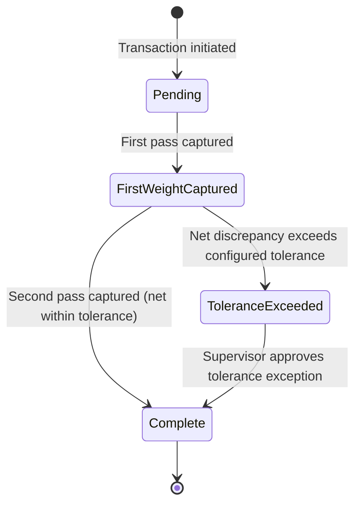

# Weight Tickets

Weight tickets are the official record of each weighing transaction. In commercial operations, they serve as the basis for billing, inventory reconciliation, and dispute resolution.

## Ticket Types

| Type | When Generated | Contains |
|------|---------------|----------|
| **Interim ticket** | After the first pass of a two-pass transaction | Gross or tare weight only; marked as "INTERIM" |
| **Final ticket** | After both passes are complete (or single-pass with stored tare) | Gross, tare, net weight, deductions, and final billable weight |

## Ticket Sections

### Weight Summary

The weight summary is the primary block on every commercial ticket:

| Field | Description |
|-------|-------------|
| **Tare weight** | Weight of the empty vehicle (kg) |
| **Tare source** | `Measured`, `Stored`, or `Preset` |
| **Gross weight** | Weight of vehicle + cargo (kg) |
| **Net weight** | Gross minus tare (kg) |
| **Quality deduction** | Weight deducted for moisture, foreign matter, or grade (kg) — if applicable |
| **Adjusted net weight** | Net weight minus quality deduction — the billable weight (kg) |

### Ticket Status

Shows the transaction status badge:

| Status | Meaning |
|--------|---------|
| **Pending** | Transaction created; no weight captured yet |
| **FirstWeightCaptured** | First pass captured; awaiting second pass |
| **Complete** | Both passes done; final ticket available |
| **ToleranceExceeded** | Weight variance beyond configured tolerance — supervisor approval required |
| **Voided** | Transaction cancelled (or a tolerance exception was rejected) — recorded with a reason |

A tolerance-exceeded transaction displays a warning and blocks final PDF generation until a
supervisor approves (or rejects/voids) the exception.

### Vehicle Details

| Field | Description |
|-------|-------------|
| Vehicle registration | Plate number |
| Vehicle make | Manufacturer / model |
| Trailer registration | Trailer plate (if applicable) |
| Weighing type | `Multideck` or `Mobile` |

### Consignment & Cargo

| Field | Description |
|-------|-------------|
| Consignment number | Reference number for the load |
| Order reference | Customer purchase order or delivery order number |
| Cargo type | Commodity description (e.g., Maize, Cement) |
| Seal numbers | Container or trailer seal numbers |
| Expected net weight | Declared load weight (kg) — used to compute discrepancy |
| Weight discrepancy | Difference between expected and actual net weight (kg) |
| Tolerance | Configured tolerance applied to this transaction |

### Parties & Route

| Field | Description |
|-------|-------------|
| Transporter | Registered hauling company |
| Driver | Driver name |
| Origin | Cargo source location |
| Destination | Delivery destination |
| Remarks | Free-text notes added by the operator |

### Weighing Passes

| Field | Description |
|-------|-------------|
| 1st pass weight | Weight captured on the first pass (kg), with timestamp |
| 1st pass type | `Gross` or `Tare` — identifies what was weighed first |
| 2nd pass weight | Weight captured on the second pass (kg), with timestamp |
| 2nd pass type | The complementary weight type |

### Billing

Shown when a weighing fee is configured for the organisation:

| Field | Description |
|-------|-------------|
| Weighing fee | Per-transaction charge in the configured currency (KES or USD) |

### Station & Officer

| Field | Description |
|-------|-------------|
| Station | Weighbridge station name and code |
| Weighed by | Name of the operator who captured the transaction |
| Weighed at | Timestamp of the final weight capture |
| Capture source | `TruConnect` (live scale) or `Manual` |

## Enforcement vs. Commercial Ticket Comparison

| Aspect | Enforcement Ticket | Commercial Ticket |
|--------|-------------------|-------------------|
| **Purpose** | Regulatory compliance evidence | Billing and inventory record |
| **Violation fields** | Yes (act, section, excess weight) | No |
| **Case reference** | Yes (linked to case register) | No |
| **Tare source** | Always measured on-site | Measured, stored, or preset |
| **Quality deductions** | Not applicable | Optional per cargo type |
| **Billable weight** | Not applicable | Yes (adjusted net) |
| **Legal watermark** | Government agency seal | Company branding |

## Printing

### PDF (A4)

Click **Print Ticket** in the ticket detail drawer to generate a full-page PDF with:

- Company logo and branding
- Weight summary hero (tare / gross / net)
- All consignment and cargo details
- Operator and driver signature lines

An interim PDF is available after the first pass for use as a delivery receipt. The final PDF is generated after the second pass.

### Thermal printer

!!! warning "Not yet built"
    80mm thermal ticket printing is planned but not implemented today — only the A4 PDF above is
    available. A station's **Printer Configuration** (see [Station Configuration](setup.md#station-configuration))
    is metadata-only for now and does not drive an actual print job.

## Searching and Filtering Tickets

The ticket list supports filtering by:

| Filter | Options |
|--------|---------|
| Date range | From / to date |
| Time range | From / to time (within the date range) |
| Status | All / Pending / First Weight Captured / Complete / Tolerance Exceeded / Voided |
| Station | All stations or a specific station |
| Vehicle registration | Partial match |
| Ticket number | Exact or partial match |

Use the **Export** button to download filtered results as CSV for reconciliation or reporting.

## Field Population and N/A Values

Some fields on the weight ticket will show **N/A** or be blank if they were not captured during the transaction. The table below explains when each optional field is populated.

| Field | Populated when |
|-------|---------------|
| Trailer registration | Operator enters it in the Ticket step |
| Transporter / Driver | Registered in Weighing Metadata and selected during Capture step |
| Cargo type | Selected during Capture step |
| Consignment number | Entered in Ticket step |
| Order reference | Entered in Ticket step |
| Seal numbers | Entered in Ticket step |
| Origin / Destination | Selected during Capture step |
| Expected net weight | Entered in Ticket step — required for discrepancy/tolerance check |
| Weight discrepancy | Only shown if Expected Net Weight was entered |
| Quality deduction | Only shown if a deduction was applied in Ticket step |
| Adjusted net weight | Only shown if Quality Deduction > 0 |
| Deck/axle weights | Only shown for Multideck scale transactions where per-deck weights were captured |
| Billing section | Only shown for third-party weighbridge organisations with a fee configured |

!!! tip "Reducing N/A fields"
    Pre-register vehicles, transporters, and drivers in **Setup > Weighing Metadata** so they auto-populate during the Capture step. Require operators to fill all Ticket step fields before printing.

## Weighing Scale Types

The ticket adapts based on how the weight was captured:

| Scale Type | Ticket behaviour |
|------------|-----------------|
| **Multideck** | Shows per-deck weight breakdown (Deck 1–4) if captured by TruConnect middleware |
| **Mobile** | No per-deck section — mobile axle-by-axle scale data is not shown on the final ticket |
| **Standard (static)** | Shows combined weight only |

The scale type is set automatically based on which weighing page was used: `/weighing/multideck` for
multideck, `/weighing/mobile` for mobile. `/weighing` itself is a hub page (Operations + Tickets)
that routes an operator into one of those two capture flows — there is no separate standalone
capture stepper for a plain static scale today. **Standard (static)** ticket rendering (combined
weight only, no deck breakdown) is the fallback shown whenever a transaction has no multideck/mobile
scale-type tag at all, e.g. one created without going through either dedicated capture flow.

## Ticket Lifecycle

```mermaid
stateDiagram-v2
    [*] --> Pending: Transaction initiated
    Pending --> FirstWeightCaptured: First pass captured
    FirstWeightCaptured --> Complete: Second pass captured (net within tolerance)
    FirstWeightCaptured --> ToleranceExceeded: Net discrepancy exceeds configured tolerance
    ToleranceExceeded --> Complete: Supervisor approves tolerance exception
    Complete --> [*]
```

!!! info "Tolerance check timing"
    Tolerance is evaluated **after** the second weight is captured and net weight is calculated. The Expected Net Weight must be entered in the Ticket step; if it is not provided before the second weight is captured, tolerance is not evaluated for that transaction.
