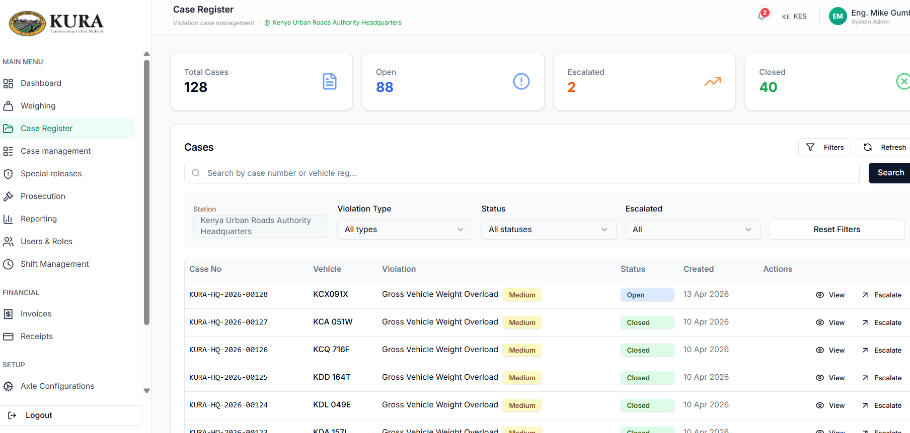
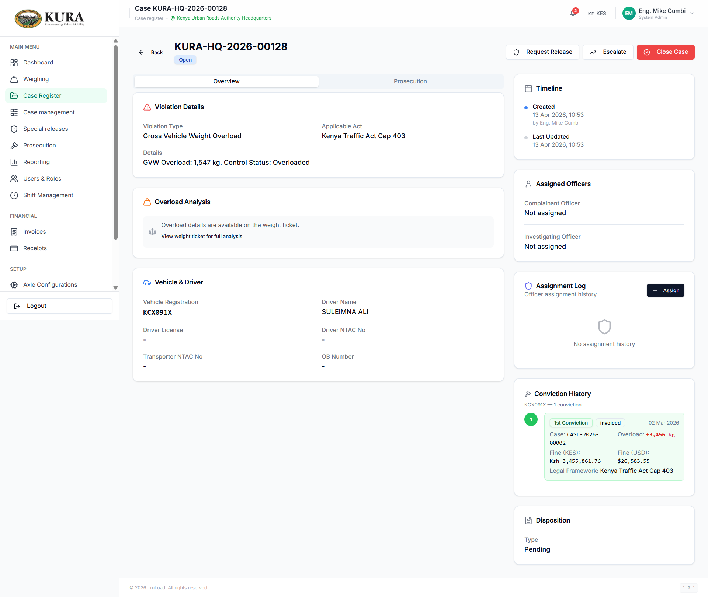
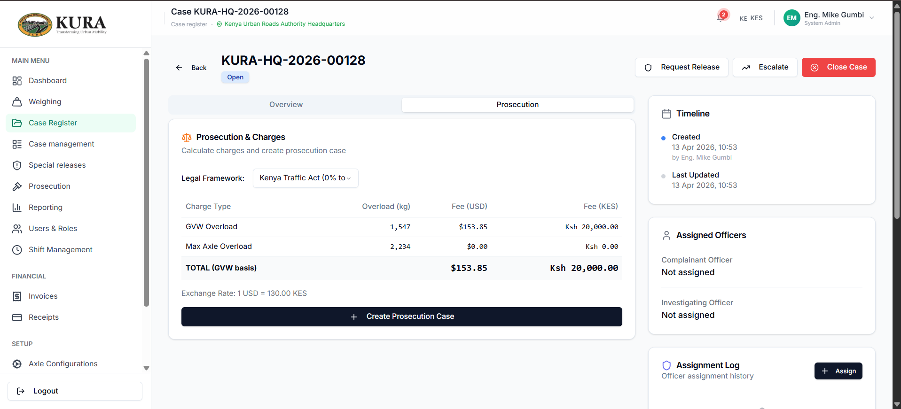
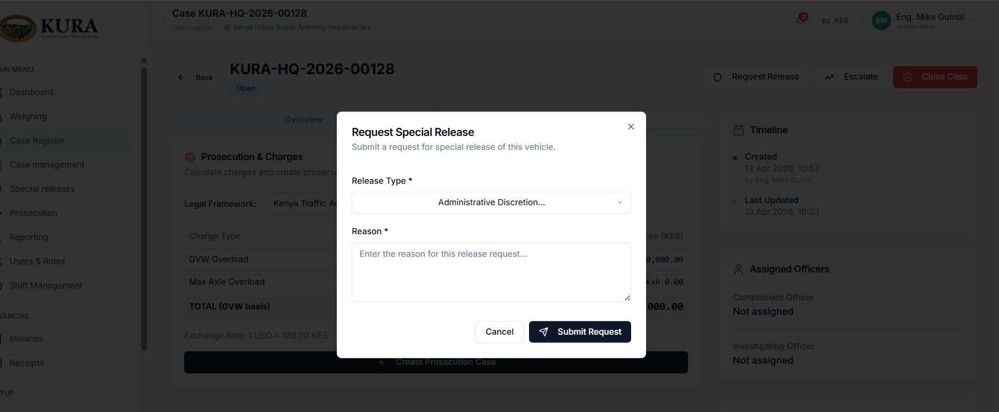
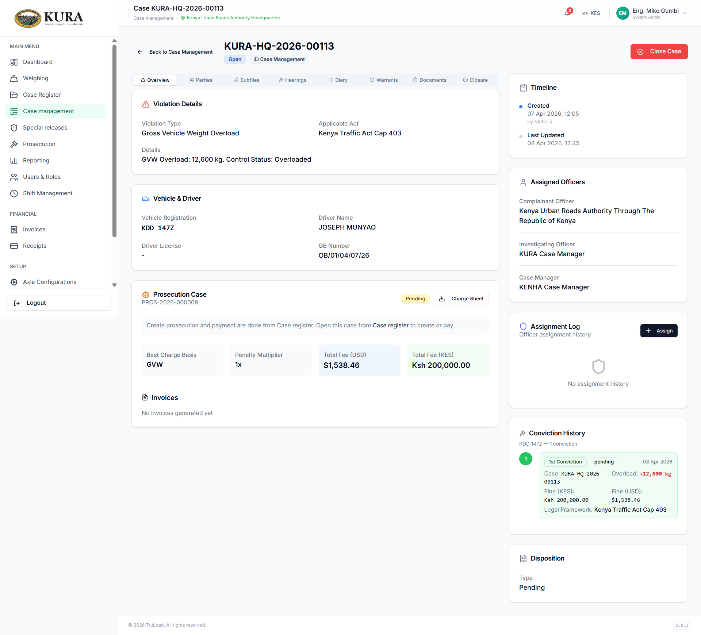
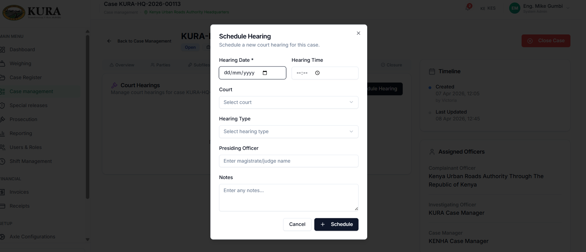
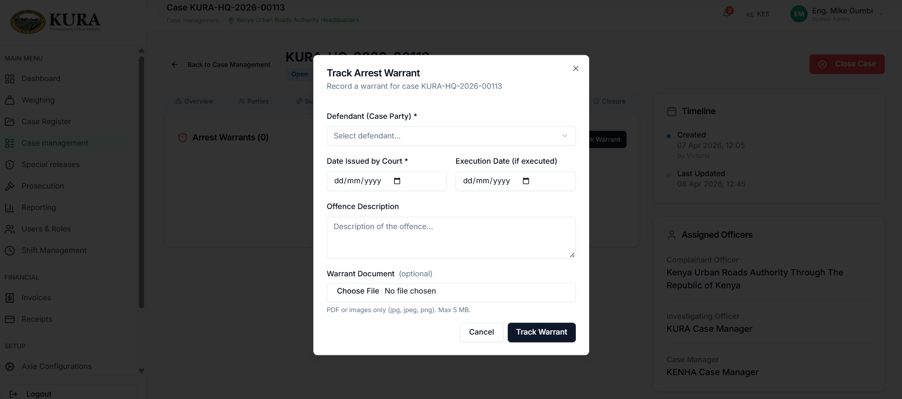
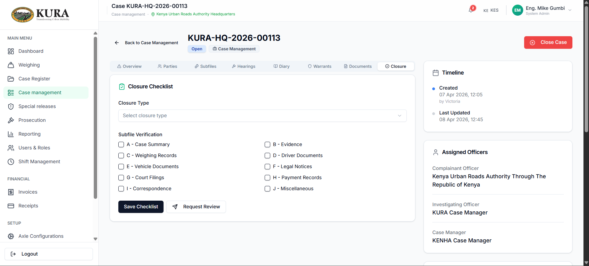
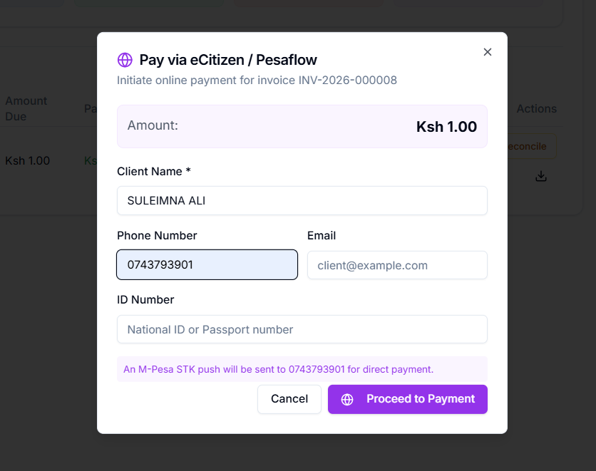

# Case and Prosecution Workflow

## Case register workflow

1. Open `Case Register`.
2. Search using either:
   - **General search** — matches weighing reference or case number
   - **Vehicle Reg** field — dedicated plate-number search; space-normalised so `KCX091X` and `KCX 091X` return the same results
3. Open the case details panel and review:
   - violation context
   - legal references
   - vehicle and operator details
   - yard/hold linkage
4. Add/update notes.
5. Choose next action:
   - escalate to prosecution
   - escalate to case management
   - request special release

## Case management (court/escalation lifecycle)

1. Open `Case Management`.
2. Open target case from queue.
3. Manage legal workflow in sequence:
   - assign parties
   - manage subfiles
   - schedule hearings
   - attach documents
   - track warrants
   - complete closure checklist

## Prosecution and invoicing workflow

1. Open `Prosecution`.
2. Open prosecution item for the selected case.
3. Validate charges and legal basis.
4. Generate invoice.
5. Initiate settlement via available payment channel.
6. Verify success and downstream receipt generation.

## Joint liability — driver and owner charges

Under the Kenya Traffic Act Cap 403 and the EAC Vehicle Load Control Act, the **registered owner** and the **driver** are jointly and severally liable for overload offences. TruLoad reflects this in how charges are calculated and displayed.

### How charges are calculated

The fee schedule (stored in `AxleFeeSchedules`) gives the **per-party** amount for each overload band:

| What | Formula |
|---|---|
| Per-party fee | Fee band lookup (overload kg × conviction number) |
| Total billed | Per-party fee × 2 (driver + owner) |

The prosecution DTO exposes both values:

| Field | Meaning |
|---|---|
| `perPartyFeeKes` / `perPartyFeeUsd` | Amount each party owes individually |
| `totalFeeKes` / `totalFeeUsd` | Combined liability (what appears on the invoice) |

### Repeat offenders

A vehicle with a prior conviction within 12 months is treated as a second offence. TruLoad selects `convictionNumber = 2` from the fee schedule, which encodes the increased rate (typically 2× the first-offence band under Cap 403). No additional multiplier is applied on top of the band — the fee schedule is the single source of truth.

### Practical example

| Scenario | Per-party fee | Total billed |
|---|---|---|
| First offence, 5 000 kg GVW overload (Cap 403) | KES 5,000 | KES 10,000 |
| Second offence (within 12 months), same overload | KES 10,000 | KES 20,000 |

## Payment and closure handoff

1. Confirm payment success state.
2. Confirm receipt record is created.
3. Return to case flow for memo/reweigh/closure where required.

