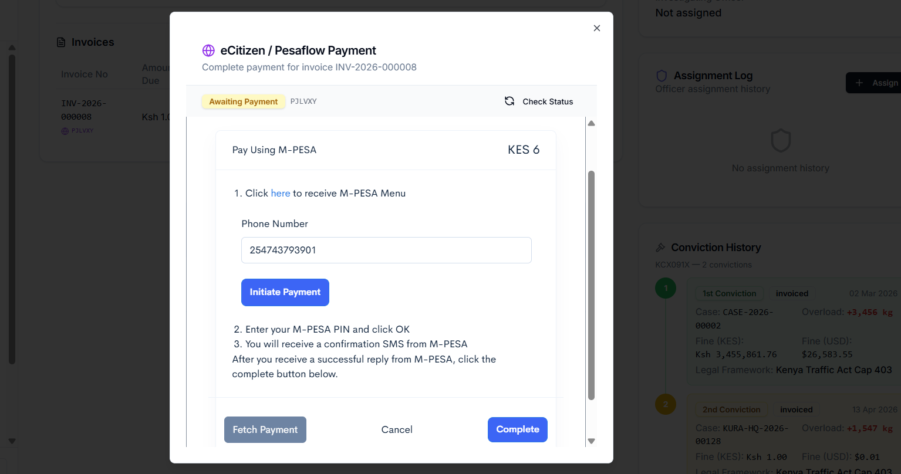
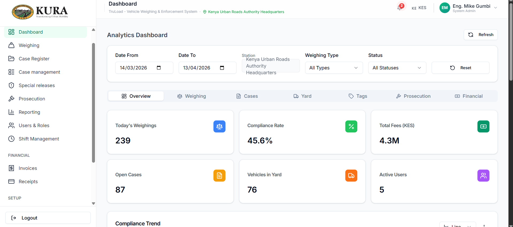
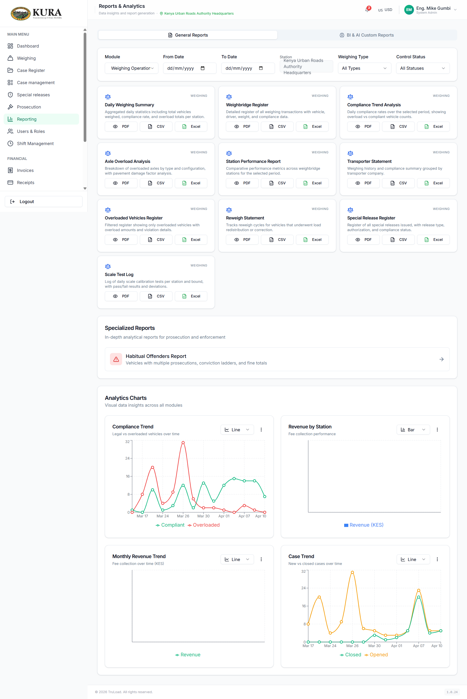

# Financial and Reporting Workflow

## Invoice-to-receipt operating flow

1. Open the prosecution/financial invoice list.

2. Select target invoice and confirm:
   - invoice number
   - amount due
   - status
   - linked case/prosecution record
   
3. Start settlement.

4. Choose payment channel (eCitizen/M-PESA or approved alternative channel).
5. Confirm response and wait for final payment success indication.

6. Open receipts and confirm receipt generation.

## M-PESA/eCitizen operator checks

1. Confirm STK push prompt is presented.

2. Confirm user receives phone prompt and authorizes payment.
3. Verify success confirmation in UI.
4. Verify receipt and updated status in invoice/receipt modules.

## Dashboard

The dashboard is the landing view after login. It surfaces the station's
daily totals (vehicles weighed, compliant/overloaded split, open cases,
pending invoices) and the shift-level summary for the signed-in operator.
Use it to confirm the shift is active and nothing from the previous shift is
left un-closed before you start capturing new weighings.

Typical start-of-shift checks from the dashboard:

1. Confirm your station and shift are shown in the header.
2. Check the "open cases" counter against the handover note; every open case
   should have an owner.
3. Check pending invoices; chase any with a payment retry flag before they
   time out the Pesaflow session.
4. Scan the weighing-hourly chart for any period with zero captures on a
   live lane — that usually means a scale-feed outage.

## Reporting flow

1. Open `Reporting`.
2. Select the report type — daily summary, overload detail, prosecution
   status, finance reconciliation, or shift performance.
3. Apply station/date/module filters. Dates default to the current shift; widen
   the range for end-of-month reports.
4. Validate the totals against the dashboard and the receipts page for the
   same period.
5. Export in PDF for sign-off or CSV for finance reconciliation.

Common reports and who reads them:

| Report | Primary audience | Frequency |
|---|---|---|
| Daily weighings summary | Station manager | End of each shift |
| Overload / prosecution register | Prosecution officer | Daily |
| Invoice & receipt reconciliation | Finance | Daily / monthly |
| Shift performance | Platform admin | Weekly |
| Compliance certificate log | Closure officer | As needed |

## Reconciliation checklist

- Invoice status is consistent with payment channel callback status.
- Receipt exists for settled invoices and is uniquely referenced.
- Case/prosecution progression aligns with payment completion.
- Any failed/pending payments are documented and retried per SOP.
