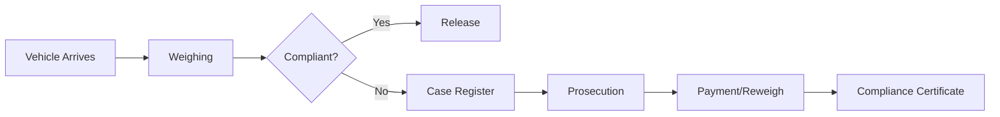

# Axle Load Enforcement Guide

TruLoad's enforcement module is designed for government agencies (KURA, KeNHA) responsible for enforcing vehicle weight limits under the **Kenya Traffic Act (Cap 403)** and **EAC Vehicle Load Control Act (2016)**.

## Workflow Overview

## Guides

| Guide | Description |
|-------|-------------|
| [Auth & Access](auth-and-access.md) | Login, roles, permissions, station context |
| [Weighing Operations](weighing.md) | Static, mobile, multideck capture; ticketing; reweigh |
| [Cases & Prosecution](case-and-prosecution.md) | Case register, court hearings, warrants, prosecution |
| [Financial & Reports](financial-and-reports.md) | Invoices, receipts, M-PESA, reporting |
| [Setup & Configuration](setup-rbac-truconnect.md) | Station setup, users, roles, TruConnect |
