# Setup, RBAC and TruConnect

## Initial station setup sequence

1. Open setup modules and configure axle templates.
2. Set tolerance values and legal/acts compliance parameters.
3. Configure weighing metadata and system defaults.
4. Save and verify values are active.

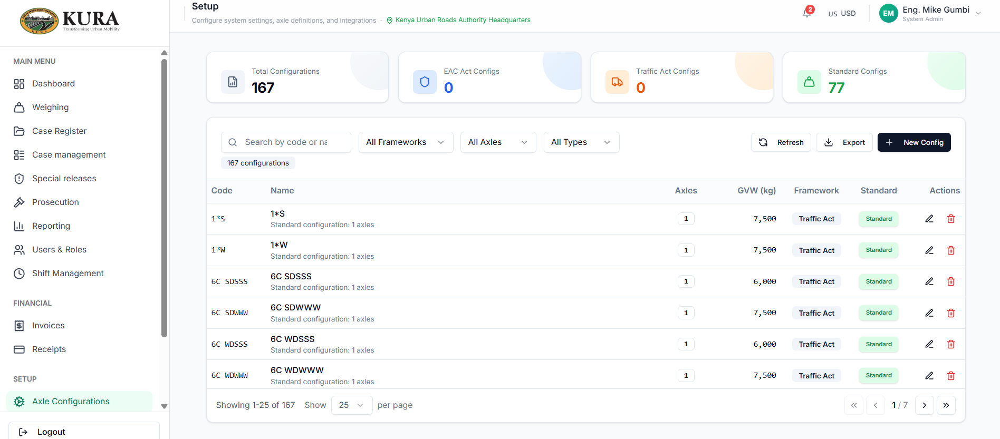
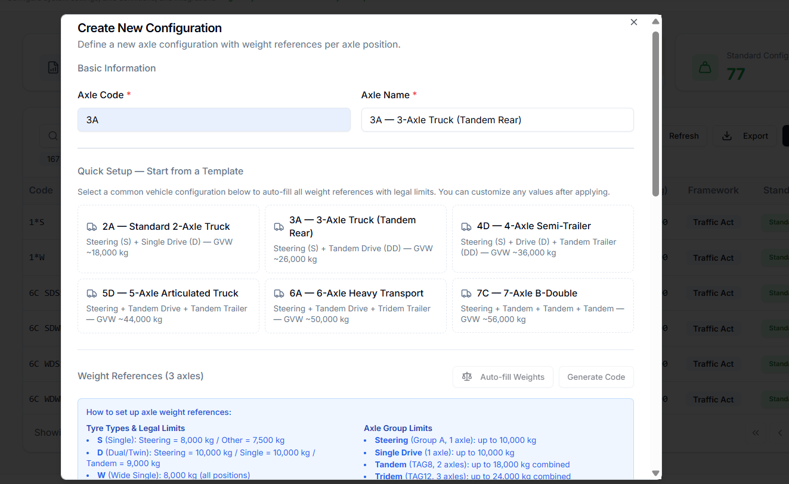
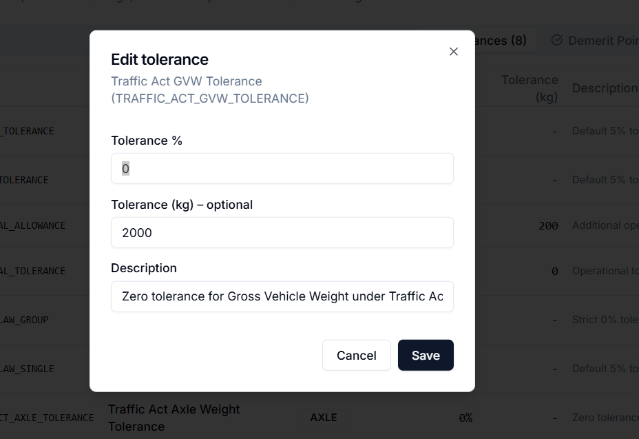
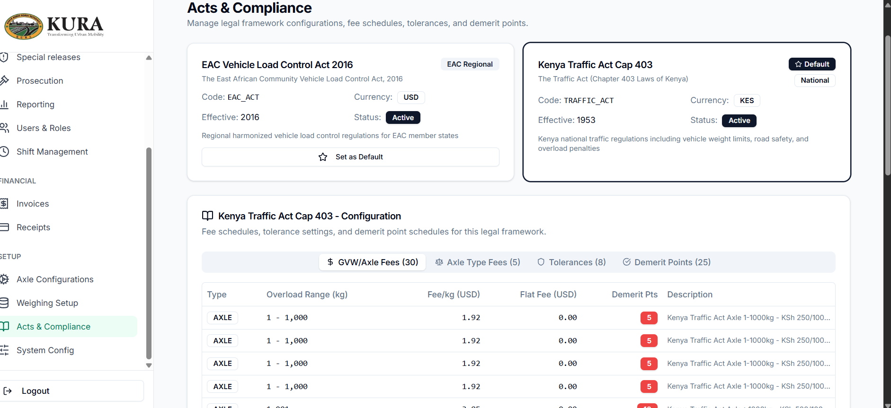
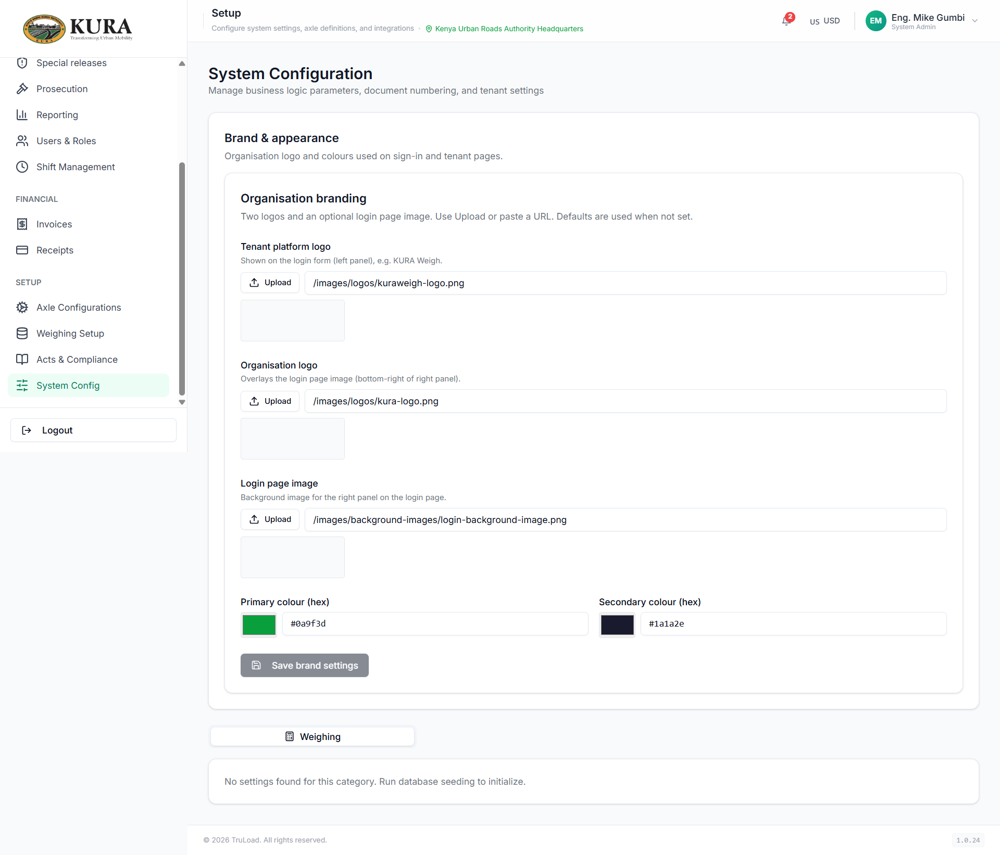

## User, role, and shift management (RBAC)

1. Open accounts management.
2. Create users with correct station/department mapping.
3. Assign role and permissions.
4. Create shift rotations.
5. Assign users to shifts.
6. Verify login/module visibility from assigned role profile.

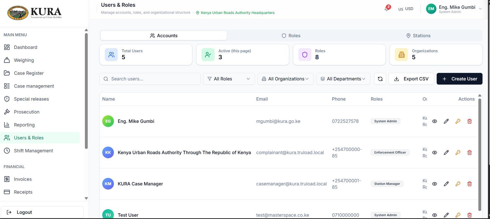
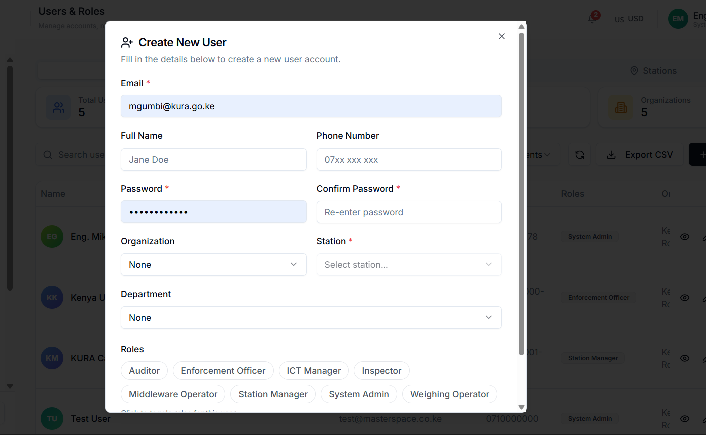
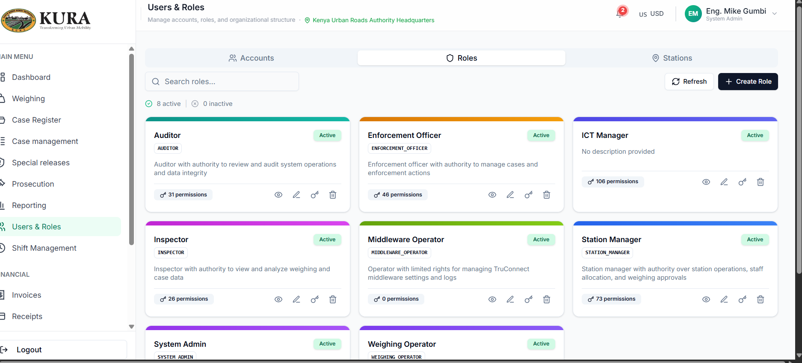
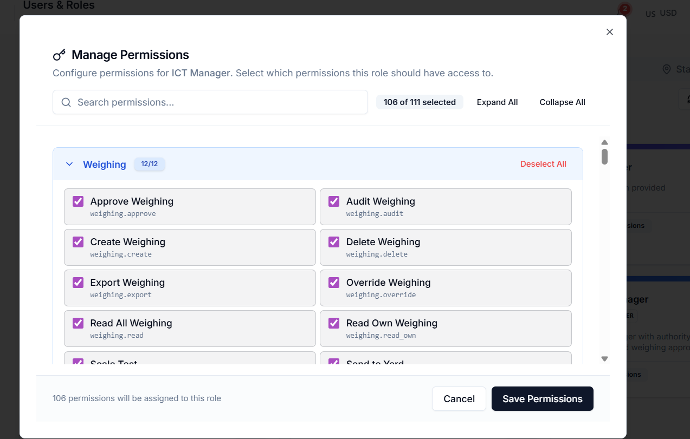
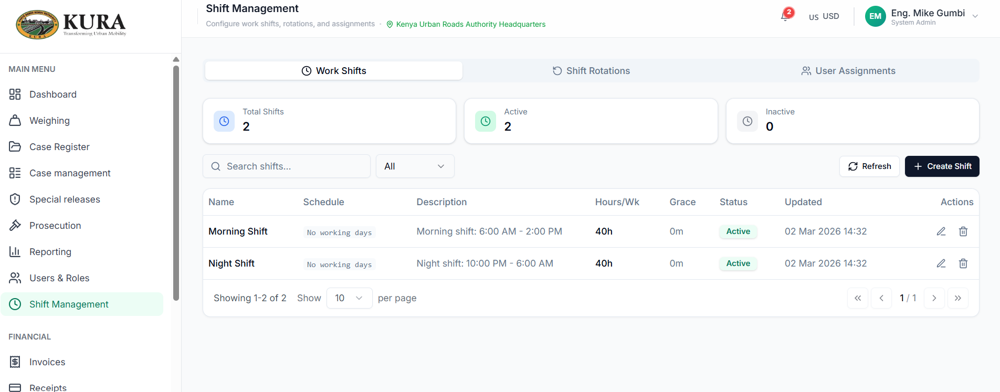
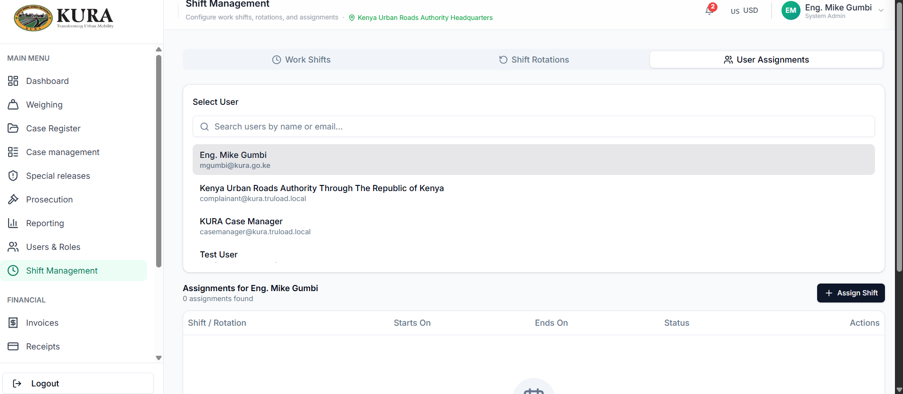

## TruConnect configuration and verification

1. Install and launch TruConnect on the workstation attached to scale hardware.
2. Configure general settings and account credentials.
3. Configure input source and output channels.
4. Configure auto-weight and threshold behavior.
5. Validate live data feed to frontend weighing screen.
6. Confirm RDU and device mappings where used.

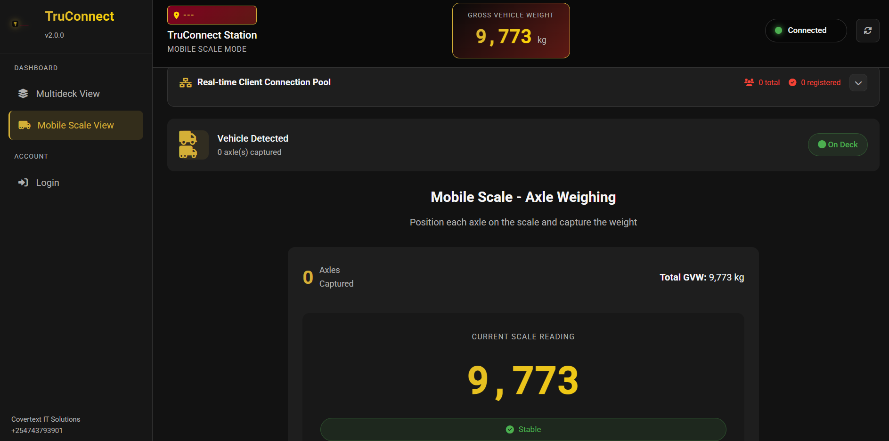
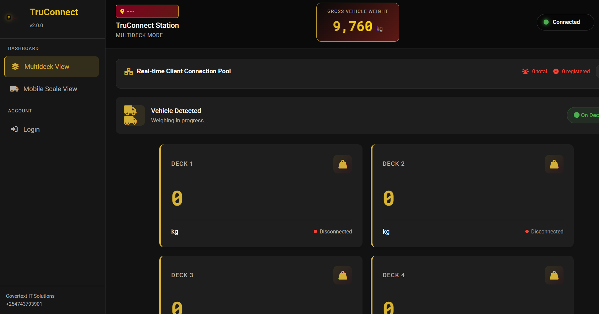
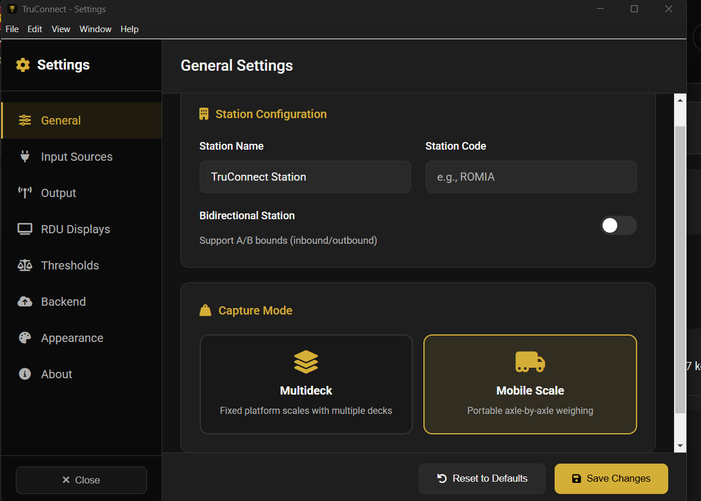
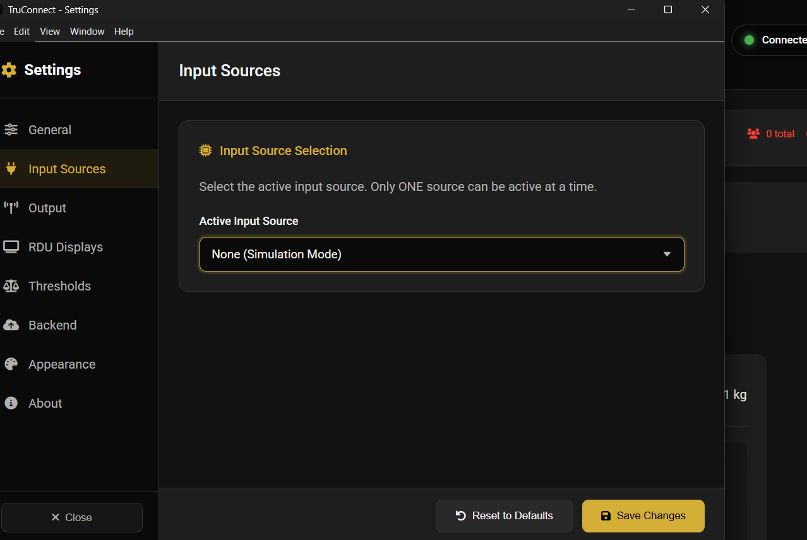
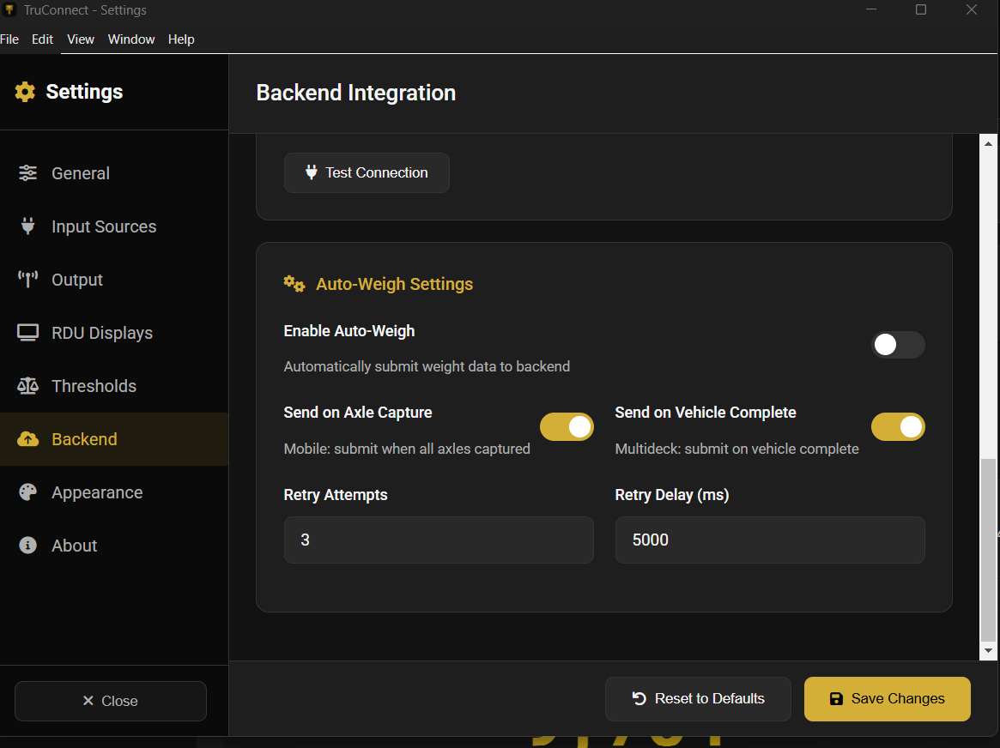
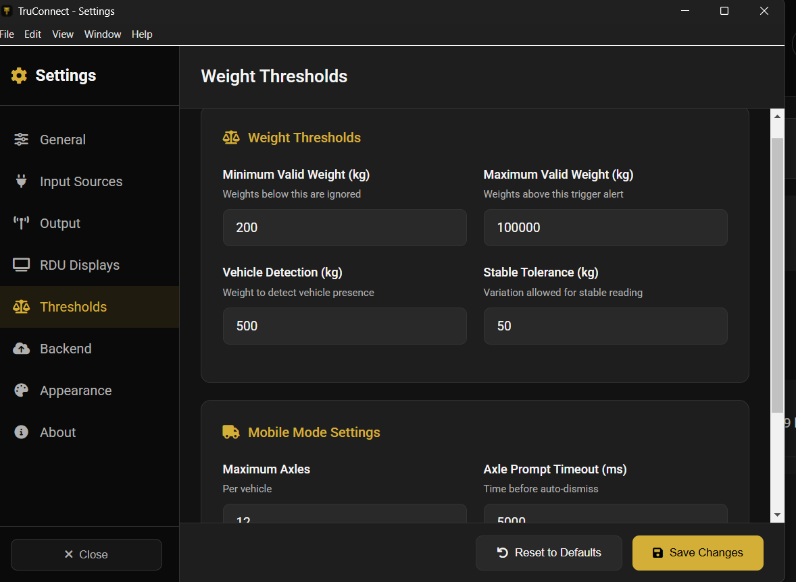

## Post-setup validation checklist

- Weighing module receives live scale values.
- Required modules are visible for each role.
- Role restrictions are enforced correctly.
- Shift assignments reflect in operator routing and accountability.
