# Weighing Workflow

## Scope

This section covers complete weighing operations from vehicle entry to decision and ticketing, for both mobile and multideck capture paths.

## Step-by-step weighing (operator flow)

1. Open `Weighing` and confirm station and shift are active.
2. Select capture mode:
   - `Mobile`
   - `Multideck`
3. Enter or confirm vehicle identification details.
4. Confirm transporter/driver details if required.
5. Start weight capture from connected scale or TruConnect source.
6. Validate axle/deck values before submission.
7. Submit weighing transaction.
8. Review decision output and proceed:
   - Compliant: issue ticket and release vehicle.
   - Within tolerance: continue special release path.
   - Overloaded: proceed to case and yard path.

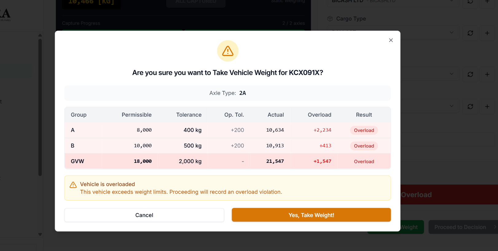
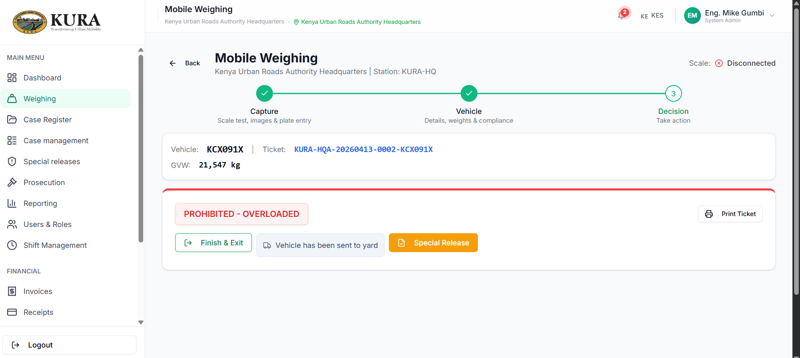

## Mobile capture sequence

1. Open mobile capture screen.
2. Confirm scale online indicator.
3. Capture first reading.
4. Move to vehicle details and validate metadata.
5. Complete and submit.

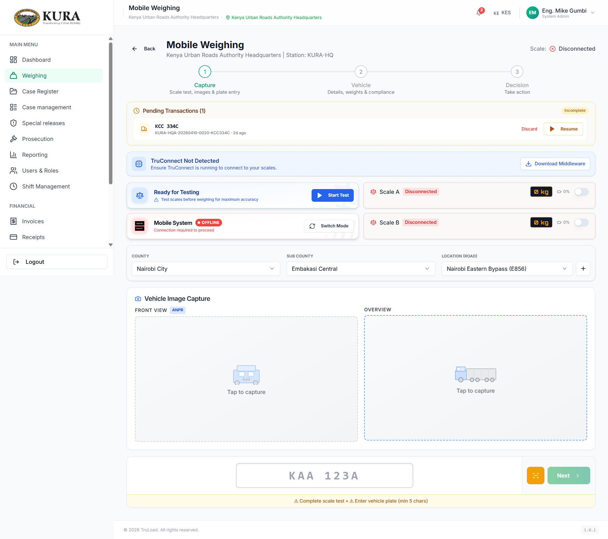
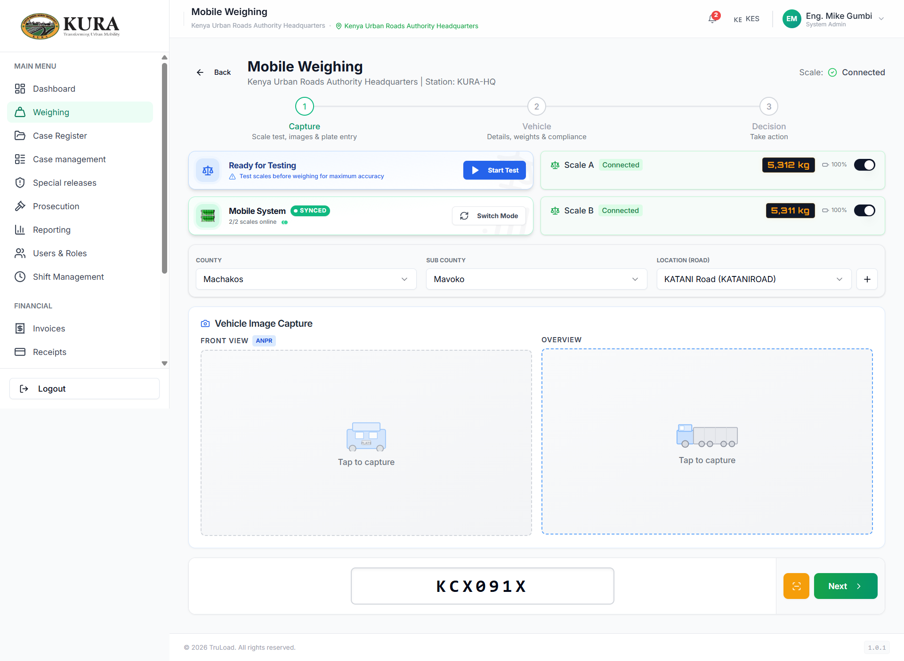
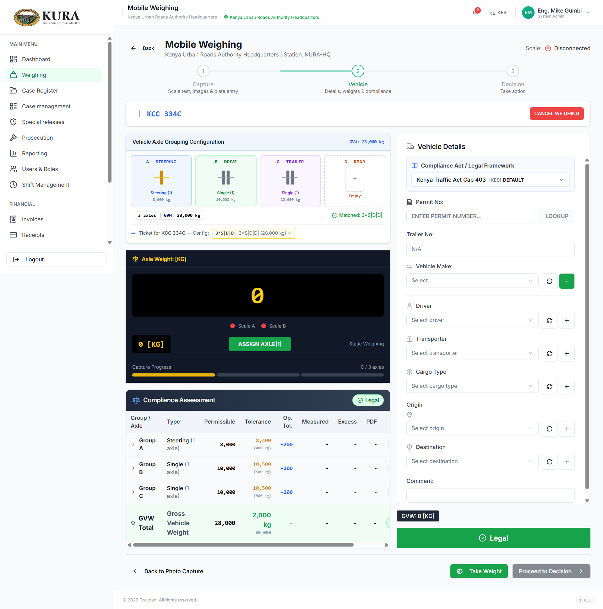

## Multideck capture sequence

1. Open multideck capture mode.
2. Confirm each deck/axle channel is receiving values.
3. Capture and submit full reading set.
4. Confirm system decision and generated ticket.

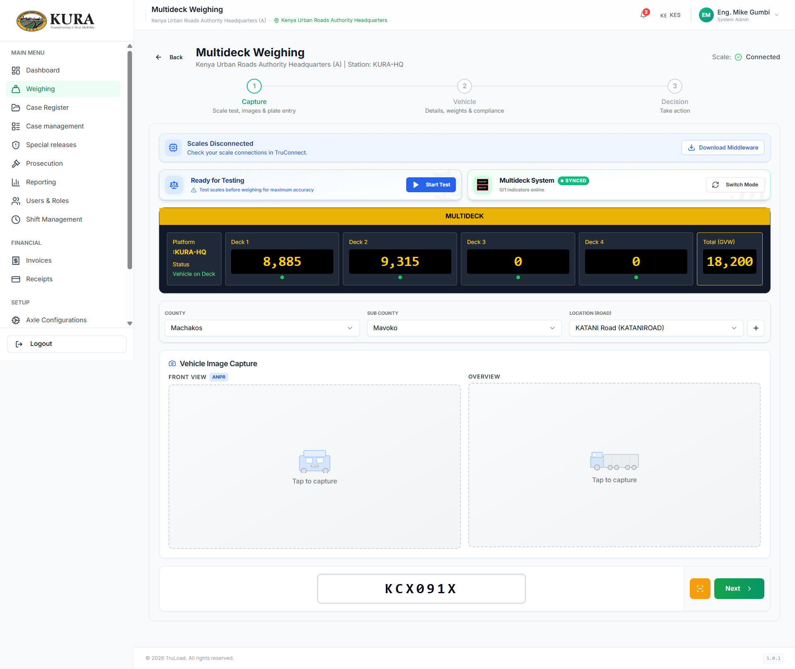
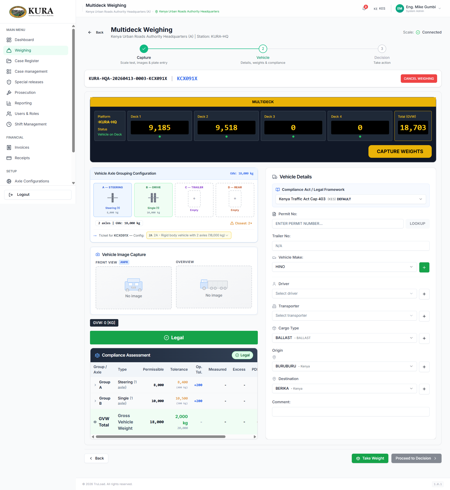

## Ticket, tags, and yard verification

1. Open ticket list and find latest transaction.
2. Validate ticket summary and image-line views.
3. Add or review tag status if required.
4. Check yard list when case/hold route is triggered.

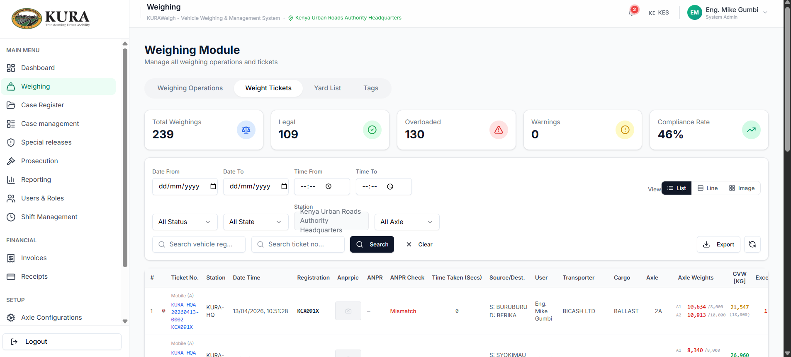
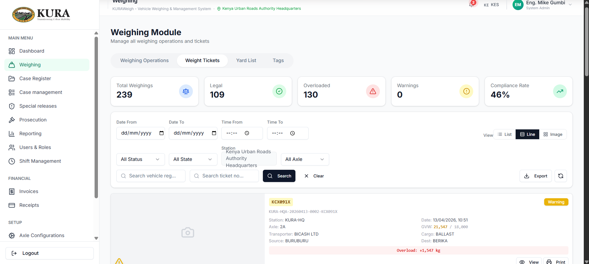
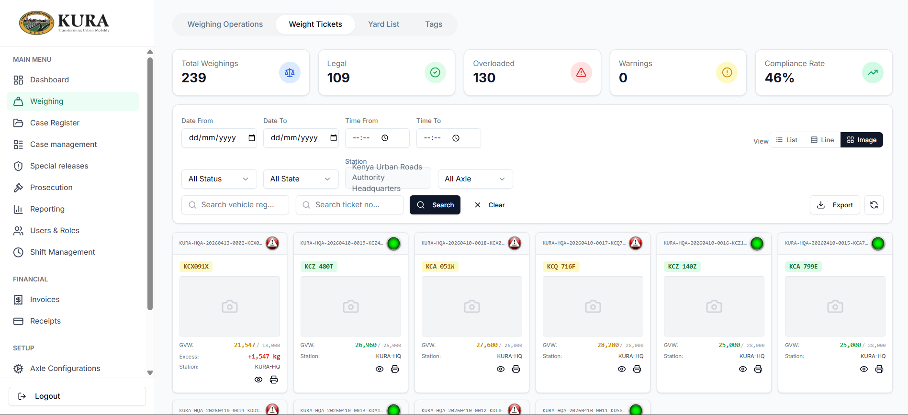
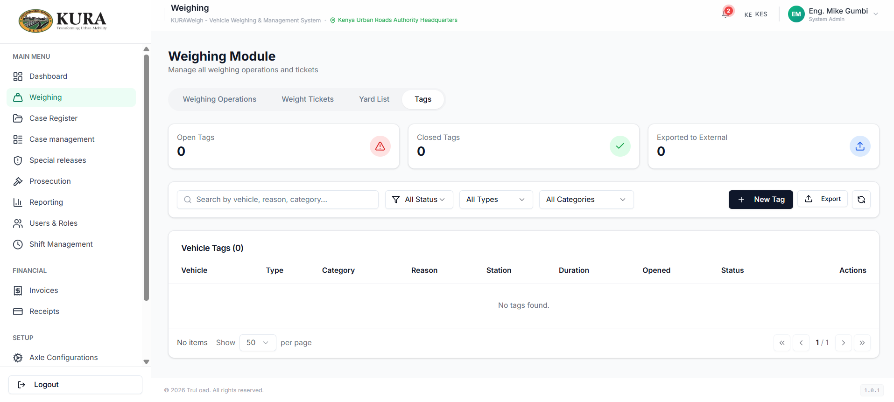
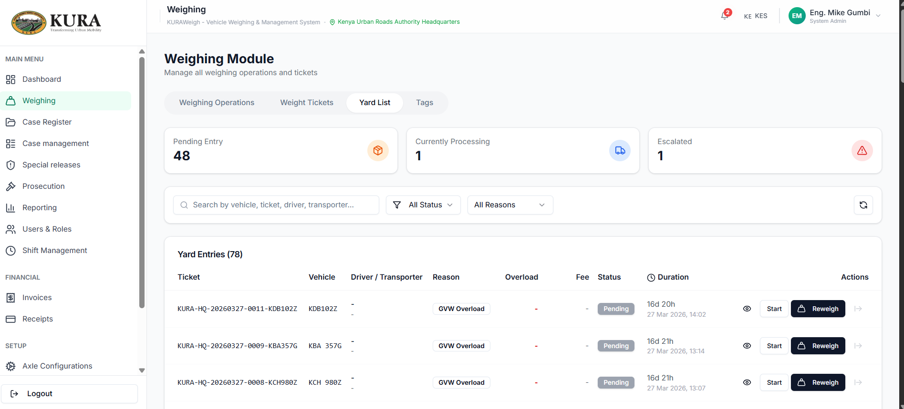

## Reweigh and closure support

1. Open case/prosecution item pending reweigh.
2. Re-capture corrected load weights.
3. Confirm compliance result.
4. Trigger compliance certificate and closure workflow where applicable.

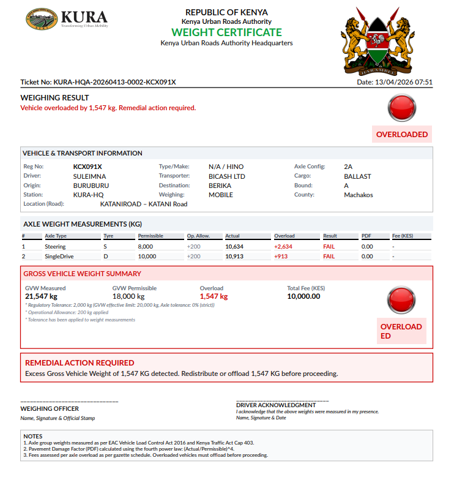

## Special release

Special release is the controlled path used when a vehicle cannot physically
offload at the yard (perishable cargo, hazmat, court order, or authorised
escort). The release is raised by a supervisor, requires a documented reason,
and always leaves an audit trail on the underlying case.

1. Open the case pending release and click `Request special release`.
2. Select the reason category and attach supporting documentation (court
   order, authorisation letter, perishable-goods manifest).
3. Supervisor reviews, approves, and signs off; the approval is recorded
   against their user ID with a timestamp.
4. System prints the special-release ticket and updates the yard entry to
   `released — special`.
5. The case remains open for follow-up reweigh or prosecution as specified
   by the release conditions.

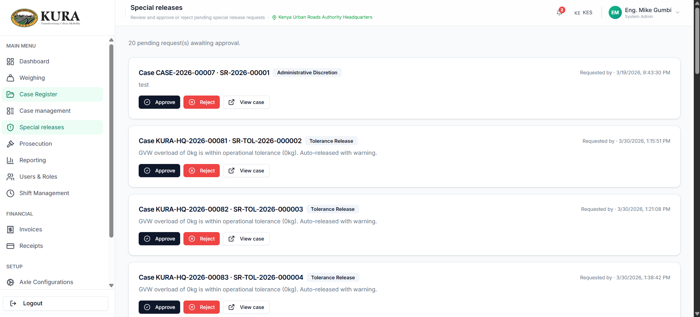

### Special release approval queue

The Special Releases page shows only **pending** items (not yet approved or rejected). Supervisors can filter the queue before acting:

| Filter | Description |
|---|---|
| Case No | Partial match on the case reference number |
| Release type | Category of the release reason |
| Date from / to | Narrow by when the release was requested |

**Approve / Reject buttons** are visible only on pending records. Records that are already approved or rejected display a status badge only; no action buttons are shown.

> Tolerance-based releases generated automatically by the weighing engine are created pre-approved and do not appear in the pending queue.
