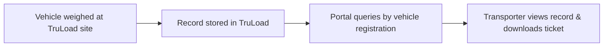

# Transporter Portal

The TruLoad Transporter Portal is a self-service web interface for **transporters, haulers, and fleet operators** who use TruLoad-equipped weighbridges. It provides read-only access to weighing history, weight tickets, and account management -- without requiring access to the full TruLoad operator interface.

## Audience

| User | What they do in the portal |
|------|---------------------------|
| **Fleet manager** | Monitor all vehicles in their fleet across multiple weighbridge sites |
| **Driver / operator** | View personal weighing history and download tickets |
| **Accounts / billing** | Reconcile invoiced weights against portal records |
| **Compliance officer** | Audit weighing records for regulatory or contractual compliance |

## Key Features

- **Cross-tenant visibility** -- view weighing records from any TruLoad site where your vehicles have been weighed
- **Weight ticket download** -- download PDF tickets for any completed transaction
- **Vehicle fleet register** -- manage your fleet's vehicle list and stored tare weights
- **Subscription management** -- choose and manage your portal access plan
- **Real-time notifications** -- receive alerts when a vehicle completes a weighing transaction

## Portal Sections

- :material-account-plus: **[Registration](registration.md)**

    Create your account and link your fleet

- :material-scale-balance: **[Weighing History](weighing-history.md)**

    View and download cross-tenant weighing records

- :material-credit-card: **[Subscriptions](subscriptions.md)**

    Compare plans and manage your subscription

## How It Works

The portal does not require the weighbridge operator to take any special action. As long as the vehicle's registration number matches the transporter's fleet register, the weighing record appears automatically in the portal.

!!! info "Data ownership"
    Weighing data is owned by the weighbridge operator (tenant). The portal provides **read-only** access to transporters. Operators can disable portal visibility for specific transactions if needed.
