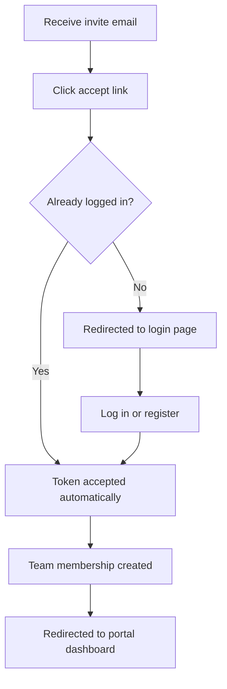

# Accepting a Team Invite

When a portal account owner invites a colleague, the invitee receives an email with a secure link. This page describes what happens when that link is clicked.

## Flow



## Steps

### 1. Click the invite link

The link in the email looks like:

```
https://portal.truload.example.com/portal/invite/accept?token=<64-char-token>
```

### 2. Log in or register

If you are not already logged in, the page redirects you to the login screen. After logging in (or creating a new portal account), you are returned to the invite acceptance page automatically.

### 3. Invite accepted

The system links your portal account to the transporter. You now have access based on the role the owner assigned (Admin, Manager, or Viewer).

## Expiry

Invitation links are valid for **7 days** from the time they were sent. If the link has expired:

1. Ask the account owner to send a new invitation from **Settings > Team > Invite Member**.

## Troubleshooting

| Issue | Resolution |
|-------|-----------|
| "Token not found or expired" | The link is more than 7 days old. Request a new invite. |
| "You are already a member" | Your account is already linked to this transporter. |
| "Invite email belongs to a different account" | Log in with the email address the invite was sent to, then try the link again. |
