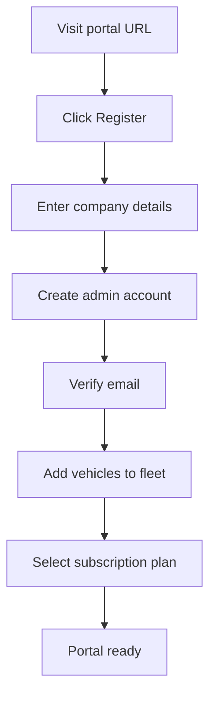

# Registration

The Transporter Portal uses a self-service registration flow. No invitation from a weighbridge operator is required -- any transporter can sign up and start viewing their weighing history immediately.

## Registration Flow

## Step-by-Step

### 1. Create your account

1. Navigate to the TruLoad Transporter Portal URL.
2. Click **Register**.
3. Enter your company details:

| Field | Required | Description |
|-------|----------|-------------|
| Company name | Yes | Legal name of the transport company |
| Registration number | Yes | Business registration / KRA PIN |
| Contact email | Yes | Primary contact for account communications |
| Phone number | Yes | Mobile number (used for M-PESA billing) |
| Physical address | No | Company address |

4. Create your admin user account (name, email, password).
5. Accept the terms of service.

### 2. Verify your email

A verification link is sent to the email address provided. Click the link to activate your account. The link expires after 24 hours.

!!! warning "Check spam folder"
    If you do not receive the verification email within 5 minutes, check your spam/junk folder. If still missing, click **Resend Verification** on the login page.

### 3. Add vehicles to your fleet

After logging in for the first time:

1. Navigate to **Fleet > Vehicles**.
2. Click **Add Vehicle**.
3. Enter the vehicle registration number (plate).
4. Optionally enter vehicle details (make, model, axle configuration, manufacturer tare weight).
5. Repeat for all vehicles in your fleet.

!!! tip "Bulk import"
    For large fleets, use the **Import CSV** option to upload multiple vehicles at once. The CSV format is: `registration, make, model, axle_count, tare_weight`.

### 4. Select a subscription plan

New accounts start with a **7-day free trial** on the Standard plan. Before the trial expires, select a plan from the [Subscriptions](subscriptions.md) page.

## Adding Team Members

The admin account holder can invite additional users:

1. Navigate to **Settings > Team**.
2. Click **Invite User**.
3. Enter their email and assign a role:

| Role | Access |
|------|--------|
| **Admin** | Full access including billing and team management |
| **Manager** | Fleet management, weighing history, ticket downloads |
| **Viewer** | Read-only access to weighing history |

4. The invited user receives an email with a link to set their password.

## Account Security

- Passwords must be at least 12 characters with mixed case, numbers, and symbols
- Two-factor authentication (2FA) is available and recommended for admin accounts
- Sessions expire after 30 minutes of inactivity
- All login attempts are logged and visible under **Settings > Security Log**
