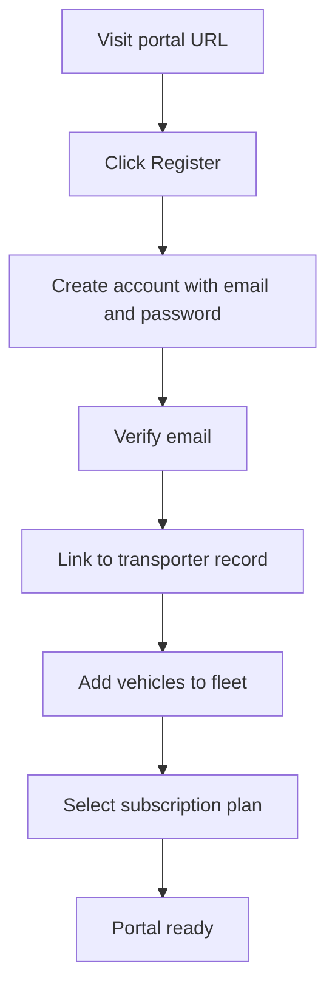

# Registration

The Transporter Portal uses a self-service registration flow. To access weighing history, your company must already be registered as a transporter at one or more weighbridges using TruLoad. During portal registration you link your account to your transporter record by matching your registered email address, phone number, or transporter code.

## Registration Flow

```mermaid
flowchart TD
    A[Visit portal URL] --> B[Click Register]
    B --> C[Create account with email and password]
    C --> D[Verify email]
    D --> E[Link to transporter record]
    E --> F[Add vehicles to fleet]
    F --> G[Select subscription plan]
    G --> H[Portal ready]
```

## Step-by-Step

### 1. Create your account

1. Navigate to the TruLoad Transporter Portal URL.
2. Click **Register**.
3. Enter your name, email address, and a password.
4. Accept the terms of service.

### 2. Verify your email

A verification link is sent to the email address provided. Click the link to activate your account. The link expires after 24 hours.

!!! warning "Check spam folder"
    If you do not receive the verification email within 5 minutes, check your spam/junk folder. If still missing, click **Resend Verification** on the login page.

### 3. Link your transporter record

After verifying your email:

1. Navigate to **Settings > Account**.
2. Click **Link Transporter**.
3. Enter one of the following identifiers that matches your record at the weighbridge:

| Identifier | Description |
|-----------|-------------|
| Email | The email address registered for your company at the weighbridge |
| Phone number | The phone number on your transporter record |
| Transporter code | The short code assigned by the weighbridge operator |

4. Click **Link**. Your weighing history and vehicle data will be available once the link is confirmed.

!!! info "Not finding a match?"
    Contact the weighbridge operator to confirm your registered email, phone, or code. Your transporter record must exist in their TruLoad system before you can link it.

### 5. Add vehicles to your fleet

After logging in for the first time:

1. Navigate to **Fleet > Vehicles**.
2. Click **Add Vehicle**.
3. Enter the vehicle registration number (plate).
4. Optionally enter vehicle details (make, model, axle configuration, manufacturer tare weight).
5. Repeat for all vehicles in your fleet.

!!! tip "Bulk import"
    For large fleets, use the **Import CSV** option to upload multiple vehicles at once. The CSV format is: `registration, make, model, axle_count, tare_weight`.

### 6. Select a subscription plan

New accounts start with a **7-day free trial** on the Standard plan. Before the trial expires, select a plan from the [Subscriptions](subscriptions.md) page.

## Adding Team Members

The admin account holder can invite additional users:

1. Navigate to **Settings > Team**.
2. Click **Invite User**.
3. Enter their email and assign a role:

| Role | Access |
|------|--------|
| **Admin** | Full access including billing and team management |
| **Manager** | Fleet management, weighing history, ticket downloads |
| **Viewer** | Read-only access to weighing history |

4. The invited user receives an email with a link to set their password.

## Account Security

- Passwords must be at least 12 characters with mixed case, numbers, and symbols
- Two-factor authentication (2FA) is available and recommended for admin accounts
- Sessions expire after 30 minutes of inactivity
- All login attempts are logged and visible under **Settings > Security Log**
