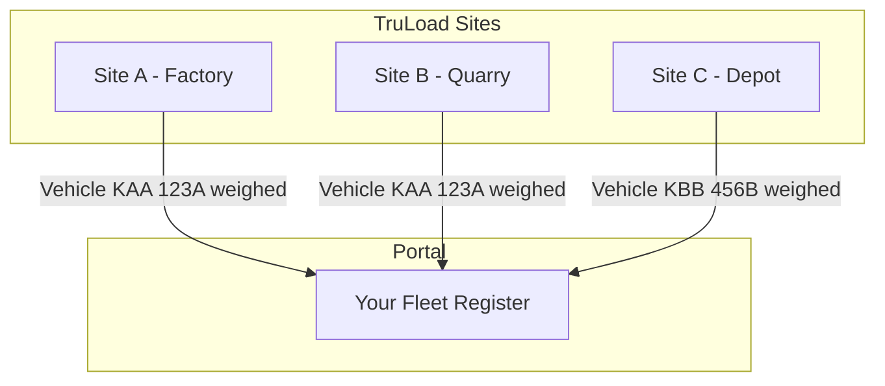

# Weighing History

The weighing history view is the primary feature of the Transporter Portal. It aggregates weighing records for your fleet vehicles across **all TruLoad-equipped weighbridge sites**, giving you a single pane of glass for your transport operations.

## Cross-Tenant Data Access

When any of your registered vehicles is weighed at any TruLoad site, the record appears in your portal automatically. No coordination with the site operator is needed.

!!! info "Matching logic"
    Records are matched by **vehicle registration number**. Ensure your fleet register has the exact plate numbers used at weighbridge sites (including any spaces or formatting).

## Viewing Records

### List View

The default view shows all weighing transactions for your fleet, most recent first.

| Column | Description |
|--------|-------------|
| Date/Time | When the transaction was completed |
| Vehicle | Registration number |
| Site | Weighbridge station name |
| Cargo | Cargo type (as recorded by the operator) |
| Gross (kg) | Gross weight |
| Tare (kg) | Tare weight |
| Net (kg) | Calculated net weight |
| Status | Final, Interim, or Voided |

### Filtering

Filter the list by:

- **Date range** -- select a start and end date
- **Vehicle** -- select one or more vehicles from your fleet
- **Site** -- filter by specific weighbridge location
- **Cargo type** -- filter by commodity
- **Status** -- show only completed, pending, or voided transactions

### Sorting

Click any column header to sort ascending or descending.

## Transaction Detail

Click any row to open the full transaction detail, which includes:

- Complete weight breakdown (gross, tare, net, deductions if applicable)
- Quality parameters (moisture, foreign matter, grade)
- Operator name and station
- Timestamps for each pass (first and second weighing)
- Tare source (measured, stored, or preset)

## Downloading Tickets

### Single ticket

From the transaction detail view, click **Download Ticket (PDF)** to get the official weight ticket.

### Bulk download

1. Use filters to select the transactions you need.
2. Select transactions using the checkboxes.
3. Click **Download Selected** to generate a ZIP file containing all selected tickets as PDFs.

### CSV export

Click **Export CSV** to download the filtered transaction list as a spreadsheet for reconciliation or analysis.

## Notifications

Configure notifications under **Settings > Notifications**:

| Notification | Channel | Description |
|-------------|---------|-------------|
| Transaction complete | Email, SMS | Sent when a vehicle completes weighing |
| Daily summary | Email | End-of-day summary of all transactions |
| Anomaly alert | Email | Sent when a transaction is flagged (tolerance breach, tare drift) |

## Data Retention

- Weighing records are available in the portal for **24 months** from the transaction date
- After 24 months, records are archived but can be requested from the platform administrator
- Downloaded tickets (PDFs) are yours to keep indefinitely
