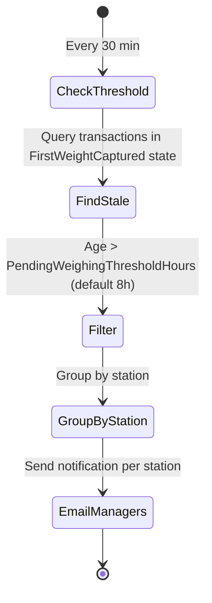
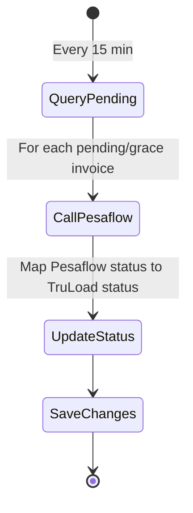

# Background Jobs

TruLoad uses **Hangfire** with PostgreSQL storage for all background and recurring job processing.

## Dashboard

The Hangfire dashboard is accessible at `/hangfire` (admin cookie authentication required).

## Recurring Jobs

| Job Name | Class | Schedule | Queue | Retries | Description |
|----------|-------|----------|-------|---------|-------------|
| `pesaflow-invoice-sync` | `PesaflowInvoiceSyncJob` | `*/15 * * * *` | `payments` | 3 | Syncs pending invoice statuses from Pesaflow API |
| `exchange-rate-sync` | `ExchangeRateSyncJob` | `0 0 * * *` | `default` | 3 | Updates USD/KES exchange rates |
| `automated-database-backup` | `BackupScheduleJob` | `0 2 * * *` | `default` | 3 | Creates a PostgreSQL backup to local storage |
| `mv-refresh` | `MaterializedViewRefreshJob` | `*/30 * * * *` | `default` | 3 | Refreshes all PostgreSQL materialized views |
| `report-schedule-runner` | `ReportScheduleJob` | `*/5 * * * *` | `default` | 3 | Runs any scheduled report definitions that are due |
| `stale-weighing-alert` | `StaleWeighingNotificationJob` | `*/30 * * * *` | `default` | 3 | Emails station managers about open first-weight-only transactions past the configured threshold |
| `portal-daily-summary` | `PortalDailySummaryJob` | `0 4 * * *` | `default` | 2 | Emails each portal transporter their previous day's weighing summary (04:00 UTC = 07:00 EAT) |
| `commercial-periodic-billing` | `CommercialPeriodicBillingJob` | `30 4 * * *` | `default` | 3 | Rolls up commercial weighings under a Daily/Weekly/Monthly `CommercialTariffRule` into one periodic invoice (04:30 UTC = 07:30 EAT, after `portal-daily-summary`) |
| `portal-anomaly-alert` | `PortalAnomalyAlertJob` | `0 * * * *` | `default` | 1 | Detects transactions where actual net weight differs from expected by >5% and emails the transporter |

## Queues

| Queue | Purpose |
|-------|---------|
| `critical` | Reserved for time-sensitive system jobs |
| `payments` | Pesaflow and payment sync jobs (isolated from other work) |
| `default` | All other recurring and enqueued jobs |

Workers in production: **10**. Workers in non-production: **5** (configurable via `HANGFIRE_WORKER_COUNT` env var logic in Program.cs).

## On-Demand Jobs (Enqueued)

| Trigger | Job | Description |
|---------|-----|-------------|
| `POST /portal/weighings/bulk-download` (>50 tickets) | `BulkDownloadJob` | Generates a ZIP of ticket PDFs asynchronously. Poll `/portal/weighings/bulk-download/{jobId}/status` to check when ready. |

## Job Architecture

All jobs follow the `IServiceScopeFactory` pattern to avoid scoped-service lifetime issues:

```csharp
public class PortalDailySummaryJob
{
    private readonly IServiceScopeFactory _scopeFactory;

    public async Task ExecuteAsync()
    {
        await using var scope = _scopeFactory.CreateAsyncScope();
        var dbContext = scope.ServiceProvider.GetRequiredService<TruLoadDbContext>();
        // ...
    }
}
```

**Important**: Jobs have no `ITenantContext`. Any service call that depends on tenant context must use `IgnoreQueryFilters()` for DB queries and pass `tenantSlug` explicitly to notification services.

## ASP.NET Core Hosted Services (BackgroundService)

In addition to Hangfire jobs, TruLoad runs long-lived background services registered via `AddHostedService`. These are not visible in the Hangfire dashboard — they run as .NET `IHostedService` instances within the process.

### SubscriptionCacheInvalidationService

| Property | Value |
|----------|-------|
| Class | `Services.Background.SubscriptionCacheInvalidationService` |
| Trigger | NATS subject `tenant.subscription.updated` (event-driven, not scheduled) |
| Redis key invalidated | `sub:status:{orgId}` |
| Enabled by | `Nats:Enabled = true` in configuration |

**What it does:**

Whenever subscriptions-api publishes a `tenant.subscription.updated` event (on plan change or status change for any tenant), this service:

1. Parses the `tenant_slug` from the event payload
2. Resolves `tenant_slug → Organization.SsoTenantSlug → org.Id` via a scoped DB query
3. Deletes the `sub:status:{orgId}` Redis key

Without this, `SubscriptionEnforcementMiddleware` would continue serving the cached (potentially stale) status for up to 60 seconds. With it, the next request after a plan change hits subscriptions-api for a fresh status.

**Configuration:**

```json
"Nats": {
  "Url": "nats://localhost:4222",
  "Enabled": false
}
```

Set `Nats:Enabled = false` (the default) in development to prevent startup failures when NATS is not running locally.

**Current production state: `Nats:Enabled` is `false` in production today.** There is no
`NATS__URL`/`NATS__ENABLED` environment override anywhere in this service's deployment config
(`devops-k8s/apps/truload-backend/`) — `appsettings.json`'s `false` default is what actually runs.
NATS itself is healthy in-cluster; this app's toggle to use it has simply never been flipped. This
affects both hosted services below identically, since they share the one `Nats:Enabled` flag.

**Why `sub:status:{orgId}` and not `tenant:{slug}`?**

All other Codevertex Go services use `tenant:{slug}` as their Redis subscription cache key. TruLoad predates the uniform pattern and uses `sub:status:{orgId}` (org UUID). The `SubscriptionCacheInvalidationService` handles the slug→UUID translation transparently.

### AuthDemoSyncService

| Property | Value |
|----------|-------|
| Class | `Services.Background.AuthDemoSyncService` |
| Trigger | NATS JetStream stream `auth`, subjects `auth.user.>` (durable, ack-explicit consumer) |
| Enabled by | `Nats:Enabled = true` in configuration (same flag as `SubscriptionCacheInvalidationService` above) |

**What it does:**

Syncs auth-api's shared `codevertex-demo` tenant's weighing-relevant personas
(`commercial.operator@`, `quarry.finance@`, `waste.operator@`, plus the enforcement demo staff,
etc. — see the class's `RoleMap`) into outlet-scoped local Organizations/Stations, so a prospect
can practice or train on TruConnect against the shared demo tenant without any risk of fake data
landing on a real organization. Each demo outlet (`COMM`/`QUARRY`/`WASTE`/`ENF`) maps to its own
Organization + Station pair via a small static `OutletOrgMap`, keyed by outlet code. On
`auth.user.created`/`updated` it finds-or-updates the matching `ApplicationUser` by email; on
`auth.user.deleted` it deactivates the account (`LockoutEnd = MaxValue`) rather than hard-deleting,
since TruLoad has real FKs from users into weighing/case data that a hard delete could violate.

**Current real-world state: this service has never executed in production.** Because it shares
the `Nats:Enabled` flag documented above, and that flag is `false` in production with no override,
the service's `ExecuteAsync` logs `NATS auth-demo sync disabled (Nats:Enabled=false)` and returns
immediately on every pod start. None of the demo personas or outlet organizations it is responsible
for creating exist live today. This is tracked as Blocker 2 in the commercial-weighing initiative's
audit plan (see that plan's "CRITICAL PATH" section) — the fix is an infra change
(`Nats__Enabled=true` on the `truload-backend-env` Secret plus a restart), not a code change; all
code for this service is written, committed, and CI-green.

---

## Stale Weighing Alert Flow



## Invoice Sync Flow



## Job Retention

Completed and failed jobs are retained for **48 hours** (configured via `WithJobExpirationTimeout`), then auto-deleted by Hangfire's built-in cleanup.

## Monitoring

- View current job queue depth and failures in the Hangfire dashboard at `/hangfire`
- Failed jobs appear under the **Failed** tab and can be retried manually
- Worker health is visible under the **Servers** tab
