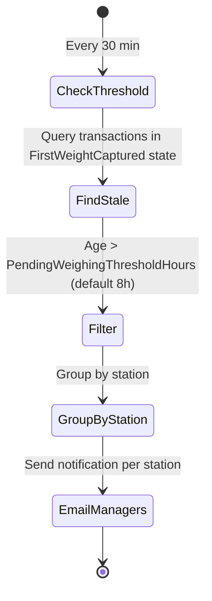
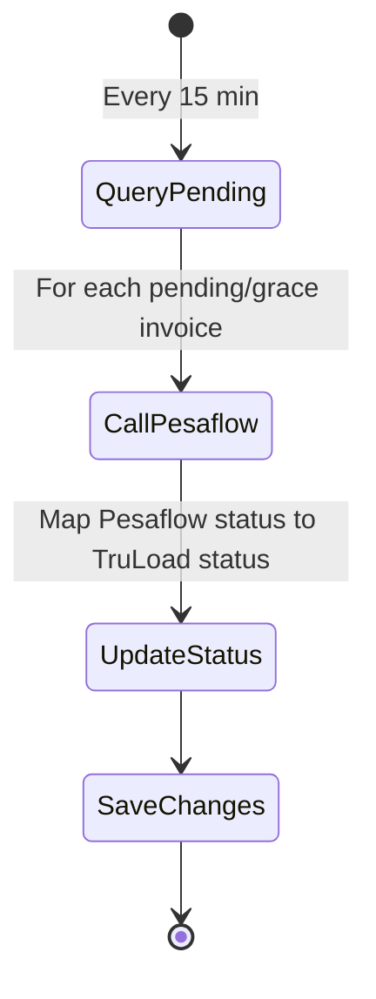

# Background Jobs

TruLoad uses **Hangfire** with PostgreSQL storage for all background and recurring job processing.

## Dashboard

The Hangfire dashboard is accessible at `/hangfire` (admin cookie authentication required).

## Recurring Jobs

| Job Name | Class | Schedule | Queue | Retries | Description |
|----------|-------|----------|-------|---------|-------------|
| `pesaflow-invoice-sync` | `PesaflowInvoiceSyncJob` | `*/15 * * * *` | `payments` | 3 | Syncs pending invoice statuses from Pesaflow API |
| `exchange-rate-sync` | `ExchangeRateSyncJob` | `0 0 * * *` | `default` | 3 | Updates USD/KES exchange rates |
| `automated-database-backup` | `BackupScheduleJob` | `0 2 * * *` | `default` | 3 | Creates a PostgreSQL backup to local storage |
| `mv-refresh` | `MaterializedViewRefreshJob` | `*/30 * * * *` | `default` | 3 | Refreshes all PostgreSQL materialized views |
| `report-schedule-runner` | `ReportScheduleJob` | `*/5 * * * *` | `default` | 3 | Runs any scheduled report definitions that are due |
| `stale-weighing-alert` | `StaleWeighingNotificationJob` | `*/30 * * * *` | `default` | 3 | Emails station managers about open first-weight-only transactions past the configured threshold |
| `portal-daily-summary` | `PortalDailySummaryJob` | `0 4 * * *` | `default` | 2 | Emails each portal transporter their previous day's weighing summary (04:00 UTC = 07:00 EAT) |
| `portal-anomaly-alert` | `PortalAnomalyAlertJob` | `0 * * * *` | `default` | 1 | Detects transactions where actual net weight differs from expected by >5% and emails the transporter |

## Queues

| Queue | Purpose |
|-------|---------|
| `critical` | Reserved for time-sensitive system jobs |
| `payments` | Pesaflow and payment sync jobs (isolated from other work) |
| `default` | All other recurring and enqueued jobs |

Workers in production: **10**. Workers in non-production: **5** (configurable via `HANGFIRE_WORKER_COUNT` env var logic in Program.cs).

## On-Demand Jobs (Enqueued)

| Trigger | Job | Description |
|---------|-----|-------------|
| `POST /portal/weighings/bulk-download` (>50 tickets) | `BulkDownloadJob` | Generates a ZIP of ticket PDFs asynchronously. Poll `/portal/weighings/bulk-download/{jobId}/status` to check when ready. |

## Job Architecture

All jobs follow the `IServiceScopeFactory` pattern to avoid scoped-service lifetime issues:

```csharp
public class PortalDailySummaryJob
{
    private readonly IServiceScopeFactory _scopeFactory;

    public async Task ExecuteAsync()
    {
        await using var scope = _scopeFactory.CreateAsyncScope();
        var dbContext = scope.ServiceProvider.GetRequiredService<TruLoadDbContext>();
        // ...
    }
}
```

**Important**: Jobs have no `ITenantContext`. Any service call that depends on tenant context must use `IgnoreQueryFilters()` for DB queries and pass `tenantSlug` explicitly to notification services.

## Stale Weighing Alert Flow



## Invoice Sync Flow



## Job Retention

Completed and failed jobs are retained for **48 hours** (configured via `WithJobExpirationTimeout`), then auto-deleted by Hangfire's built-in cleanup.

## Monitoring

- View current job queue depth and failures in the Hangfire dashboard at `/hangfire`
- Failed jobs appear under the **Failed** tab and can be retried manually
- Worker health is visible under the **Servers** tab
