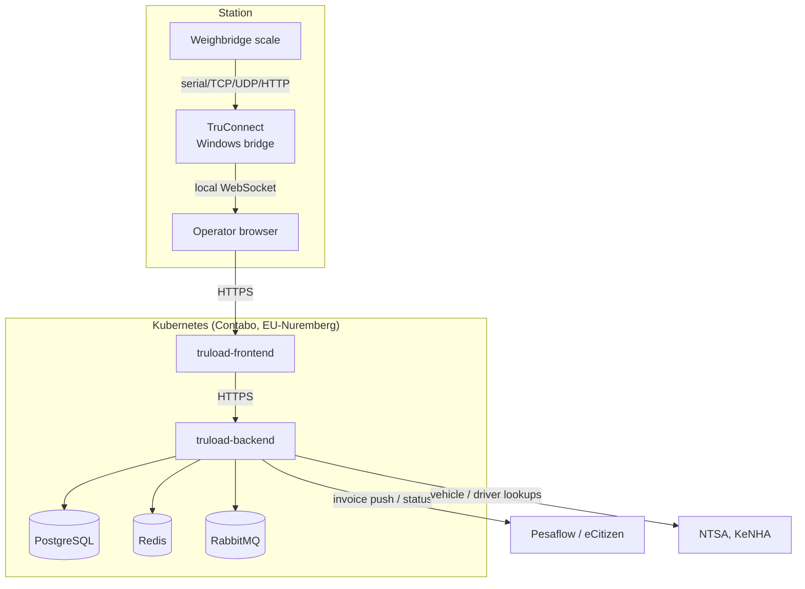
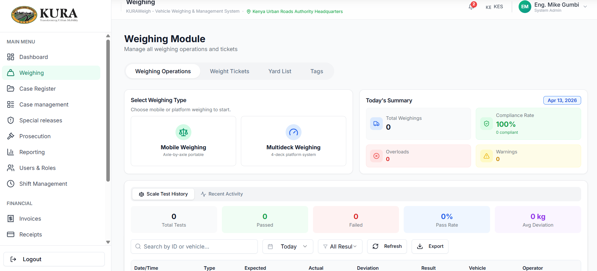
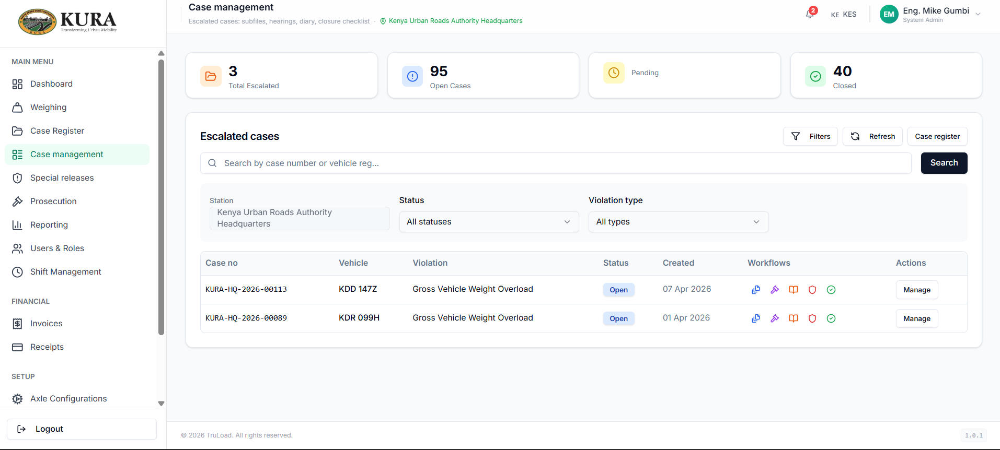
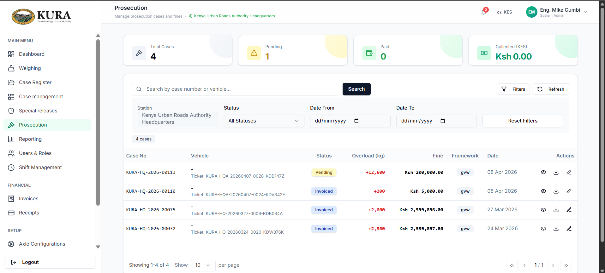

# Architecture

## System topology

## Components

### `truload-backend` (.NET 10)

Controllers and services in `Controllers/` and `Services/Implementations/`.
Major modules:

- **Weighing** — `WeighingController`, `AxleConfigurationController`,
  `VehicleController`, `DriverController`. Autoweigh endpoint,
  capture-weights update, compliance decision.
- **Case / yard / prosecution** — `CaseRegisterController`,
  `CourtHearingController`, `ComplianceCertificateController`,
  `YardController`, `VehicleTagController`.
- **Financial** — `PaymentController`, `InvoiceController`,
  `ReceiptController`, `PaymentCallbackController`.
- **Identity / RBAC** — `RolesController`, `PermissionsController`,
  `UsersController`; `ApplicationRole`, `Permission`, `RolePermission`.
- **Reporting** — `ReportController`, `SupersetController`.
- **Configuration** — `SettingsController`, `IntegrationConfigController`,
  `AuditLogController`.

Background jobs run on Hangfire: reconciliation, document generation,
scheduled backups.

### `truload-frontend` (Next.js 15, React 19, TypeScript)

Module layout in `src/app/[orgSlug]/`:

- `weighing/` — capture, tickets, tags, yard
- `cases/` — register, court hearings, charges
- `users/modules/` — user, role, station, department admin
- `setup/` — initial setup wizard

Cross-cutting concerns:

- `src/lib/offline/` — IndexedDB via Dexie + background sync
  (service worker) for intermittent networks
- `src/lib/api/` — typed API client
- `src/hooks/queries/` — React Query per domain
- `src/components/integrations/`, `src/components/payments/` —
  Pesaflow checkout dialog, reconciliation panel

### TruConnect (Electron + Node)

Pluggable adapter model:

- `src/parsers/` — ZmParser, CardinalParser, I1310Parser,
  MobileScaleParser, CustomParser
- `src/input/` — SerialInput, TcpInput, UdpInput, ApiInput
- `src/output/` — WebSocketOutput, ApiOutput, SerialRduOutput,
  NetworkRduOutput
- `src/core/` — EventBus, StateManager, ConnectionPool
- `src/database/` — `better-sqlite3` with migrations
- `src/cloud/` — two-way sync with the backend
- `src/simulation/` — scripted feeds for regression runs

## Data stores

- **PostgreSQL 16** with `pgvector` — transactional data and semantic
  search on prior violations.
- **Redis** — session cache, permission cache, background-job progress.
- **RabbitMQ** (2 nodes) — async jobs, document generation, notifications.

## Transaction path

1. Operator authenticates; backend issues JWT with role + permission
   claims.
2. Frontend calls the relevant module endpoints.
3. TruConnect streams live weight to the browser; the browser posts the
   capture to the backend.
4. Compliance engine computes axle-group aggregation, tolerance, and the
   overload decision.
5. Case register, yard entry, and prosecution records auto-create where
   applicable.
6. Prosecution generates an invoice; payment is settled via Pesaflow; a
   receipt is generated on callback.
7. Compliant reweigh triggers the auto-close cascade back to the case and
   yard entry.

## See also

- [Swagger UI](api/swagger.md) · [live Swagger (test)](https://kuraweighapitest.masterspace.co.ke/v1/docs/index.html)

