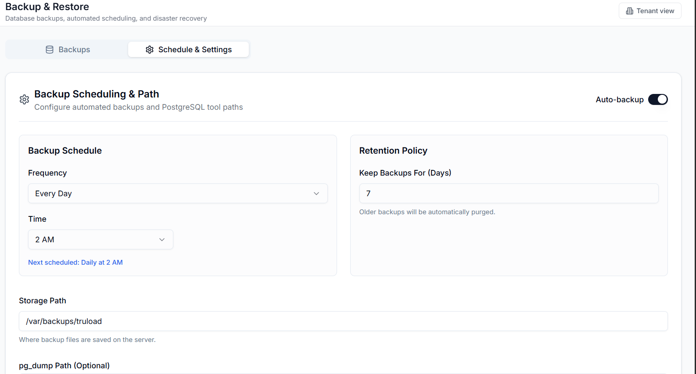

# Backup, DR and Troubleshooting

## Backup

PostgreSQL dumps run nightly from a CronJob that writes to the
`truload-backups` PersistentVolumeClaim (20 GiB, `local-path` storage
class). Retention: 7 days on test, 30 days on production.

Media uploads live on the `truload-backend-media` PVC (10 GiB) and are
snapshotted daily to the same backup volume.

Manual backup before a major release:

1. Trigger the backup CronJob from the backend admin screen, or
   `kubectl -n truload create job --from=cronjob/truload-backup backup-$(date +%s)`.
2. Record the job ID and timestamp in the operations log.
3. Verify the resulting dump in `truload-backups`.

## Restore drill

Run once a month against an isolated namespace. The drill is complete when:

1. The selected dump restores cleanly into a fresh PostgreSQL instance.
2. The backend comes up against the restored DB and passes its readiness
   probe.
3. A smoke run of the compliance E2E suite passes against the restored
   environment.

Record drill outcomes in the ops log; a failed drill is a sev-2 incident.

## Disaster recovery

Recovery objectives:

| Tier | RPO | RTO |
|---|---|---|
| API (read) | 1 h | 30 min |
| API (write) | 24 h | 2 h |
| Full data-path | 24 h | 4 h |

Sequence:

1. Declare the incident and notify stakeholders.
2. Freeze writes where required.
3. Restore in order: infrastructure (PostgreSQL, Redis, RabbitMQ),
   backend, frontend, TruConnect connectivity.
4. Smoke: auth, weighing, case, prosecution, payment.
5. Publish recovery completion and the post-incident report.

## Closed-space and intermittent-network operation

TruConnect runs entirely on the station workstation, so scale capture
continues even when the upstream link is down. The frontend queues
mutations in IndexedDB via Dexie and replays them when connectivity
returns. Idempotency keys generated client-side guarantee the backend
processes each mutation at most once.

Pesaflow is the one integration with hard online requirements; payment
settlement simply cannot proceed without reachability. Callback retries
and the reconciliation poll handle transient failures automatically.

## Troubleshooting

1. Identify the affected module and environment.
2. Collect the correlation ID from the error response.
3. Check dependency health:
   `kubectl -n truload get pods`,
   `kubectl -n infra get pods`,
   Grafana at `grafana.codevertexitsolutions.com`.
4. Apply the relevant runbook step.
5. Capture a post-incident note with timestamps.

## Quick map

| Symptom | First thing to check |
|---|---|
| No live weight in browser | TruConnect running, WebSocket port not blocked, input source matches scale |
| Weighing capture 5xx | Backend pod logs + correlation ID; DB health in `infra` |
| Payment stuck pending | Pesaflow reachability, callback handler logs, reconciliation job state |
| Case won't close | Prerequisite records (payment, reweigh, memo) — verify every link |
| Slow reports | Redis health, PostgreSQL CPU + slow-query log |
