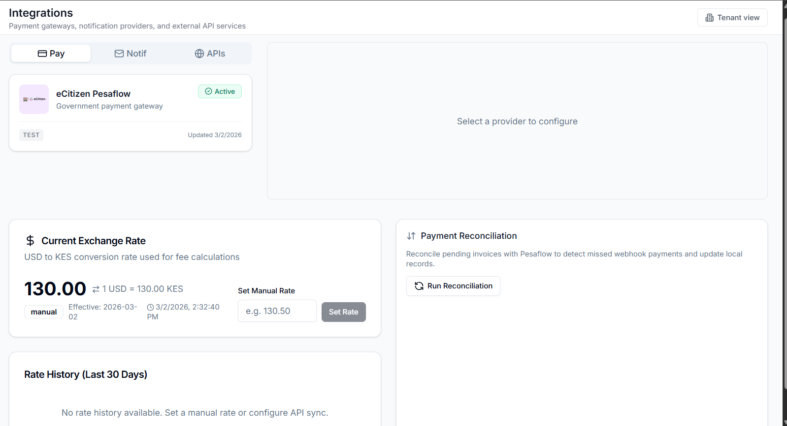

# Deployment and Environments

## Hosting

TruLoad runs on a single-node Kubernetes cluster hosted on Contabo Cloud VPS
(Nuremberg, Germany), managed via GitOps.

| Item | Value |
|---|---|
| Provider | Contabo GmbH |
| Region | EU — Nuremberg, Germany |
| OS | Ubuntu 24.04 LTS |
| Kubernetes | `v1.30.14`, single control-plane node |
| Container runtime | containerd `2.2.2` |
| CPU | 12 vCPU (AMD EPYC) |
| Memory | 47 GiB |
| Disk | 484 GB (local-path storage class) |
| Ingress | NGINX |
| Certificates | cert-manager + Let's Encrypt (`letsencrypt-prod` ClusterIssuer) |
| GitOps | ArgoCD |

## Hostnames

| Environment | Backend API | Frontend | Docs |
|---|---|---|---|
| Test | [kuraweighapitest.masterspace.co.ke](https://kuraweighapitest.masterspace.co.ke) | [kuraweightest.masterspace.co.ke](https://kuraweightest.masterspace.co.ke) | [kuraweigh-docs.masterspace.co.ke](https://kuraweigh-docs.masterspace.co.ke) |
| Production | [truloadapi.codevertexitsolutions.com](https://truloadapi.codevertexitsolutions.com) | [truload.codevertexitsolutions.com](https://truload.codevertexitsolutions.com) | [truload-docs.codevertexitsolutions.com](https://truload-docs.codevertexitsolutions.com) |

Every host terminates TLS via a cert-manager-issued Let's Encrypt
certificate, served through the shared NGINX ingress class.

## Workloads

All three services share the `truload` namespace:

| Workload | Replicas | Image |
|---|---|---|
| `truload-backend` | 2 | `docker.io/codevertex/truload-backend:<sha>` |
| `truload-frontend-app` | 2 | `docker.io/codevertex/truload-frontend:<sha>` |
| `truload-docs` | 1 | `docker.io/codevertex/truload-docs:<sha>` |

Persistent volumes (local-path storage class):

- `truload-backend-media` — 10 GiB, backend uploads and generated PDFs
- `truload-backups` — 20 GiB, nightly database dumps

Shared infrastructure in the `infra` namespace:

- PostgreSQL 16 (`postgresql-0`, 20 GiB data PVC)
- Redis (`redis-master-0`, 8 GiB data PVC)
- RabbitMQ (2-node cluster, 10 GiB data PVC per node)
- Prometheus + Grafana for monitoring

## Test vs production segregation

| Axis | Test | Production |
|---|---|---|
| DNS zone | `*.masterspace.co.ke` | `*.codevertexitsolutions.com` |
| Database | `truload_test` on shared PostgreSQL | `truload` on shared PostgreSQL |
| Redis | Dedicated logical DB index | Dedicated logical DB index |
| JWT signing key | Distinct `JWT_SECRET` | Distinct `JWT_SECRET` |
| Pesaflow credentials | eCitizen sandbox | eCitizen production |
| Callback URL | Points at test backend | Points at production backend |
| Backups | Nightly, retained 7 days | Nightly, retained 30 days |

Secrets are never committed. They live as plain Kubernetes `Secret`
objects, synced via a dedicated GitHub Actions workflow in the GitOps
repository.

## Deploy flow

1. Commit lands on `main` in the app repo.
2. The app's GitHub Actions workflow builds the container image, pushes it
   to `docker.io/codevertex/<app>:<short-sha>`, and commits a one-line bump
   to `apps/<app>/values.yaml` in `devops-k8s`.
3. ArgoCD detects the change, hard-refreshes, and rolls the workload
   (`prune: true, selfHeal: true`).
4. `kubectl rollout status` confirms readiness before the workflow
   finishes.

## Rollback

Revert the `values.yaml` image-tag commit on `devops-k8s`. ArgoCD
reconciles to the previous image within the minute. If a database
migration is incompatible, restore from the most recent nightly backup —
see [Backup, DR and Troubleshooting](backup-dr-troubleshooting.md).

## References

- Backend app manifest: `devops-k8s/apps/truload-backend/app.yaml`
- Frontend app manifest: `devops-k8s/apps/truload-frontend/app.yaml`
- Docs app manifest: `devops-k8s/apps/truload-docs/app.yaml`
- Shared Helm chart: `devops-k8s/charts/app/`
- Cluster issuer: `devops-k8s/manifests/cert-manager-clusterissuer.yaml`

