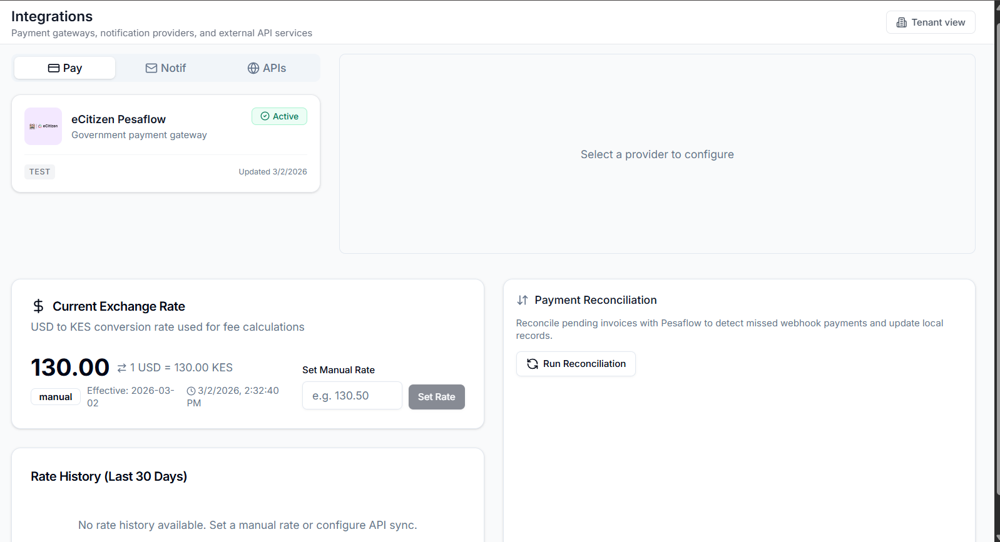

# Deployment and Environments

## Hosting

TruLoad runs on a single-node Kubernetes cluster hosted on Contabo Cloud VPS
(Nuremberg, Germany), managed via GitOps.

| Item | Value |
|---|---|
| Provider | Contabo GmbH |
| Region | EU — Nuremberg, Germany |
| OS | Ubuntu 24.04 LTS |
| Kubernetes | `v1.30.14`, single control-plane node |
| Container runtime | containerd `2.2.2` |
| CPU | 12 vCPU (AMD EPYC) |
| Memory | 47 GiB |
| Disk | 484 GB (local-path storage class) |
| Ingress | NGINX |
| Certificates | cert-manager + Let's Encrypt (`letsencrypt-prod` ClusterIssuer) |
| GitOps | ArgoCD |

## Hostnames

There is a single shared backend API (`truloadapi.codevertexafrica.com`) and a single shared frontend app. Tenants access the platform through their own frontend hostnames. The `X-Env` header (sent automatically by the frontend based on hostname) routes requests to the correct tenant database.

### TruLoad SaaS (commercial weighing tenants)

| Environment | Backend API | Frontend | Docs |
|---|---|---|---|
| Production | [truloadapi.codevertexafrica.com](https://truloadapi.codevertexafrica.com) | [truload.codevertexafrica.com](https://truload.codevertexafrica.com) | [truload-docs.codevertexafrica.com](https://truload-docs.codevertexafrica.com) |

### KURA Tenant (Kenya Urban Roads Authority — axle load enforcement)

| Environment | Backend API | Frontend | Notes |
|---|---|---|---|
| Live | [truloadapi.codevertexafrica.com](https://truloadapi.codevertexafrica.com) | [kuraweigh.kura.go.ke](https://kuraweigh.kura.go.ke) | Uses `kuraweigh` dedicated DB; `X-Env: live` |
| Test | [truloadapi.codevertexafrica.com](https://truloadapi.codevertexafrica.com) | [kuraweightest.masterspace.co.ke](https://kuraweightest.masterspace.co.ke) | Uses shared `truload` DB; `X-Env: test` |

The `X-Env` header is injected automatically by the frontend based on hostname — `kuraweigh.kura.go.ke` sends `X-Env: live` and `kuraweightest.masterspace.co.ke` sends `X-Env: test`. See [Multi-Tenancy Architecture](MULTI_TENANCY.md#environment-switching-x-env) for details.

Every host terminates TLS via a cert-manager-issued Let's Encrypt
certificate, served through the shared NGINX ingress class.

## Workloads

All three services share the `truload` namespace:

| Workload | Replicas | Image |
|---|---|---|
| `truload-backend` | 2 | `docker.io/codevertex/truload-backend:<sha>` |
| `truload-frontend-app` | 2 | `docker.io/codevertex/truload-frontend:<sha>` |
| `truload-docs` | 1 | `docker.io/codevertex/truload-docs:<sha>` |

Persistent volumes (local-path storage class):

- `truload-backend-media` — 10 GiB, backend uploads and generated PDFs
- `truload-backups` — 20 GiB, nightly database dumps

Shared infrastructure in the `infra` namespace:

- PostgreSQL 17 (`postgresql-0`, 20 GiB data PVC)
- Redis (`redis-master-0`, 8 GiB data PVC)
- RabbitMQ (2-node cluster, 10 GiB data PVC per node)
- Prometheus + Grafana for monitoring

## Test vs production segregation

| Axis | KURA Test | KURA Live | TruLoad SaaS |
|---|---|---|---|
| Frontend domain | `kuraweightest.masterspace.co.ke` | `kuraweigh.kura.go.ke` | `truload.codevertexafrica.com` |
| `X-Env` header | `test` | `live` | `live` |
| Database | `truload` (shared) | `kuraweigh` (dedicated) | `truload` (shared) |
| Pesaflow credentials | eCitizen sandbox | eCitizen production | N/A |
| Redis | Shared logical DB | Shared logical DB | Shared logical DB |
| Backups | Nightly, retained 7 days | Nightly, retained 30 days | Nightly, retained 30 days |

The same backend pod and JWT signing key serve all environments. The `X-Env` request header (auto-injected by the frontend) switches the tenant database connection at the middleware layer — no separate backend deployment is needed for test vs live.

Secrets are stored as Kubernetes `Secret` objects, synced via a
dedicated CI workflow in the GitOps repository. They are never placed
in version-controlled files.

## Deploy flow

1. A change is merged to the `main` branch in the application repository.
2. The CI pipeline builds the container image, pushes it to the registry,
   and updates the image tag in the GitOps repository (`devops-k8s`).
3. ArgoCD detects the updated tag, refreshes, and rolls the workload
   automatically.
4. Readiness is confirmed before the pipeline finishes.

## Rollback

Revert the image-tag update in the GitOps repository. ArgoCD
reconciles to the previous image within a minute. If a database
schema change is incompatible, restore from the most recent nightly
backup -- see [Backup, DR and Troubleshooting](backup-dr-troubleshooting.md).

## References

- Backend app manifest: `devops-k8s/apps/truload-backend/app.yaml`
- Frontend app manifest: `devops-k8s/apps/truload-frontend/app.yaml`
- Docs app manifest: `devops-k8s/apps/truload-docs/app.yaml`
- Shared Helm chart: `devops-k8s/charts/app/`
- Cluster issuer: `devops-k8s/manifests/cert-manager-clusterissuer.yaml`

