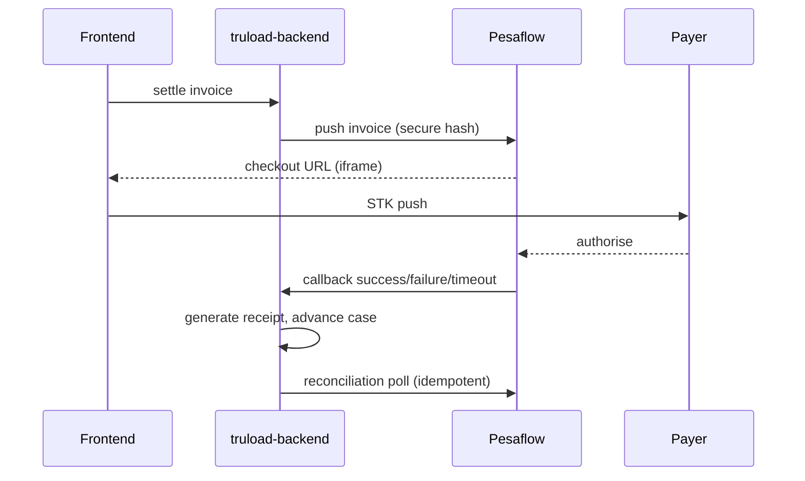

# Integrations and M-PESA

## Integration surface

- **TruConnect** — local scale protocol bridge (serial, TCP, UDP, HTTP).
- **Pesaflow / eCitizen** — invoice push, STK push, payment callbacks,
  reconciliation webhook.
- **NTSA, KeNHA** — vehicle and driver reference lookups.

## Payment flow

1. Operator opens a prosecution invoice in the frontend and triggers
   settlement.
2. Backend posts the invoice to Pesaflow at
   `pesaflow.ecitizen.go.ke/PaymentAPI/iframev2.1.php` with a secure
   hash computed per
   [PESAFLOW_INTEGRATION_GUIDE.md](https://github.com/Bengo-Hub/truload-backend/blob/main/docs/integrations/PESAFLOW_INTEGRATION_GUIDE.md).
3. Pesaflow returns a checkout URL; the frontend opens it in a dialog.
4. Payer authorises the STK push on their phone.
5. Pesaflow posts back to
   `api/v1/payments/callback/{success,failure,timeout}` on the backend.
6. The backend marks the invoice paid, generates a receipt, and kicks the
   case workflow forward.
7. A reconciliation job polls `api/v1/payments/webhook/ecitizen-pesaflow`
   for drift and retries idempotently.

## Code entry points

| Concern | File |
|---|---|
| Outbound invoice push | `Services/Implementations/Financial/ECitizenService.cs` |
| Callback handlers | `Controllers/Financial/PaymentCallbackController.cs` |
| Reconciliation webhook | `Controllers/Financial/PaymentController.cs` |
| Frontend checkout dialog | `truload-frontend/src/components/payments/PesaflowCheckoutDialog.tsx` |
| Frontend queries | `truload-frontend/src/hooks/queries/useIntegrationQueries.ts` |

## Test suites

| Suite | Purpose |
|---|---|
| `pesaflow_api_test.py` | OAuth, invoice creation via iframe, payment status — direct against Pesaflow |
| `pesaflow_invoice_e2e.py` | Backend-mediated: login, select unpaid invoice, push, poll status |
| `pesaflow_callback_reconciliation_e2e.py` | Callback success/failure/timeout + webhook idempotency |

Results are tracked on [Live E2E Results](../testing/live-e2e-results.md).

## Screenshots

## See also

- [PESAFLOW_INTEGRATION_GUIDE.md](https://github.com/Bengo-Hub/truload-backend/blob/main/docs/integrations/PESAFLOW_INTEGRATION_GUIDE.md)
  (secure-hash computation, field mapping)
- [Live E2E results](../testing/live-e2e-results.md)
- [Swagger UI](api/swagger.md) · [live Swagger (test)](https://kuraweighapitest.masterspace.co.ke/v1/docs/index.html)
  — try the `payments/*` endpoints directly
