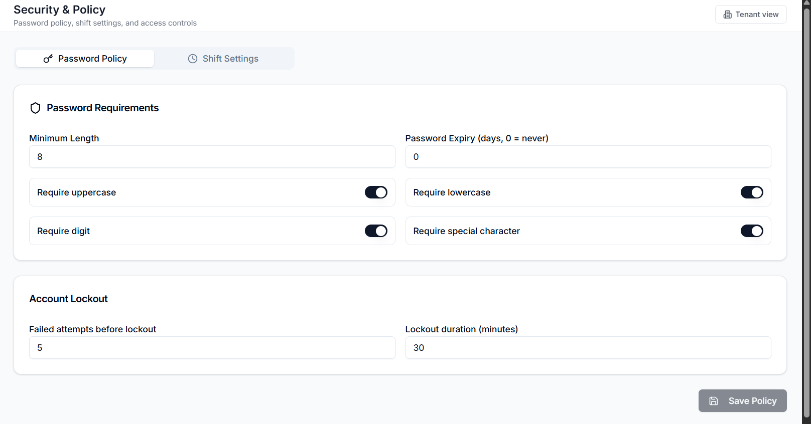
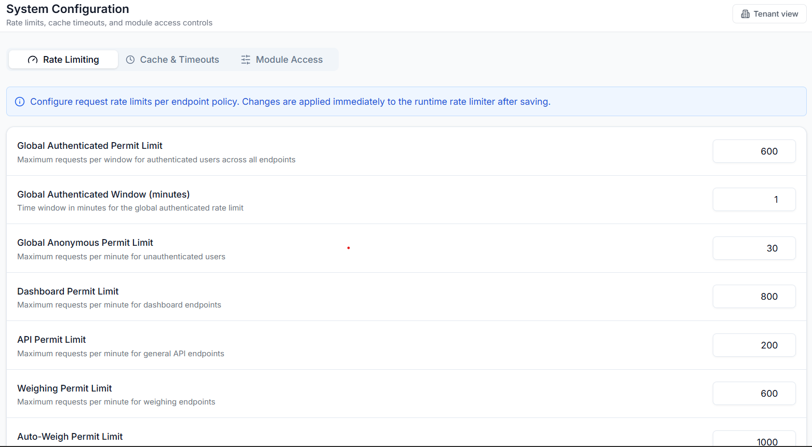
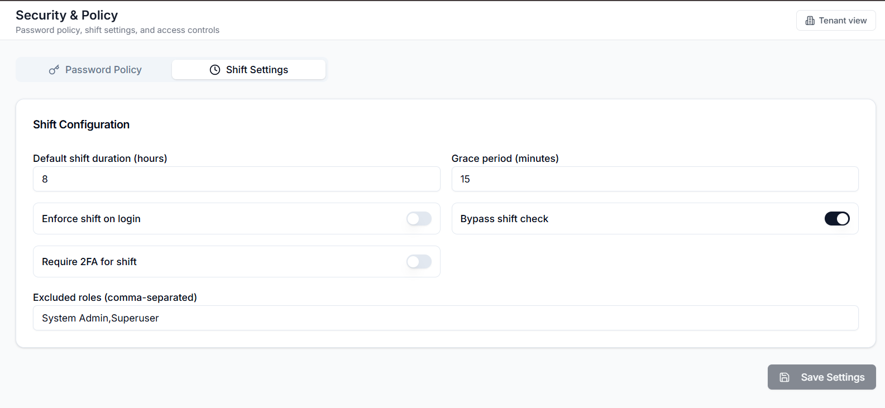

# Security Assurance

## Controls

Authentication and authorization:

- JWT access tokens, rotating refresh tokens, short TTL.
- Permission-based authorization via `PermissionRequirementHandler`
  and `[PermissionAttribute]` on every controller action.
- Roles split between tenant-visible and system-only via `IsSystemRole`;
  system-sensitive permissions hidden from non-superusers.
- Account lockout with backoff on repeated failures.

Transport and secrets:

- TLS on every ingress, certificates issued by cert-manager +
  Let's Encrypt.
- Integration credentials (Pesaflow API key, NTSA tokens, scale middleware
  secrets) encrypted at rest with a per-install data-protection key; never
  returned in API responses.
- Secrets mounted from Kubernetes Secret objects synced via the GitOps
  repository; never committed.

Auditability:

- Audit log records every create, update, and approve on financial, case,
  and prosecution records; see `AuditLogController`.
- Every request is tagged with a correlation ID surfaced in error
  responses for traceability.

Backups:

- Nightly database dumps to the `truload-backups` PVC (20 GiB).
- Retention: 7 days on test, 30 days on production.
- Documented restore drill in [Backup, DR and Troubleshooting](backup-dr-troubleshooting.md).

## Assessment status

The most recent internal audit is documented in
`truload-backend/docs/AUDIT_SUMMARY_REPORT.md`
(dated 2026-01-22, updated 2026-01-23). Findings with a security impact:

| Finding | Severity | Status |
|---|---|---|
| Axle-group aggregation (data integrity) | P0 | Resolved |
| Per-axle-type fee calculation (financial correctness) | P0 | Resolved |
| Demerit-points tracking (audit completeness) | P0 | Resolved |
| Dual-table weight-ticket format (evidentiary) | P1 | In progress |
| Case subfile A-J completeness (evidentiary) | P1 | In progress |
| NGINX + per-principal API rate limiting | P2 | Deployed; tuning in progress |
| External penetration test | -- | Scheduled, report pending |

## Verification checklist

Run before every production promotion:

1. Five wrong-password logins against a test account trigger lockout and
   the reset path.
2. Logging in as each role (`SYSTEM_ADMIN`, `STATION_MANAGER`, `OPERATOR`,
   `PROSECUTOR`, `FINANCE`) surfaces only that role's modules.
3. A prosecution invoice approval is recorded in the audit log with
   actor, timestamp, and payload hash.
4. The integration settings screen masks secrets for non-admins.
5. `kubectl -n truload exec deploy/truload-backend -- env | grep -E 'SECRET|PASSWORD'`
   returns mounted-path references only, never literal values.
6. `curl -i https://<host>/api/v1/auth/login` returns `X-RateLimit-*`
   headers.

