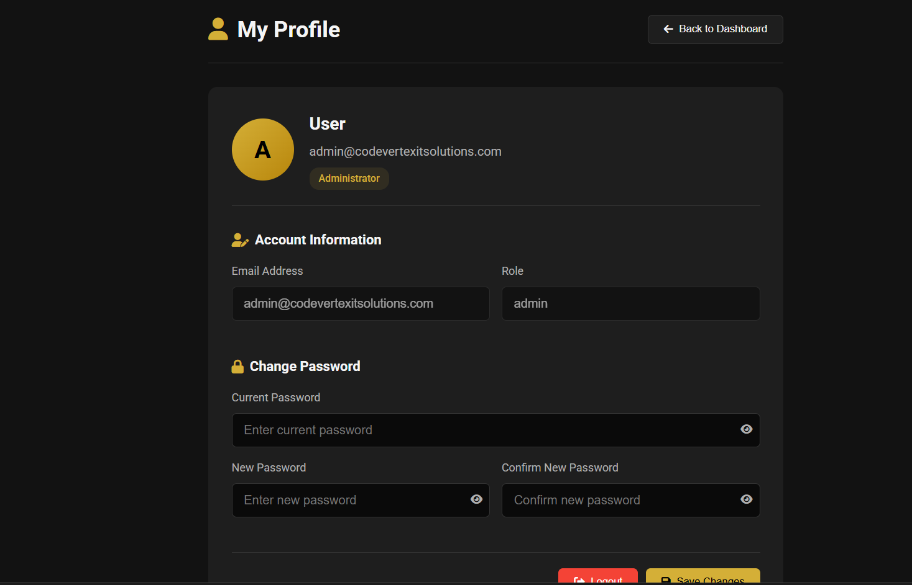
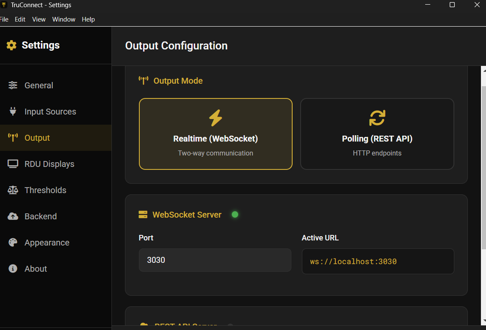
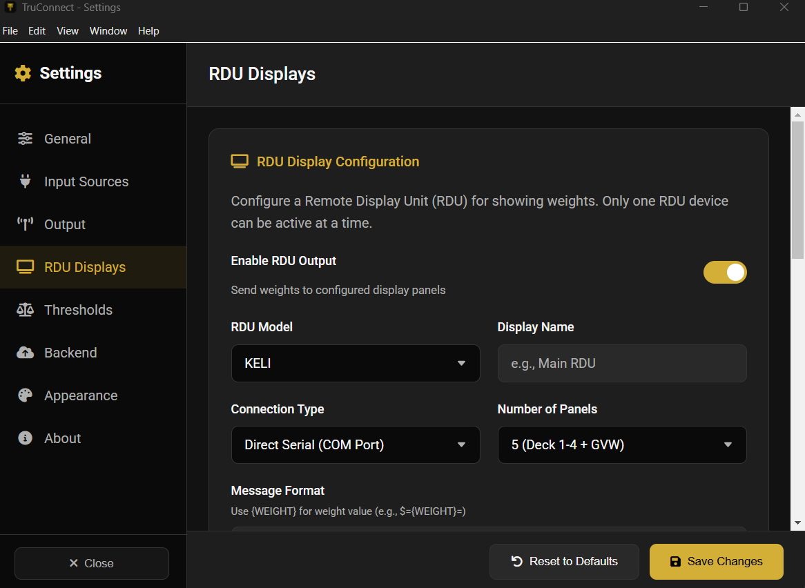

# Installing and configuring TruConnect

TruConnect is the local Windows application that bridges the weighbridge
scale (static, mobile, or multideck) to the TruLoad frontend. It reads weight
data over serial, TCP, UDP, or HTTP and streams it into the browser via a
local WebSocket. It also writes to connected RDU display boards.

This chapter is for the operator or station admin who installs TruConnect on
a new workstation, or updates an existing install.

## Download the installer

TruConnect is released through GitHub Releases. Every release has a signed
Windows NSIS installer attached.

- Latest release: <https://github.com/Bengo-Hub/TruConnect/releases/latest>
- Release history: <https://github.com/Bengo-Hub/TruConnect/releases>
- A specific version: `https://github.com/Bengo-Hub/TruConnect/releases/tag/<version_tag>`
  (for example, `v2.0.80`).

Download `TruConnect-<version>-Setup.exe` from the `Assets` section of the
chosen release.

## Install

1. Right-click the downloaded installer and choose `Run as administrator`.
2. Accept the license terms.
3. Pick the install path (keep the default unless your station has a
   prescribed location).
4. Let the installer finish and launch TruConnect from the desktop shortcut.

The first launch creates the local SQLite database and writes default
configuration into `%APPDATA%/TruConnect`.

## First-run configuration

1. **Account settings** — enter the TruLoad backend URL, station ID, and
   service credentials supplied by the platform admin.
   

2. **General settings** — confirm the operator name, language, and auto-start
   behaviour.
   

3. **Input source** — choose serial, TCP, UDP, or HTTP, and enter the scale
   parameters. For serial scales, select the COM port, baud rate, and parser
   (Cardinal, ZM, I1310, Mobile, or Custom).
   

4. **Output configuration** — set the local WebSocket port that the
   frontend will read from, plus any RDU board destinations.
   
   

5. **Auto-weight** — configure the stable-window and capture-threshold rules.
   These determine when a live reading is considered "settled" enough to
   auto-submit.
   

6. **Threshold** — tune the minimum weight that will trigger capture, the
   reject-band around zero, and the motion tolerance.
   

## Verify the end-to-end feed

1. Open the TruLoad frontend weighing screen for this station.
2. Place a known load on the scale or run the TruConnect simulation harness.
3. Confirm the live weight updates in the browser within a second of the
   scale settling.
4. Submit a test weighing and verify the ticket prints against the expected
   axle configuration.

## Updating an existing install

1. Close TruConnect.
2. Download the new installer from the release page.
3. Run the installer; it detects the existing install and upgrades in place.
   Local settings and the SQLite database are preserved.
4. Start TruConnect and check that input sources and outputs are still
   active.

If you need to roll back, uninstall the current version from
`Apps & Features`, then re-install the previous release from the release
history link above.

## Troubleshooting

- **No live weight in the browser** — check the local WebSocket port is not
  blocked by the firewall, and that the frontend's TruConnect URL matches
  the port set in `Output configuration`.
- **Scale connected but no reading** — wrong parser or baud rate. Re-check
  the scale manual against the parser selection in `Input source`.
- **Readings jitter** — widen the motion tolerance in `Threshold` or the
  stable window in `Auto-weight`.
- **RDU board not updating** — open `Output configuration` and confirm the
  board IP/serial settings; a non-responding board is logged to
  `%APPDATA%/TruConnect/logs`.
