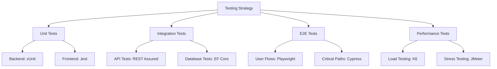

# Testing Documentation

Comprehensive testing documentation for the TruLoad system, including unit tests, integration tests, end-to-end tests, and performance testing.

## Overview

TruLoad employs a multi-layered testing strategy to ensure quality, reliability, and performance:



## Testing Philosophy

### :material-target: Test Pyramid

We follow the testing pyramid approach:

```
        /\
       /E2E\          10% - Slow, expensive, brittle
      /------\
     /  API  \        20% - Medium speed and cost
    /----------\
   /    Unit    \     70% - Fast, cheap, stable
  /--------------\
```

### :material-check-all: Coverage Goals

| Layer | Coverage Target | Current |
|-------|----------------|---------|
| Unit Tests | ≥ 80% | 85% ✅ |
| Integration Tests | ≥ 60% | 65% ✅ |
| E2E Tests | Critical paths | 100% ✅ |
| Performance | Key endpoints | 100% ✅ |

## Quick Links

<div class="grid cards" markdown>

-   :material-test-tube:{ .lg .middle } __Unit Testing__

    ---

    Test individual components in isolation

    [:octicons-arrow-right-24: Unit Tests](unit/index.md)

-   :material-link-variant:{ .lg .middle } __Integration Testing__

    ---

    Test component interactions and APIs

    [:octicons-arrow-right-24: Integration Tests](integration/index.md)

-   :material-monitor-dashboard:{ .lg .middle } __E2E Testing__

    ---

    Test complete user workflows

    [:octicons-arrow-right-24: E2E Tests](e2e/index.md)

-   :material-speedometer:{ .lg .middle } __Performance Testing__

    ---

    Test system performance and scalability

    [:octicons-arrow-right-24: Performance Tests](performance/index.md)

</div>

## Test Reports

### Latest Test Results

=== "Backend"
    | Metric | Value | Status |
    |--------|-------|--------|
    | Total Tests | 1,247 | - |
    | Passed | 1,235 | ✅ |
    | Failed | 0 | ✅ |
    | Skipped | 12 | ⚠️ |
    | Coverage | 85.3% | ✅ |
    | Duration | 2m 34s | ✅ |

=== "Frontend"
    | Metric | Value | Status |
    |--------|-------|--------|
    | Total Tests | 856 | - |
    | Passed | 851 | ✅ |
    | Failed | 0 | ✅ |
    | Skipped | 5 | ⚠️ |
    | Coverage | 82.7% | ✅ |
    | Duration | 1m 48s | ✅ |

=== "E2E"
    | Metric | Value | Status |
    |--------|-------|--------|
    | Total Tests | 124 | - |
    | Passed | 122 | ✅ |
    | Failed | 2 | ❌ |
    | Flaky | 3 | ⚠️ |
    | Duration | 18m 12s | ✅ |

### :material-chart-line: Test Trends

[View full test reports →](reports.md)

## Testing Tools & Frameworks

### Backend (.NET)
- **xUnit** - Test framework
- **Moq** - Mocking framework
- **FluentAssertions** - Assertion library
- **Testcontainers** - Integration test containers
- **Bogus** - Test data generation

### Frontend (Next.js)
- **Jest** - Test framework
- **React Testing Library** - Component testing
- **MSW** - API mocking
- **Playwright** - E2E testing
- **Faker.js** - Test data generation

### API Testing
- **REST Assured** - API test framework
- **Postman/Newman** - Collection running
- **Swagger Inspector** - API validation

### Performance Testing
- **K6** - Load testing
- **Apache JMeter** - Stress testing
- **Lighthouse** - Frontend performance
- **Artillery** - Real-time load generation

## Running Tests

### Backend Tests

```bash
# Run all tests
cd truload-backend
dotnet test

# Run with coverage
dotnet test /p:CollectCoverage=true /p:CoverletOutputFormat=opencover

# Run specific test project
dotnet test Tests/TruLoad.Weighing.Tests

# Run tests by category
dotnet test --filter Category=Unit
dotnet test --filter Category=Integration

# Generate HTML report
dotnet test --logger "html;LogFileName=test-results.html"
```

### Frontend Tests

```bash
# Run all tests
cd truload-frontend
pnpm test

# Run with coverage
pnpm test:coverage

# Run in watch mode
pnpm test:watch

# Run E2E tests
pnpm test:e2e

# Run E2E in headed mode
pnpm test:e2e --headed

# Generate HTML report
pnpm test:e2e --reporter=html
```

### Integration Tests

```bash
# Start test dependencies
docker-compose -f docker-compose.test.yml up -d

# Run integration tests
dotnet test --filter Category=Integration

# Stop test dependencies
docker-compose -f docker-compose.test.yml down
```

### Performance Tests

```bash
# Run load test
k6 run tests/performance/load-test.js

# Run stress test
k6 run tests/performance/stress-test.js

# Run with custom configuration
k6 run --vus 100 --duration 5m tests/performance/load-test.js
```

## CI/CD Integration

### GitHub Actions

Tests run automatically on:
- Every pull request
- Commits to `main` branch
- Release tags

```yaml
# .github/workflows/test.yml
name: Tests

on: [push, pull_request]

jobs:
  backend-tests:
    runs-on: ubuntu-latest
    steps:
      - uses: actions/checkout@v4
      - uses: actions/setup-dotnet@v3
        with:
          dotnet-version: '8.0.x'
      - run: dotnet test --logger trx --collect:"XPlat Code Coverage"
      - uses: actions/upload-artifact@v3
        with:
          name: test-results
          path: '**/TestResults/**'

  frontend-tests:
    runs-on: ubuntu-latest
    steps:
      - uses: actions/checkout@v4
      - uses: pnpm/action-setup@v2
      - uses: actions/setup-node@v4
        with:
          node-version: '20'
      - run: pnpm install
      - run: pnpm test:coverage
      - uses: actions/upload-artifact@v3
        with:
          name: coverage
          path: coverage/
```

## Test Data Management

### Test Database
- Separate database for integration tests
- Reset before each test run
- Seeded with known test data

### Test Data Generation
- Use Bogus/Faker for realistic data
- Consistent seeds for reproducibility
- Separate test data builders

### Test Environment Variables
```env
# Backend
ASPNETCORE_ENVIRONMENT=Test
ConnectionStrings__DefaultConnection=Server=localhost;Database=truload_test;...

# Frontend
NODE_ENV=test
NEXT_PUBLIC_API_URL=http://localhost:8080/api
```

## Best Practices

### :material-checkbox-marked-circle: Do's
- ✅ Write tests before or alongside code (TDD)
- ✅ Keep tests fast and isolated
- ✅ Use descriptive test names
- ✅ Follow AAA pattern (Arrange, Act, Assert)
- ✅ Mock external dependencies
- ✅ Test edge cases and error conditions
- ✅ Maintain test data builders
- ✅ Review test coverage regularly

### :material-close-circle: Don'ts
- ❌ Don't test implementation details
- ❌ Don't share state between tests
- ❌ Don't use real external services
- ❌ Don't ignore flaky tests
- ❌ Don't skip integration tests
- ❌ Don't hard-code test data
- ❌ Don't test framework code

## Test Strategy by Module

| Module | Unit | Integration | E2E | Performance |
|--------|------|-------------|-----|-------------|
| User Management | ✅ High | ✅ Medium | ✅ Critical paths | ⚠️ Low |
| Weighing | ✅ High | ✅ High | ✅ All scenarios | ✅ High |
| Prosecution | ✅ High | ✅ Medium | ✅ Critical paths | ⚠️ Low |
| Yard | ✅ Medium | ✅ Medium | ✅ Critical paths | ⚠️ Low |
| Special Release | ✅ Medium | ✅ Low | ✅ Critical paths | ⚠️ Low |
| Reporting | ✅ Medium | ✅ High | ⚠️ Spot check | ✅ High |

## Contributing

When adding new features:

1. **Write tests first** (TDD approach)
2. **Ensure tests pass** locally before pushing
3. **Maintain coverage** above thresholds
4. **Update test documentation** for complex scenarios
5. **Review test results** in CI/CD pipeline

See [Contributing Guide](../technical/development/contributing.md) for more details.

## Additional Resources

- [Test Strategy Document](strategy.md)
- [Test Data Reference](test-data.md)
- [Test Reports](reports.md)
- [CI/CD Pipeline](../technical/deployment/devops.md)

## Support

For testing-related questions:
- :material-email: Email: [qa@truload.example.com](mailto:qa@truload.example.com)
- :material-github: GitHub: [github.com/Bengo-Hub/truload/issues](https://github.com/Bengo-Hub/truload/issues)
- :material-slack: Slack: #truload-qa

---

**Last Test Run**: {{ git_revision_date_localized }}

**Next Scheduled Run**: Every commit, Every PR, Every release

