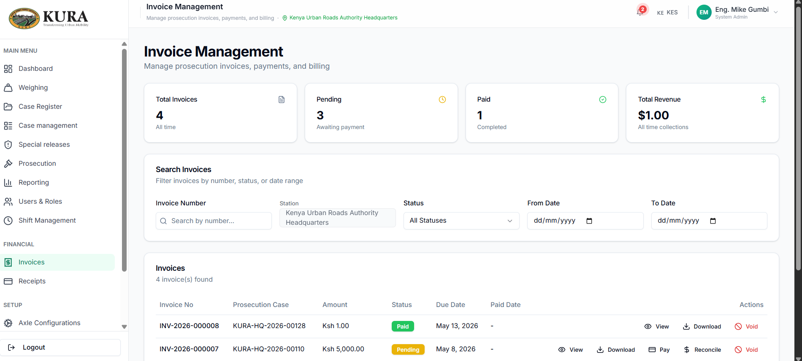
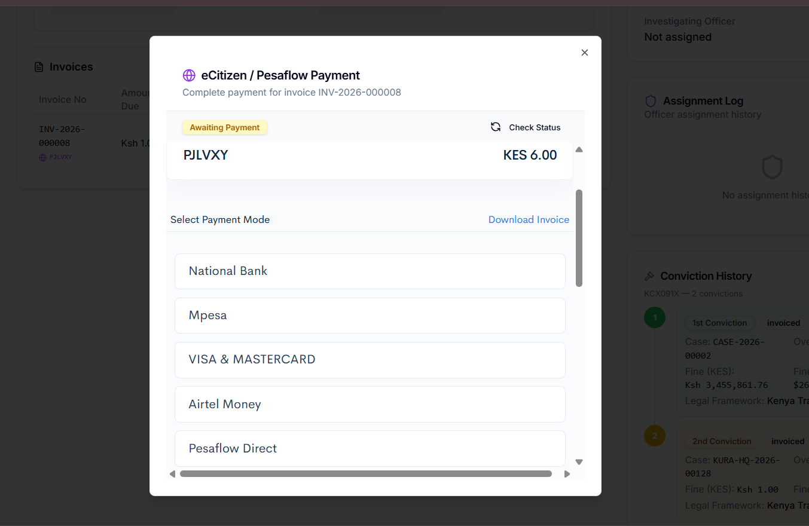
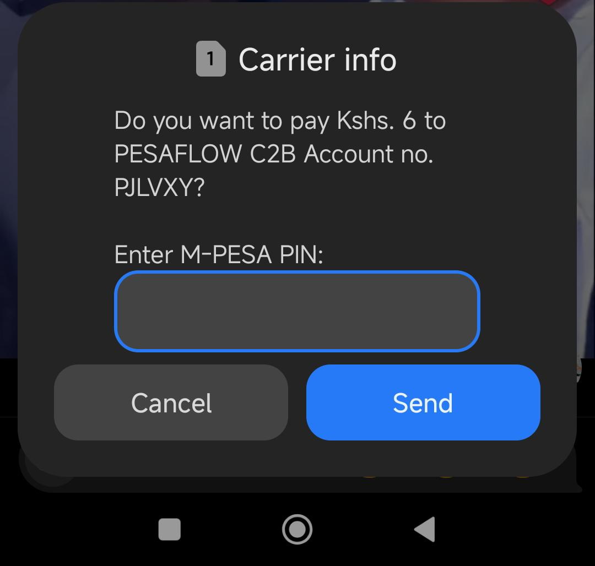
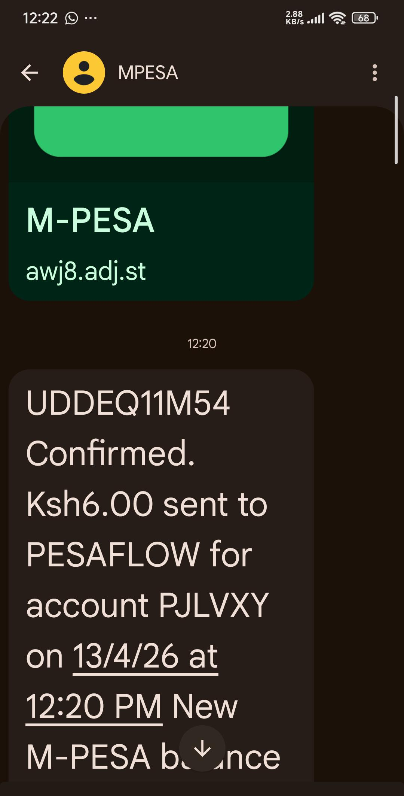
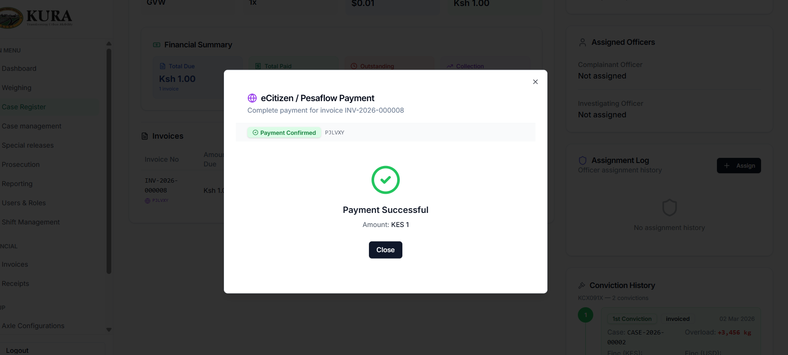
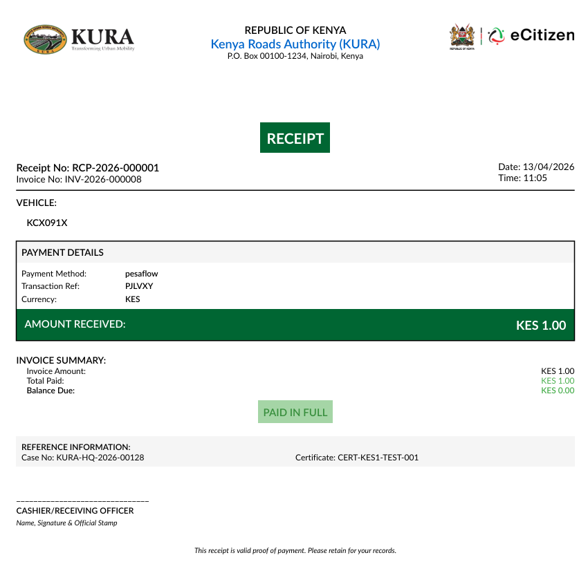
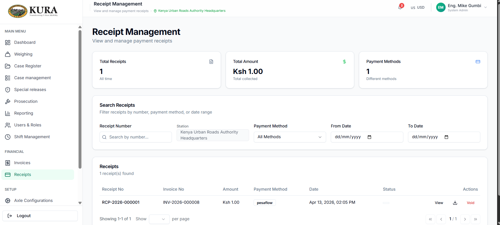

# Live End-to-End Results

## Target environments

- Backend: [kuraweighapitest.masterspace.co.ke](https://kuraweighapitest.masterspace.co.ke)
- Frontend: [kuraweightest.masterspace.co.ke](https://kuraweightest.masterspace.co.ke)

## Latest run — 2026-05-05

| Suite | Outcome | Evidence |
|---|---|---|
| Compliance (19 steps) | All 19 steps verified | `TEST_RESULTS.md` |
| Pesaflow invoice | Invoice push verified | `pesaflow_invoice_e2e.md` |
| Pesaflow callback / reconciliation | Pass | `pesaflow_callback_reconciliation_e2e.md` |
| Pesaflow direct API | Pass | `pesaflow_api_test.md` |

Summary:

- Authentication fully tested across all suites.
- All 19 compliance steps verified end-to-end including yard release, reweigh, and auto-close cascade.
- Callback, reconciliation, and direct Pesaflow API probes pass end to end.
- Invoice status polling fallback (background worker retry) verified.

## Screenshots from the run

## Reproducing the run

Live-run orchestration uses the `run_live_suite.py` script, which
redacts secrets from output and produces a markdown summary appended to
this page. See the backend repository's `live/README.md` for the
exact invocation.

## See also

- [Integrations and M-PESA](../technical/integrations-mpesa.md)
- [Existing Test Reports](reports.md)
- [Compliance Checklist](../testing/compliance-checklist.md)
