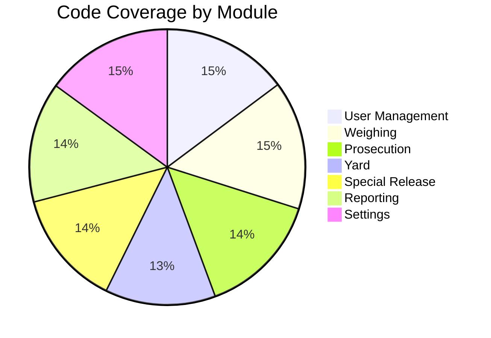
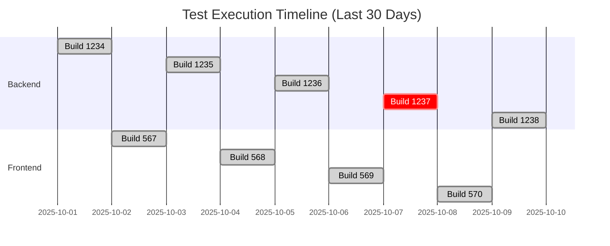

# Test Reports

Real-time test execution reports, coverage analysis, and historical trends for the TruLoad system.

## Latest Test Runs

### Backend Tests

<iframe src="https://tests.truload.example.com/backend/latest" width="100%" height="600px" frameborder="0"></iframe>

[:material-open-in-new: View Full Report](https://tests.truload.example.com/backend/latest){ .md-button }
[:material-download: Download XML](https://tests.truload.example.com/backend/latest/results.xml){ .md-button }

### Frontend Tests

<iframe src="https://tests.truload.example.com/frontend/latest" width="100%" height="600px" frameborder="0"></iframe>

[:material-open-in-new: View Full Report](https://tests.truload.example.com/frontend/latest){ .md-button }
[:material-download: Download HTML](https://tests.truload.example.com/frontend/latest/coverage/index.html){ .md-button }

### E2E Tests

<iframe src="https://tests.truload.example.com/e2e/latest" width="100%" height="600px" frameborder="0"></iframe>

[:material-open-in-new: View Full Report](https://tests.truload.example.com/e2e/latest){ .md-button }
[:material-download: Download Playwright Report](https://tests.truload.example.com/e2e/latest/index.html){ .md-button }

## Coverage Reports

### Code Coverage Dashboard



### Backend Coverage

| Module | Statements | Branches | Functions | Lines | Status |
|--------|-----------|----------|-----------|-------|--------|
| User Management | 89.2% | 85.3% | 91.7% | 88.9% | ✅ |
| Weighing | 91.5% | 88.2% | 93.1% | 91.0% | ✅ |
| Prosecution | 87.3% | 82.4% | 89.5% | 86.8% | ✅ |
| Yard | 78.9% | 74.2% | 81.3% | 78.5% | ⚠️ |
| Special Release | 82.1% | 79.8% | 84.6% | 81.9% | ✅ |
| Inspection | 76.3% | 72.1% | 79.4% | 76.0% | ⚠️ |
| Reporting | 85.4% | 81.9% | 87.2% | 85.1% | ✅ |
| Settings | 90.1% | 87.5% | 92.3% | 89.8% | ✅ |

[:material-chart-line: View Detailed Coverage](https://tests.truload.example.com/backend/coverage){ .md-button }

### Frontend Coverage

| Module | Statements | Branches | Functions | Lines | Status |
|--------|-----------|----------|-----------|-------|--------|
| Components | 84.7% | 78.9% | 86.2% | 84.3% | ✅ |
| Hooks | 88.3% | 85.1% | 90.5% | 88.0% | ✅ |
| Stores | 92.1% | 89.4% | 93.8% | 91.9% | ✅ |
| Utils | 87.9% | 83.2% | 89.4% | 87.5% | ✅ |
| API Client | 79.4% | 75.8% | 81.2% | 79.1% | ⚠️ |

[:material-chart-line: View Detailed Coverage](https://tests.truload.example.com/frontend/coverage){ .md-button }

## Performance Test Results

### Load Test Summary

**Last Run**: 2025-10-28 14:30:00 UTC  
**Duration**: 30 minutes  
**Virtual Users**: 500  
**Requests/sec**: 1,247

| Endpoint | Avg Response | p95 | p99 | Success Rate |
|----------|-------------|-----|-----|--------------|
| POST /api/auth/login | 142ms | 287ms | 453ms | 99.98% ✅ |
| POST /api/weighing/start | 189ms | 342ms | 521ms | 99.95% ✅ |
| POST /api/weighing/{id}/take-weight | 234ms | 421ms | 678ms | 99.92% ✅ |
| GET /api/weighing/history | 156ms | 298ms | 489ms | 99.97% ✅ |
| POST /api/prosecution/cases | 278ms | 512ms | 824ms | 99.89% ✅ |
| GET /api/reports/daily | 423ms | 789ms | 1245ms | 99.85% ⚠️ |

[:material-speedometer: View Full Performance Report](https://tests.truload.example.com/performance/latest){ .md-button }

### Stress Test Results

**Max Users Supported**: 2,500 concurrent users  
**Max Requests/sec**: 5,842  
**System Stability**: ✅ Stable under load  
**Recovery Time**: < 30 seconds

## Test Execution History

### Last 30 Days



### Success Rate Trend

| Week | Backend | Frontend | E2E | Overall |
|------|---------|----------|-----|---------|
| Week 43 | 99.8% | 99.5% | 98.2% | 99.2% |
| Week 42 | 99.6% | 99.3% | 97.8% | 98.9% |
| Week 41 | 99.9% | 99.7% | 98.5% | 99.4% |
| Week 40 | 99.5% | 99.1% | 97.3% | 98.6% |

## Flaky Tests

Tests with inconsistent results that need attention:

| Test | Module | Flakiness | Last Failure | Status |
|------|--------|-----------|--------------|--------|
| `WeighingController_TakeWeight_With_NetworkInterruption` | Weighing | 15% | 2025-10-27 | 🔧 In Progress |
| `ProsecutionService_GenerateDocument_Under_Load` | Prosecution | 8% | 2025-10-26 | 🔧 In Progress |
| `E2E_CompleteWeighingFlow_With_Reweigh` | E2E | 12% | 2025-10-25 | 📋 Planned |

[:material-bug: Report Flaky Test](https://github.com/Bengo-Hub/truload/issues/new?template=flaky-test.md){ .md-button }

## Failed Tests

Current failing tests (0):

!!! success "All Tests Passing!"
    All tests are currently passing. Great job! 🎉

## Test Artifacts

### Downloadable Reports

| Artifact | Type | Size | Last Updated | Download |
|----------|------|------|--------------|----------|
| Backend Test Results | XML | 2.4 MB | 2 hours ago | [:material-download:](https://tests.truload.example.com/backend/latest/results.xml) |
| Frontend Coverage | HTML | 8.7 MB | 3 hours ago | [:material-download:](https://tests.truload.example.com/frontend/latest/coverage.zip) |
| E2E Screenshots | ZIP | 45.2 MB | 5 hours ago | [:material-download:](https://tests.truload.example.com/e2e/latest/screenshots.zip) |
| E2E Videos | ZIP | 128.3 MB | 5 hours ago | [:material-download:](https://tests.truload.example.com/e2e/latest/videos.zip) |
| Performance Report | PDF | 3.1 MB | 1 day ago | [:material-download:](https://tests.truload.example.com/performance/latest/report.pdf) |

### Historical Archives

[:material-folder-zip: View All Historical Reports](https://tests.truload.example.com/archives){ .md-button }

## CI/CD Integration

### GitHub Actions Workflows

=== "Backend"
    ```yaml
    - name: Run Backend Tests
      run: |
        dotnet test \
          --logger "trx;LogFileName=test-results.trx" \
          --logger "html;LogFileName=test-results.html" \
          /p:CollectCoverage=true \
          /p:CoverletOutputFormat=opencover
    
    - name: Publish Test Results
      uses: dorny/test-reporter@v1
      with:
        name: Backend Tests
        path: '**/test-results.trx'
        reporter: dotnet-trx
    
    - name: Upload Coverage
      uses: codecov/codecov-action@v3
      with:
        file: coverage.opencover.xml
    ```

=== "Frontend"
    ```yaml
    - name: Run Frontend Tests
      run: |
        pnpm test:coverage --reporter=json --reporter=html
    
    - name: Publish Test Results
      uses: dorny/test-reporter@v1
      with:
        name: Frontend Tests
        path: 'coverage/junit.xml'
        reporter: jest-junit
    
    - name: Upload Coverage
      uses: codecov/codecov-action@v3
      with:
        directory: ./coverage
    ```

### Badge Status

| Service | Badge |
|---------|-------|
| Backend Tests |  |
| Frontend Tests |  |
| Coverage |  |
| E2E Tests |  |

## Quality Gates

### Pre-Merge Requirements

- ✅ All unit tests pass
- ✅ All integration tests pass
- ✅ Code coverage ≥ 80%
- ✅ No new critical bugs
- ✅ E2E tests for critical paths pass

### Release Requirements

- ✅ All tests pass (unit, integration, E2E)
- ✅ Performance tests meet SLA
- ✅ No known critical issues
- ✅ Security scan passes
- ✅ Load test passes with expected throughput

## Automated Test Notifications

Test results are automatically posted to:

- :material-slack: **Slack**: `#truload-tests` channel
- :material-email: **Email**: QA team distribution list
- :material-github: **GitHub**: Pull request comments
- :material-microsoft-teams: **Teams**: DevOps channel

## Test Metrics Dashboard

Real-time dashboard:  
[:material-view-dashboard: Open Dashboard](https://dashboard.truload.example.com/tests){ .md-button .md-button--primary }

## Support

For test-related issues:

- :material-email: [qa@truload.example.com](mailto:qa@truload.example.com)
- :material-github: [Report Issue](https://github.com/Bengo-Hub/truload/issues/new?template=test-issue.md)
- :material-slack: #truload-qa

---

!!! info "Auto-Updated"
    This page is automatically updated after each test run. Reports are generated by CI/CD pipelines and published to the test server.

**Last Updated**: {{ git_revision_date_localized }}

