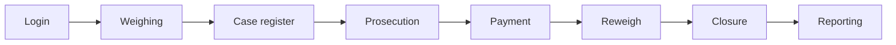

# User Guide

The user guide is the operator's reference for running a TruLoad station:
signing in, capturing weights, handling cases, settling invoices, closing
out a shift. Each chapter is structured around one module of the frontend
and follows the screens an operator sees.

## Audience

- Weighbridge operators
- Case register and case management officers
- Prosecution and finance officers
- Station administrators

## Chapters

[Auth & access](auth-and-access.md)
: Sign in, role and station context, password hygiene.

[Weighing](weighing.md)
: Static, mobile, and multideck capture; ticketing; tags and yard;
  reweigh; special release.

[Cases & prosecution](case-and-prosecution.md)
: Case register triage, case management (hearings, warrants, subfiles),
  prosecution, invoicing.

[Financial & reports](financial-and-reports.md)
: Invoice settlement over M-PESA/eCitizen, receipts, daily reports,
  reconciliation.

[Setup, RBAC & TruConnect](setup-rbac-truconnect.md)
: Initial station setup, users, roles, shift rotations, scale-bridge
  configuration.

[Install TruConnect](truconnect-install.md)
: Downloading, installing, and configuring the scale bridge on a station
  workstation.

[Troubleshooting](troubleshooting.md)
: Symptom-to-action table and per-module quick checks.

## End-to-end path

